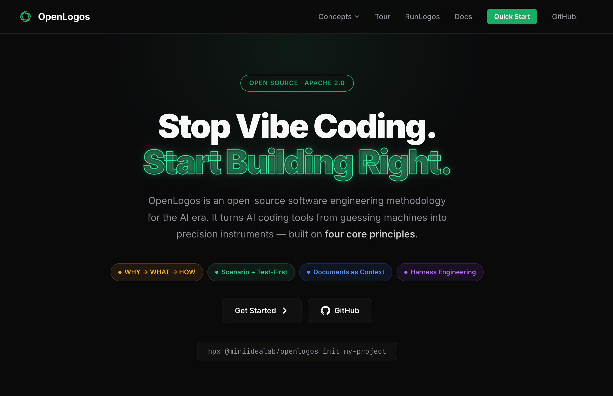

# OpenLogos

[English](./README.en.md)

<p align="center">
  
</p>

**面向 AI 时代的开源软件研发方法论。**

> OpenLogos 定义标准，RunLogos 让它更高效地落地。

## 什么是 OpenLogos？

OpenLogos 是一套面向 AI 时代的软件研发方法论，用来约束和引导 AI 参与真实软件项目的完整过程。

它反对直接把 AI 当作“代码自动生成器”使用，而是强调先明确：

- 为什么做
- 做什么
- 如何做

OpenLogos 把这套过程沉淀为可执行的规范、Skills、CLI 命令和验收规则，让 AI 在项目里沿着正确轨道推进，而不是把项目带向失控的 Vibe Coding。

## OpenLogos 与 RunLogos

**OpenLogos 定义标准。RunLogos 让标准更好落地。**

- **OpenLogos** 是开源方法论，提供研发流程、AI Skills、CLI 工具和规范文档
- **RunLogos** 是构建在 OpenLogos 之上的专业桌面工具，用来把 AI 生成的文档、API、DB、测试与变更结果变成可视化、可编辑、可编排、可调试的工作空间

OpenLogos 可以独立工作，兼容多种 AI 编码工具。  
RunLogos 则是它的效率增强层，适合需要更强可视化编辑、API 编排调试和结构化评审体验的团队或个人。

了解更多：

- OpenLogos 官网：[openlogos.ai](https://openlogos.ai)
- RunLogos 国际站：[runlogos.com](https://runlogos.com)
- RunLogos 中国站：[runlogos.cn](https://runlogos.cn)

### RunLogos 站点选择

- **`runlogos.com`**：面向国际用户
- **`runlogos.cn`**：面向中国区用户

两者对应同一产品体系，但会根据不同区域用户提供更合适的访问入口与信息。

## 核心工作流

```text
WHY  -> 需求文档
WHAT -> 产品设计
HOW  -> 技术架构 -> 场景建模 -> API / DB -> 测试设计 -> 代码实现 -> 验收验证
```

核心原则：

- **反 Vibe Coding**：AI 负责执行，人负责判断
- **场景驱动**：从真实业务场景推导实现方案
- **测试先行**：测试不是补充材料，而是开发规格的一部分
- **变更可追溯**：通过 proposal / merge / archive 管理迭代

## 安装与前置条件

### 第一步：安装 OpenLogos CLI

需要 `Node.js >= 18`。

```bash
npm install -g @miniidealab/openlogos
openlogos --version
```

CLI 包说明见 [cli/README.md](./cli/README.md)。

### 第二步：安装宿主 AI 工具

OpenLogos 本身提供方法论、Skills、规范和 CLI，但 `agent` / 插件 / 命令面板是否可见，取决于你使用的宿主 AI 工具是否已正确安装并完成登录。

## 快速开始

```bash
openlogos init my-project
cd my-project
openlogos status
openlogos next
```

一个典型流程通常是：

1. 用 `openlogos init` 初始化项目
2. 让 AI 按当前 Phase 逐步补齐文档与设计
3. 用 `openlogos status` / `openlogos next` 检查进度和下一步动作
4. 按场景实现代码与测试，并写入 OpenLogos reporter
5. 用 `openlogos verify` 生成验收结果
6. 首轮开发完成后，用 `openlogos launch` 进入活跃迭代阶段
7. 后续迭代通过 `openlogos change <slug>`、`merge`、`archive` 管理

## 支持的 AI 工具

OpenLogos 当前已支持：

| 工具 | 集成方式 |
|------|----------|
| Cursor | `AGENTS.md` + `.cursor/rules/` |
| Claude Code | 原生插件或 `CLAUDE.md` |
| OpenCode | 原生插件 + `.opencode/commands/`，或 `AGENTS.md` |
| Codex | 原生插件模式（`.codex-plugin/` + `.codex/config.toml`）+ `AGENTS.md` 兜底 |

补充说明：

- Codex 已是一等集成能力，可自动部署 `.agents/skills/`、`.codex-plugin/` 和 `.codex/config.toml`
- OpenLogos Skills 本身是平台无关的 Markdown 规范，因此也具备较强的跨工具兼容性

### AI 工具安装前置条件

如果宿主 AI 工具本身没有安装好、没有登录成功，或者没有完全重启，OpenLogos 部署出来的 Skills / 插件 / agent 面板通常不会正常显示。

建议至少确认以下几点：

| 工具 | 需要先满足的条件 |
|------|------------------|
| Cursor | 已安装 Cursor 桌面端；可正常打开项目；允许读取项目根目录下的 `AGENTS.md` 与 `.cursor/rules/`；若规则未生效，重启 Cursor 或重新打开项目窗口 |
| Claude Code | 已安装 Claude Code；当前终端可正常启动；插件市场可用；安装或同步完成后重启 Claude Code，确保插件与 agent 面板重新加载 |
| OpenCode | 已安装 OpenCode；终端中可执行 `opencode`；项目根目录启动；`openlogos sync` 后重启 OpenCode，确保 `.opencode/plugins/` 与 `.opencode/commands/` 被重新加载 |
| Codex | 已安装 Codex CLI；当前终端可正常启动 `codex`；项目内允许读取 `.codex/config.toml` 与 `.codex-plugin/`；同步完成后重启会话，确保 hooks 与 `.agents/skills/` 生效 |

通用建议：

- 先安装并确认 `openlogos` CLI：`npm install -g @miniidealab/openlogos`
- 再安装对应 AI 工具本体，并确认命令可在当前终端环境中执行
- 在项目根执行 `openlogos init` 或 `openlogos sync`
- 最后完全退出并重新打开 AI 工具

推荐顺序：

1. 安装 `openlogos` CLI
2. 安装并登录宿主 AI 工具
3. 在项目根执行 `openlogos init` 或 `openlogos sync`
4. 完全重启宿主工具，检查 Skills / 插件 / agent 面板是否出现

如果 agent / 插件面板仍不显示，优先检查：

- AI 工具是否已登录
- CLI 是否在当前终端 `PATH` 中
- 是否在项目根目录启动
- 同步后是否真正重启了工具

## 核心 CLI 命令

| 命令 | 说明 |
|------|------|
| `openlogos init [name]` | 初始化项目 |
| `openlogos sync` | 重新生成 AI 指令文件与 Skills |
| `openlogos status` | 查看当前阶段进度 |
| `openlogos next` | 输出下一步建议 |
| `openlogos verify` | 生成测试验收报告 |
| `openlogos launch` | 从首轮开发切换到活跃迭代 |
| `openlogos change <slug>` | 创建变更提案 |
| `openlogos merge <slug>` | 合并提案 deltas |
| `openlogos archive <slug>` | 归档已完成提案 |
| `openlogos module list/add/rename/remove` | 管理多模块项目 |

注意：以上命令应在项目根目录执行，也就是 `logos/logos.config.json` 所在目录。

## 可运行示例

仓库内提供了两个完整示例：

- [examples/flowtask](./examples/flowtask/README.md)：Tauri 桌面应用，侧重 Claude Code 集成
- [examples/money-log](./examples/money-log/README.md)：Electron 桌面应用，侧重 OpenCode 集成

总览见 [examples/README.md](./examples/README.md)。

## 仓库结构

```text
openlogos/
├── cli/              # OpenLogos CLI
├── skills/           # 平台无关的 AI Skills
├── spec/             # 方法论规范源码
├── docs/             # 工具与使用文档
├── plugin/           # Claude Code 插件
├── plugin-codex/     # Codex 插件模板
├── plugin-opencode/  # OpenCode 插件模板
└── examples/         # 可运行示例项目
```

## `openlogos init` 后的项目结构

```text
your-project/
├── AGENTS.md
├── CLAUDE.md                # 适用时生成
├── logos/
│   ├── logos.config.json
│   ├── logos-project.yaml
│   ├── resources/
│   ├── changes/
│   └── spec/
└── src/
```

OpenLogos 会把方法论资产集中在 `logos/` 目录中，尽量减少对现有代码结构的侵入。

## 许可证

- 代码与规范：[Apache License 2.0](./LICENSE)
- 文档与教程：[CC BY-SA 4.0](https://creativecommons.org/licenses/by-sa/4.0/)

## 链接

- 官网：[openlogos.ai](https://openlogos.ai)
- RunLogos 国际站：[runlogos.com](https://runlogos.com)
- RunLogos 中国站：[runlogos.cn](https://runlogos.cn)
- OpenCode 指南：[docs/opencode.md](./docs/opencode.md)
- CLI 说明：[cli/README.md](./cli/README.md)
- GitHub：[github.com/miniidealab/openlogos](https://github.com/miniidealab/openlogos)
