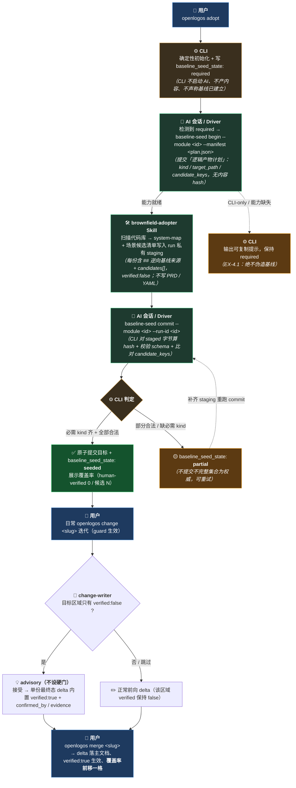

# 存量项目逆向建基线（brownfield-adopter）使用说明

> 面向把**已有代码库**接入 OpenLogos 的场景：不要求你回头补齐 initial 文档基线，而是**逆向扫描现状**、以「种子基线」（system-map + 场景候选清单）形式登记，随后在日常 change 迭代中**按需深化**、逐格把「逆向猜测」升级为「人工确认」。

---

## 1. 它解决什么问题

传统 OpenLogos 从 Why → What → How 正向推进，要求先有需求/设计/技术方案才写代码。但存量项目**代码已经存在**，没有对应文档。brownfield-adopter 让你：

- `openlogos adopt` 一键把已有项目接入（跳过 initial 文档基线，模块直接 `launched`）；
- 由 AI 会话**逆向扫描**代码库，产出**种子基线**并登记为 `reverse-engineered / verified:false`（明确标注「这是机器猜的、尚未人工确认」）；
- 存量代码享受 **grandfather 豁免**：`verify` 对未确认的逆向 spec 只软告警、不阻断；
- 之后每次 `openlogos change` 触碰到「只有逆向 spec」的区域时，给你一个 **advisory（不设硬门）**，建议顺手在同一份 delta 里确认现状（`verified:true`），可信边界随迭代**自然前移**。

一句话：**先把现状照原样登记下来（不假装是权威意图），再在真正改动它时顺手确认。**

### 它是如何解决的（理论视角）

存量项目与 OpenLogos 的根本矛盾在于：方法论是**意图优先（intent-first）**的——代码必须可追溯地派生自权威意图（Why → What → How）；而存量代码是**先有 What（实现），没有 Why（意图）**。两条朴素的出路都不可行：要么在动任何代码前先逆向补齐**全量权威规格**（成本 ≈ O(代码规模)，且你在"补写你无法验证的意图"，等于伪造 Why）；要么对 legacy 直接放弃可追溯性保证。brownfield-adopter 用四条原理绕开这个矛盾：

1. **事实 / 意图分离（provenance 分层）**——把"代码现状是什么"（可验证事实）与"设计意图为什么"（权威 intent）显式拆成两层。种子基线**只声称前者**（`reverse-engineered`），绝不伪造后者。于是"无可信意图"不再是障碍：系统不假装知道 Why，只如实登记 What-is，可信度低但**诚实**。

2. **可信度的单调偏序（verified 格）**——`verified:false → verified:true` 是一条**只升不降**的偏序；可信边界随确认单调前移、永不倒退。系统在任一时刻都精确知道"哪些是机器猜的、哪些是人工确认的"，而**覆盖率 = 已确认 / 候选总量**就是这条格上的一个**可度量收敛指标**——adoption 从"是/否"变成一个能持续逼近 1 的连续过程。

3. **惰性求值 / 按需深化（JIT）**——不要求一次性确认整个 legacy（那是 O(代码规模) 的巨额前置成本），而把"确认"**推迟到真正触碰该区域的那次 change**（成本按实际改动摊销，≈ O(被触碰的改动数)）。理论上这是把"全量前置验证"换成"增量按需验证"：与其花无穷成本去确认那些永远不会再改的代码，不如**只在改它时才确认它**——把接入的固定大成本转化为随迭代分摊的边际成本。

4. **豁免只对历史、门只对新意图**——因为存量 spec 是"未确认的事实"而非"被违反的意图"，`verify` 对它**软告警而非硬失败**（grandfather）。方法论的硬门只对**新引入的意图**生效、不对历史现状追溯生效，从而保证"接入"这一步本身永远不会因"历史欠债"而阻断当前工作。

这四条合起来，使 legacy 现状也进入 OpenLogos 同一套 change / delta / merge 可追溯账本（每条候选有稳定 key、`source_hash`、provenance 标记），**只是初始可信度标为低、随迭代提升**——最终"存量"与"新增"收敛到同一治理模型下。

---

## 2. 核心概念

| 概念 | 含义 |
|------|------|
| **种子基线（seed baseline）** | 逆向扫描产出的两类必需产物：`system-map`（系统地图）+ `scenario-candidates`（场景候选清单）。**非权威意图**，只登记「可验证事实」。 |
| **provenance（来源标记）** | 每份逆向产物文档内含具名章节 `## 逆向基线来源`，其中 `candidates[]` 逐条标 `verified`。`verified:false` = reverse-engineered（机器猜的）；`verified:true` = human-verified（人工确认）。 |
| **`baseline_seed_state`** | 模块级**枚举**状态字段（非布尔），唯一写入者是 CLI：`required`（待建立）/ `partial`（部分建立、扫描未完成）/ `seeded`（已建立）/ 缺省+无候选视为 `unknown`（不推断）。 |
| **覆盖率** | `human-verified 分子 / 候选分母`。刚 seeded 时 human-verified=0；随每次 change 确认逐格上升。 |
| **grandfather 豁免** | 存量代码即便对应 spec 仍是 `verified:false`，`verify` 也**不硬失败**，只软告警。 |
| **JIT advisory** | change-writer 判定本次 change 目标区域是否「只有 verified:false 逆向 spec」，若是则给非硬门建议，让你在**当前那一份最终态 delta**里一并确认现状。 |
| **run / staging** | 每次逆向提交是一个事务：`begin` 冻结「逻辑产物计划」并签发 `run_id` + 建 run 私有 staging；AI 把产物写进 staging；`commit` 校验 staged 字节后**原子**落入目标文档。 |

---

## 3. 端到端流程（谁做什么）



> **重要**：`begin` / staging 写入 / `commit` 正常由**支持 brownfield-adopter 的 AI 会话/driver 驱动**，你一般不手打这些命令。下面的命令详解是为了让你理解机制、能手动排障或验证。

---

## 3.5 用户使用步骤（Step by Step · 每步看到什么 · 产出物）

> 下面是一次完整走查。**你亲手做的只有 Step 1、Step 5 观察、Step 6 迭代**；Step 2–4 由 AI 会话/driver 驱动（这里也展示出来，便于你核对它到底做了什么、落了哪些盘）。命令前均已 `cd <项目根>`。

### Step 1 —— 接入已有项目（你做）
```bash
cd /path/to/your-existing-project
openlogos adopt
```
**你看到**（要点）：
```
✓ 创建 logos/ 标准目录结构
✓ 写入 logos.config.json
✓ 写入 logos-project.yaml（bootstrap: adopted, lifecycle: launched）
✓ 标记待建现状基线（baseline_seed_state: required）
✓ 写入 AGENTS.md / CLAUDE.md
🎉 已有项目接入完成！
建议的下一步：逆向建立现状基线（种子基线，非权威意图）
```
**产出物（磁盘）**：
- `logos/`（标准目录结构）、`logos/logos.config.json`
- `logos/logos-project.yaml` —— 模块含 `bootstrap: adopted`、`lifecycle: launched`、`baseline_seed_state: required`
- 项目根 `AGENTS.md` / `CLAUDE.md`
- **此刻还没有任何逆向内容**——CLI 只登记「待建基线」，不产内容、不启动 AI。

> ✅ 自检：`openlogos status` 应显示该模块「现状基线待建立 / required」。

### Step 2 —— 冻结产物计划、开一个 run（AI driver 做）
```bash
openlogos baseline-seed begin --module core --manifest seed-plan.json
```
（`seed-plan.json` 见 §5，声明打算产出 `system-map` + `scenario-candidates` 及各自 `candidate_keys`。）

**你看到**：
```
✓ baseline-seed begin：run_id=seed-core-0001，expected=2
  staging：logos/resources/verify/baseline-seed-runs/seed-core-0001/staging/
  把逆向产物写入 staging 后运行：openlogos baseline-seed commit --module core --run-id seed-core-0001
```
**产出物（磁盘）**：
- `logos/resources/verify/baseline-seed-runs/seed-core-0001/run.json`（run 记录：module/status=open/expected/issued_nonce）
- `logos/resources/verify/baseline-seed-runs/seed-core-0001/staging/`（**空的** run 私有暂存区）
- `logos/resources/verify/baseline-seed-runs/.issued-runs-core.json`（签发账本记入本 run）
- ⚠️ **目标文档尚未产生**，`baseline_seed_state` 仍是 `required`（begin 不改状态）。

### Step 3 —— 逆向扫描、把产物写入 staging（brownfield-adopter Skill 做）
Skill 扫描代码库，把两份产物写进 staging（**不碰目标 `logos/resources/`、不改 YAML**）：
```
logos/resources/verify/baseline-seed-runs/seed-core-0001/staging/
  └─ logos/resources/prd/3-technical-plan/1-architecture/core-system-map.md
  └─ logos/resources/prd/3-technical-plan/2-scenario-implementation/core-scenario-candidates.md
```
每份文档含 `## 逆向基线来源` 章节 + `candidates[]`（`verified: false`，见 §6）。

**产出物**：staging 下按 `target_path` 相对路径的两份 `.md`。此刻它们**只在暂存区**，还不是权威基线。

> 🔎 想看进度：`openlogos baseline-seed status --module core`
> ```
> run: seed-core-0001  state: required  staged 2/2  missing 0
> ```

### Step 4 —— 校验 staged 字节并原子提交（AI driver 做）
```bash
openlogos baseline-seed commit --module core --run-id seed-core-0001
```
**你看到（成功 → seeded）**：
```
✓ baseline-seed commit：baseline_seed_state=seeded
  committed=2 missing=0 invalid=0
```
**若不完整（→ partial）会看到**：
```
✓ baseline-seed commit：baseline_seed_state=partial
  committed=1 missing=1 invalid=0
  未完成——补齐 staging 后重跑：openlogos baseline-seed commit --module core --run-id seed-core-0001
```
**产出物（seeded 时，原子落盘）**：
- 目标文档正式写入 `logos/resources/...`（core-system-map.md、core-scenario-candidates.md，含 `## 逆向基线来源`）
- `logos/logos-project.yaml` → 模块 `baseline_seed_state: seeded` + 派生覆盖率索引（`baseline_index`，含 `source_hash`）
- `logos/resources/verify/baseline-events.jsonl` 追加一条 `register` 审计事件
- `run.json.status` → `committed`

### Step 5 —— 查看现状基线（你做）
```bash
openlogos status          # 或 openlogos next / baseline-seed status --module core
```
**你看到**（要点）：`baseline_seed_state=seeded`，覆盖率 **human-verified 0 / 候选 N**，并引导「可正常发起 openlogos change <slug> 迭代」。
> 覆盖率一开始 human-verified=0 是正常的——种子基线全是 `verified:false`，等你在 change 里逐格确认后才上升。

### Step 6 —— 日常迭代时按需确认现状（你做）
```bash
openlogos change refine-login     # guard 生效，进入变更流程
```
- 若本次改动区域**只有 verified:false 逆向 spec**，change-writer 给一条 **advisory（不是硬门，可跳过）**：建议在**这一份最终态 delta** 里顺手把该区域 `## 逆向基线来源` 候选置 `verified: true` + `confirmed_by`/`evidence`。
- `openlogos merge refine-login` 后：delta 落主文档、`verified:true` 生效、**覆盖率前移一格**（human-verified +1）。
- 期间 `openlogos verify`：对仍未确认的逆向区域**只软告警、不阻断**（grandfather 豁免）。

**产出物**：`logos/changes/refine-login/` 提案与 delta；merge 后主文档对应候选变 `verified:true`；`baseline_index` 覆盖率随之更新。

---

### 一页速览：命令 → 状态 → 产出物

| # | 谁 | 命令 | 状态变化 | 关键产出物 |
|---|----|------|----------|-----------|
| 1 | 你 | `openlogos adopt` | → `required` | `logos/`、`logos-project.yaml`、`AGENTS/CLAUDE.md` |
| 2 | AI | `baseline-seed begin --manifest` | `required`（不变） | `baseline-seed-runs/<run>/run.json` + 空 `staging/` + 签发账本 |
| 3 | Skill | （写 staging） | `required`（不变） | staging 下的 `## 逆向基线来源` 产物 |
| 4 | AI | `baseline-seed commit --run-id` | → `seeded`/`partial` | 目标文档落盘 + 覆盖率索引 + `baseline-events.jsonl` |
| 5 | 你 | `status` / `next` | 观察 | 覆盖率 human-verified 0 / 候选 N |
| 6 | 你 | `change` → `merge` | 覆盖率前移 | delta + 主文档候选 `verified:true` |

---

## 4. 命令详解

### 4.1 `openlogos adopt [name]`
把当前目录的已有项目接入 OpenLogos。

- `--locale <zh|en>`：文档语言（默认 zh）
- `--ai-tool <claude|codex|other|...>`：目标 AI 工具

效果：创建 `logos/` 标准结构、写 `logos.config.json` / `logos-project.yaml`（`bootstrap: adopted, lifecycle: launched`）、写 `AGENTS.md` / `CLAUDE.md`，并标 `baseline_seed_state: required`。**不产任何逆向内容**——它只把「待建现状基线」这件事登记下来。

> CLI-only / 无可用 AI 会话时：保持 `required`，输出可复制提示，**绝不伪造基线**（EX-4.1）。

### 4.2 `openlogos baseline-seed begin --module <id> --manifest <path> [--format json]`
冻结**逻辑产物计划**、签发 `run_id`、建 run 私有 staging。

- `--manifest <path>`：计划文件（见 §5），描述打算产出哪些 `kind`、落到哪个 `target_path`、各含哪些 `candidate_keys`——**此刻还没有产物字节，不含内容 hash**。
- CLI 校验：必需 kind 齐（`system-map` + `scenario-candidates`）、`target_path` 项目根相对且位于 `logos/resources/**.md`、拒绝绝对路径/`..`/符号链接/重复路径、`candidate_keys` 必须是字符串数组。
- 通过后签发 `run_id`（形如 `seed-<module>-<序号>`）并记入**受控签发账本**，建 `logos/resources/verify/baseline-seed-runs/<run_id>/staging/`。

### 4.3 （AI/Skill）把产物写入 staging
产物按 `target_path` 的相对路径写进 `.../baseline-seed-runs/<run_id>/staging/<target_path>`，每份含 `## 逆向基线来源` 章节（见 §6）。Skill/driver **不直接改 YAML、不直接写目标 `logos/resources/`**——只写 staging。

### 4.4 `openlogos baseline-seed commit --module <id> --run-id <id> [--format json]`
对 **staged 实际字节**逐项校验后原子提交。

- 校验：内容 sha256、`## 逆向基线来源` / `candidates[]` schema 合法、staged `candidates[]` key 与 manifest `candidate_keys` **逐项一致**、路径安全复检、run 已签发（账本核对）。
- 结果：必需 kind 齐 + 全部 expected 合法 → 经 commit journal 事务原子提交全部目标 + 派生覆盖率索引 + `baseline_seed_state: seeded`；≥1 合法但未全 / 必需 kind 不齐 → `partial`（**不提交不完整集合为权威**）。

### 4.5 `openlogos baseline-seed status --module <id> [--format json]`
查看该模块种子基线状态、覆盖率、以及 partial 时的恢复入口（`commit --run-id <id>`）。

### 4.6 观察状态：`openlogos status` / `openlogos next`
- `required`：next 引导「逆向建立现状基线」。
- `seeded`：显示覆盖率、引导正常 `openlogos change`。
- `partial`：无活跃提案 → 指向恢复入口；有活跃提案 → 保持提案前沿、partial 以结构化 advisory 呈现、**不阻断 change**。
- 提交进行中（并发/崩溃恢复门未过）→ 报 `baseline_commit_in_progress`，**不把半提交集合当权威**。

---

## 5. manifest（逻辑产物计划）格式

`begin` 的 `--manifest` 指向一个 JSON：

```json
{
  "module": "core",
  "expected": [
    {
      "kind": "system-map",
      "target_path": "logos/resources/prd/3-technical-plan/1-architecture/core-system-map.md",
      "candidate_keys": ["core::a1b2c3d4e5f6"]
    },
    {
      "kind": "scenario-candidates",
      "target_path": "logos/resources/prd/3-technical-plan/2-scenario-implementation/core-scenario-candidates.md",
      "candidate_keys": ["core::0f1e2d3c4b5a", "core::9988776655aa"]
    }
  ]
}
```

规则：
- **必需 kind**：`system-map` + `scenario-candidates`（缺任一 → `missing_required_kind`）。可选 kind：`dependency-map`、`entry-points`。
- `target_path`：项目根相对、位于 `logos/resources/` 下、`.md` 结尾；禁绝对路径 / `..` / 符号链接 / 重复路径。
- `candidate_keys`：字符串数组（可为空）；同一稳定 key **不得**分布在多个目标文档（跨目标复制 → `candidate_key_conflict`）。
- manifest 必须**覆盖当前仍持有本模块候选的所有文档**——若重扫把某目标改名/换址致旧文档退出计划，会被 `provenance_doc_uncovered` 拒绝（应把旧文档纳入 manifest 并在 staging 清空其 provenance 以迁移候选）。

---

## 6. staging 产物：`## 逆向基线来源` 章节格式

每份逆向产物文档末尾（或独立章节）含一个具名章节 + fenced YAML：

```markdown
# 系统地图（system-map）

...正文...

## 逆向基线来源
```yaml
candidates:
  - key: "core::a1b2c3d4e5f6"
    anchor: "cli:baseline-seed-commit"
    state: active
    verified: false
```
```

字段规则（seed 输入**严格**校验）：
- `key`：规范键 = `<module>::<sha256(normalize(anchor))[:12]>`。CLI 会重算并与你填的 key 比对，不一致即拒。
- `anchor`：稳定锚点（非空字符串），是身份来源；重命名时旧 anchor 进 `aliases[]` 以继承身份。
- `state`：`active`（默认）/ `tombstone`（已删/退役但保留分母）/ `retired`。seed 输入必须显式 `active`。
- `verified`：seed 输入必须**显式为布尔 `false`**（缺失/非布尔一律拒——种子只登记未确认事实）。
- `source_hash`：CLI 对整个章节文本算 sha256，作为覆盖率/新鲜度基准（你不用填）。

> 人工确认时（在 change 的 delta 内）把对应候选改为 `verified: true` 并补 `confirmed_by` / `evidence` / `confirmed_at`。

---

## 7. 状态机与覆盖率

```
adopt ─────────────► required ──begin+commit(全合法)──► seeded ──change确认──► 覆盖率逐格前移
                        │                                  ▲
                        └──commit(部分合法/缺必需kind)──► partial ──重跑commit/重begin──┘

缺省(无字段)+无候选 ─► unknown（不推断，视为非 brownfield / 已 seeded 由候选推导）
旧布尔 true ─────────► required（legacy 迁移）
```

- 覆盖率 = human-verified / 候选分母；`partial` 时标 `incomplete`、不算精确百分比。
- 从 `partial` 重新 `begin` **不回退到 `required`**（保留 partial 至新 run 首次有效 commit）。

---

## 8. 按需深化（把 verified:false 升级为 true）

1. 日常 `openlogos change <slug>`（guard 生效）。
2. change-writer 若判定目标区域只有 `verified:false` 逆向 spec → 给 **advisory（非硬门）**。
3. 接受建议：在**当前 change 的那一份最终态 delta** 内，把对应 `## 逆向基线来源` 候选置 `verified:true` + `confirmed_by`/`evidence`，与前向改动**一并落盘**——不生成第二份「现状确认 delta」、不直接改 `resources/`、不嵌套第二个 change（EX-12.1 允许跳过）。
4. `openlogos merge <slug>` → delta 落主文档、`verified:true` 生效、覆盖率**只读已合并主文档**并前移一格。
5. `openlogos verify`：对仍为 `verified:false` 的区域只**软告警**、不硬失败（EX-15.1，grandfather 豁免）。

---

## 9. 错误码速查

| error | 触发 |
|-------|------|
| `missing_required_kind` | manifest 缺 `system-map` 或 `scenario-candidates` |
| `invalid_manifest` | manifest schema 非法 / `candidate_keys` 非字符串数组或含非字符串元素 |
| `path_escape` | `target_path` 绝对路径 / `..` / 符号链接 / 越界 / 重复路径 |
| `candidate_key_conflict` | 同一稳定 key 分布在多个目标文档 |
| `candidate_key_mismatch` | staged `candidates[]` key 与 manifest `candidate_keys` **集合不等**（含空对非空/非空对空，无条件校验） |
| `provenance_doc_uncovered` | manifest 未覆盖当前仍持有本模块候选的文档（目标改名/换址致旧文档退出计划） |
| `unknown_run` | run 未经 `begin` 签发（不在受控账本）/ `run.json.run_id` 与 `--run-id` 不一致 |
| `stale_run` | 对已 `superseded` 的旧 run 执行 commit |
| `run_locked` | 同模块并发 commit / 事务锁被占 |
| `baseline_commit_in_progress` | 提交进行中、恢复门未过 → 机器消费者不把半集合当权威 |

任一错误：**非零退出、不写 `baseline_seed_state`、不提交任何 staged 文件**。

---

## 10. 恢复与并发（你基本无需干预）

- **崩溃一致性**：commit 走 journal 事务（`prepared → committing → committed`，状态最后写）。任一机器消费者（重跑 commit、下次 begin、`status`/`next`/`verify`/覆盖率重算/`index`/`sync`）在读目标前先取模块锁 + 检测未终结 journal → 先恢复（前滚/回滚），再在**同一锁区间**内读取，杜绝读到半提交集合。
- **`sync` 提交进行中**：读取门前移到任何迁移/写副作用之前 → **零写副作用**后非零退出报 `baseline_commit_in_progress`。
- **陈旧死锁回收**：经死 owner 身份的独立 marker 单赢仲裁 + 条件重读后原子替换，**绝不移动/覆盖 path 上的活锁**（互斥不破），孤儿 marker 可被检测清除（无永久锁死）。

---

## 11. 信任边界（务必知情）

签发账本把「签发事实」从「目录内自述 JSON 是否自洽」提升为「CLI 受控账本是否登记」，杜绝把手工放入（未经 `begin`）的自洽 run 目录提交为 `seeded`。但**本地文件型模型无密钥**：能任意改写 `logos/` 的完全对抗写者仍可同时伪造 `run.json` 与账本条目——该残留**显式声明为超出本地信任模型范围**（与 producer 直接以同一计划 `begin` 等价，不构成越权）。密码学级不可伪造需 CLI 私钥/OS 权限边界，非当前迭代目标。

---

## 12. 快速上手 checklist

1. 在项目根 `cd <项目根>`（`logos.config.json` 所在目录），运行 `openlogos adopt`。
2. 确认 `logos-project.yaml` 里模块为 `bootstrap: adopted, lifecycle: launched, baseline_seed_state: required`。
3. 在**支持 brownfield-adopter 的 AI 会话**里说明：「当前模块 `baseline_seed_state: required`，请逆向建立现状基线」——让 driver 走 `begin → 扫描写 staging → commit`。
4. `openlogos baseline-seed status --module <id>` 或 `openlogos status` 看是否变 `seeded`、覆盖率如何。
5. 之后正常 `openlogos change <slug>` 迭代；遇到 advisory 时顺手在同一份 delta 里确认现状（`verified:true`），`merge` 后覆盖率前移。

> 所有 `openlogos` 命令都要先 `cd` 到项目根再执行，否则报 `logos.config.json not found`。
