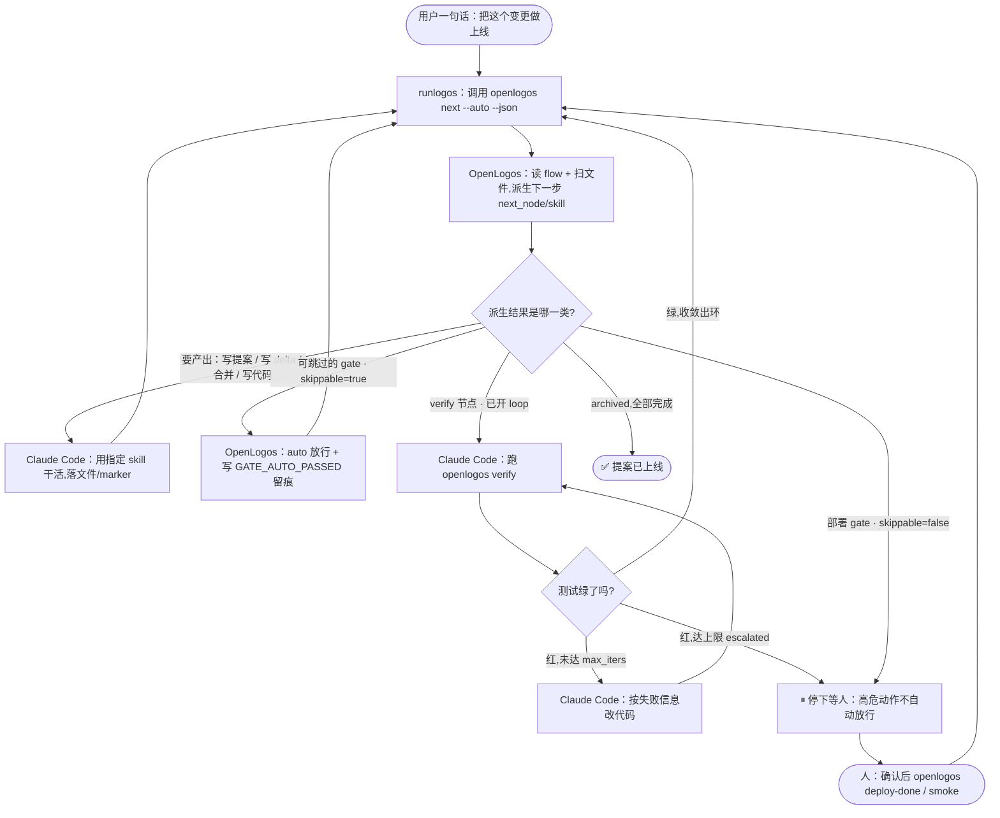

# OpenLogos 可编排研发流程 · 使用与理念指南

> 版本对象：flow 模型 M1 + M2 全量(切片 A/B/C + S25–S30)。
> 配套规格：数据模型见 `spec/flow-spec.md`,机器输出契约见 `spec/cli-json-output.md`,
> 设计决策见 `docs/orchestratable-flow-design.md`,验证记录见 `docs/orchestratable-flow-verification.md`。
> 本文面向**使用者**:先讲清楚"这套东西到底在解决什么、精髓是什么",再讲"怎么用"。

---

## 0. 一句话先讲清楚

> **OpenLogos 把研发流程从"散落在代码和散文里的硬编码"变成"一份声明式的 flow 文件"。
> 它读这份文件 + 扫你的文件系统,告诉你"现在在哪、下一步该干什么、用哪个 skill",
> 但它自己不动手——执行交给宿主(Claude Code / 你 / CI)。它是乐谱和指挥,不是乐手的手。**

如果你只记一句话:**OpenLogos 是被动的"流程裁判",不是主动的"流程引擎"。** 状态全在文件里,
没有后台进程、没有运行时,任何 AI 工具都能接,git 全程可审计。

---

## Part 1 · 理念与精髓(为什么这么设计)

### 1.1 诊断:改造前,OpenLogos 没有"一个流程",而是四份各自硬编码的流程

| 事实来源 | 形态 | 问题 |
|---|---|---|
| initial 阶段瀑布(13 段) | 代码里的硬编码数组 | 只能整段 skip,不能增删改 |
| launched 变更生命周期(11 态) | 代码里的硬编码状态机 | 完全不可编辑 |
| "该干什么"的判定 | `CLAUDE.md` 自然语言散文 | 改散文≈改行为,脆弱、随模型漂移 |
| 发版流程 | `logos-project.yaml` 里的 YAML | 已经是声明式——这是"对的样子"的雏形 |

**"可编排"的第一步不是做个流程编辑器,而是把这四份合并成一份声明式模型。** 这份模型就是 flow 文件。

### 1.2 最关键的一个决策:走"被动派生"(A),而不是"主动编排引擎"(B)

引擎有两种可能的形态:

- **(A) 被动派生器**:只回答"我在哪、下一步跑什么",执行交给宿主。状态全在文件,无进程、无运行时。
- **(B) 主动编排器**:自己 spawn agent、跑脚本、守 marker、推进节点——本质是 Temporal / n8n 那类,需要进程监督、agent 运行时、重试、并发。

**OpenLogos 坚定走 A,并把 A 做到极致,绝不滑向 B。** 理由:

1. OpenLogos 的护城河是**方法论**(Why→What→How、场景贯穿即追溯链、spec 驱动),不是编排管线的水管。自造通用 DAG 引擎会和宿主、和 Temporal 正面竞争,还丢掉"文件即状态、git 可审计、任何工具都能接"的独特价值。
2. B 的"驱动+watch+重试+并发"是无底洞,会吃掉做方法论的精力。
3. A 完全够用:`openlogos next --json` 已经能吐出"下一节点 + 用哪个 skill + 现成提示词",宿主照做即可。

> **定位一句话:OpenLogos 当编排的"乐谱"和"指挥",不当"乐手的手"。**

这个决策渗透到所有细节:`cmd:` 门禁的命令、`pre/post_script` 脚本、`working/review_agent`——
OpenLogos **只声明它们存在**,是否真执行、以什么权限执行,全部委托给宿主的权限模式。

### 1.3 精髓:文件即状态

没有数据库、没有后台进程记录"你做到哪了"。**状态 100% 由文件系统推导**:
- 某目录非空了 → 那个节点做完了;
- 提案目录里出现了 `VERIFY_PASS` 这个标记文件 → 验收过了;
- `tasks.md` 里 `[code]` 这一段全勾上了 → 编码节点完成。

好处:你随时 `git log` 就能看到流程怎么走的;换个 AI 工具接着干,状态不丢;没有"服务挂了状态就乱"的问题。

### 1.4 三层抽象(理解整个系统的骨架)

- **L1 模型层**:一份 flow 文件 = 有序节点 + subflow 分组,是唯一事实来源。落文件、git 可追踪。
- **L2 派生层**:`status`/`next`/`watch` 做的事——读 flow 模型 + 扫文件 → 算出每个节点 done/active/pending/failed/skipped。无状态。
- **L3 驱动层**:真正让节点跑起来。**OpenLogos 不做这层**(就是 1.2 的 A 决策),交给宿主引擎。

### 1.5 统一 loop 模型 + 收敛押"测试绿"

- **一切皆 loop**:线性节点 = "迭代上限为 1、收敛条件为'产出存在'"的退化环。这样"线性"和"循环"用同一套模型表达,将来加环不返工。
- **`code/verify` 子流程可点亮真迭代**(`max_iters>1`):变成"改→测→未绿再改"的收敛循环(actor-critic 范式)。
- **收敛裁判永远是"测试是否全绿"这一数字信号**,不靠评审 agent 的主观判断——质量是数字,没有模糊地带,规避幻觉。

### 1.6 overlay:让方法论可以中心化演进

自定义流程**不是把内置模板整份拷贝来改**,而是写一层"补丁"(overlay),用 `extends: builtin:launched@v1` 引用基线,只写差异。

- 好处:内置模板(方法论)升级时,你的项目自动跟随;你的 diff 很小、意图清晰("我只改了这两处")。
- 代价:需要 `openlogos flow show --resolved` 才能看到"基线 + 补丁"合并后的完整流程——这个命令就是为补偿"不如整份拷贝直观"而存在的。

---

## Part 2 · 心智模型(几个核心概念)

### 2.1 结构:flow → subflow → node

```
flow(一份流程,如 launched)
 └─ subflow(子流程,把连续节点圈成一组,可挂 gate / loop)
     └─ node(节点:一个研发步骤,如 code / verify / deploy)
```

### 2.2 两条内置主干

| flow | 何时用 | 节点(subflow) |
|---|---|---|
| **initial** | 首轮从 0 到 1 开发 | prd → product-design → architecture → scenario-modeling → api/db-design → deployment-design → test-cases → orchestration-test → code → verify → deploy → smoke(13 段瀑布) |
| **launched** | `openlogos launch` 之后的每次变更 | 提案[write-proposal, write-delta] → 合并[generate-merge-prompt, apply-merge] → 实现[code, verify] → 交付[deploy, smoke] → 收尾[archive] |

> 判定用哪条:项目里有 `lifecycle: launched` 的模块,且有活跃变更提案,就走 launched。

### 2.3 节点的字段(挑重点)

- `skill`:这个节点推荐用的 Skill(`next` 会把它告诉宿主)。
- `when`:条件,不满足则该节点跳过(如 `when: deployment_required`)。
- `done_when` / `fail_when`:**完成判定 / 失败判定谓词**——这是整个模型最核心的部分(见 2.5)。
- `for_each` + `produces`:fan-out,一个节点对 N 个场景各产出一份(见 2.6)。
- `working_agent` / `review_agent` / `pre_script` / `post_script`:不透明声明,OpenLogos 不解释,透传给宿主编排。

### 2.4 gate(门禁 / 人类确认点)

挂在 subflow 上,`type: human` 表示"到这里要人确认,`next` 不自动往下推"。

- `position: exit`(默认):本组节点全做完后、进下一组前确认。
- `position: entry`:进本组第一个节点**之前**确认(典型:部署前确认,卡在 deploy 之前)。
- `skippable: true|false`:这个确认点在"全自动模式"下能不能被自动跳过(见 Part 7)。`deploy` 的 gate 默认 `false`(防止误触发生产部署)。

### 2.5 done_when 谓词词表(节点"怎么算做完")

| 谓词 | 含义 |
|---|---|
| `dir_nonempty` | 目标目录非空 |
| `file:<path>` | 指定文件存在 |
| `marker:<NAME>` | 活跃提案目录下存在该标记文件(如 `marker:VERIFY_PASS`) |
| `any_present:[A,B]` | 列出的任一标记/文件存在即可 |
| `all_present` | fan-out:每个场景都有对应产出(可配 `coverage_threshold` 放宽为"覆盖率≥阈值") |
| `proposal_package_filled` | proposal.md 与 tasks.md 都已脱离模板填写完整 |
| `section_complete:<tag>` | tasks.md 指定段(如 `code`/`delta`)全部勾选或不存在 |
| `archived` | 提案已归档 |
| **`cmd:<命令>`** | **命令退出码为 0 即满足**(见 Part 5) |

`fail_when` 用同一套词表,但命中表示节点 **failed**(失败/阻塞)。**`fail_when` 优先于 `done_when`**——两者都命中时判 failed(忠实复刻现状 `VERIFY_FAIL > VERIFY_PASS`)。

### 2.6 fan-out(一个节点,N 份产出)

```yaml
- id: test-cases
  for_each: scenarios     # 集合在求值时动态解析(场景会增长,覆盖目标是移动靶)
  produces: "logos/resources/test/{module}-{scenario}-test-cases.md"
  done_when: all_present  # 每个场景都有对应文件才算 done
```
派生时还会输出覆盖度 `{ total, covered, missing }` 供 status/watch 展示。

---

## Part 2.5 · 这版到底解决什么问题:让"无人值守跑完一个变更"成为可能

前面讲机制,这里讲**收益**。本版本最实在的价值,是让一个**自动化引擎(宿主)**能在基本无人值守的情况下,把一个变更从"提案"一路推到"上线门前"。要做到这点,以前有两个拦路虎,本版分别用两件武器打通:

| 自动化的拦路虎 | 本版的武器 |
|---|---|
| 流程里**满地人类确认点(gate)**,自动化一跑到就停 | **① auto-skip**:把"写文档/评审"这类 `skippable:true` 的 gate 自动放行(留痕),只在真正高危的(如上生产)停下等人 |
| **verify 一红就停**,没有"自动改→重测"的小循环 | **② subflow loop**:把 `code/verify` 圈成一个小循环,红了自动再来一轮,绿了才出环;到上限还不绿才升级给人 |

### 先认识"引擎":OpenLogos 是指挥,宿主是乐手

OpenLogos 自己不跑测试、不写代码(被动派生 A)。真正"动手"的是**宿主(driver)**——可以是 auto 模式的 Claude Code、一个 CI 机器人、甚至一个 shell 脚本。两者配合成一个循环:

```
        ┌───────────────────────────────────────────────┐
        │              宿主(乐手 / driver)              │
        │  while 还没到头:                               │
        │    1. 问指挥: openlogos next --auto --json      │
        │    2. 照指令干: 用 r.skill / r.working_agent    │
        │       写代码 / 跑 openlogos verify / …          │
        │    3. 把产出落成文件(代码、marker)            │
        └───────────────┬───────────────▲───────────────┘
                        │ "下一步干嘛?"  │ 落了文件、状态变了
                        ▼               │
        ┌───────────────────────────────────────────────┐
        │          OpenLogos(指挥,被动派生)           │
        │  读 flow + 扫文件 → 算"现在在哪、下一步跑啥"   │
        │  auto 模式: 能跳的 gate 直接放行并写审计留痕   │
        └───────────────────────────────────────────────┘
```

关键:**循环是宿主在转,不是 OpenLogos 在转。** OpenLogos 每次只被动回答一句"接下来干嘛",所以状态永远在文件里、可中断、可审计——引擎挂了重启,接着问 `next` 就能继续。

### 全景图:runlogos 引擎如何指挥 Claude Code 把一个提案推上线

下图是这套配合的完整流程(以一个假想引擎 **runlogos** 为例;它就是 Part 1.2 说的"宿主/driver")。三个角色:**runlogos** 转循环、**OpenLogos** 被动派生、**Claude Code** 真正干活:



读图要点:

- **所有箭头都回到 `ASK`**——循环是 runlogos 在转,OpenLogos 每轮只被动回答一句"下一步",绝不主动驱动(A 架构)。
- **同一个 `WORK` 框,在不同轮里承载不同节点**:第一轮是 write-proposal,下一轮是 write-delta,再下一轮是 merge、code……由 OpenLogos 按 flow 顺序派生当前前沿节点,runlogos 照着 `skill`/`next_node` 派给 Claude Code。
- **两个决策菱形 = 两件武器**:`Q`(派生结果分流)体现 auto-skip——能跳的 gate 走 `SKIP` 自动放行;`CONV`(测试绿没绿)体现 subflow loop 的自愈循环。
- **唯一的 `STOP`** 只为两种情况:部署 gate(`skippable:false`)和 loop 到上限仍没绿(`escalated`)——都是"高危/需要人判断"的点。其余全自动。

### 场景:让引擎"过夜"把 `add-due-date` 这个变更推到上线门前

项目 **todo-api** 早已上线。睡前你丢给 auto 模式的宿主一句话:"给待办加截止日期功能"。引擎开始一圈圈问 `openlogos next --auto`:

```
 提案    write-proposal   宿主用 change-writer 填好 proposal/tasks   ✓
         write-delta      宿主产出 deltas/(改了哪些规格)           ✓
         ── 评审 gate · skippable:true ── auto 放行 ✅ 写 GATE_AUTO_PASSED
 合并    generate/apply   宿主按指令合并,落下 SPEC_MERGED           ✓
 实现    ┌ code           宿主写代码                                ✓
         │ verify         宿主跑 openlogos verify……
         │   ↑ 红了! ─┐                       ← 武器② 自愈小循环
         └──自动再来──┘                          (放大见下)
 交付    ── 部署 gate · skippable:false ── ✋ 停!即使 auto 也挡住
         deploy / smoke   等你早上起来点头

 ⇒ 一觉醒来:变更自己跑到了"部署确认"门前,测试是绿的。
   唯一没替你做的,正是你"故意不让它自动做的"那一步——上生产。
```

这就是收益:**文档 / 评审 / 编码 / 自测全程无人值守,只在真正该停的地方停下。**

### 放大 · 武器②:实现段的"自愈小循环"(subflow loop)

默认实现段是线性的(verify 红了就停)。你在 overlay 里把它点亮成循环(不开则维持原样):

```yaml
overlay:
  - op: set-loop
    subflow: implement
    set: { max_iters: 3 }      # code/verify 最多自动迭代 3 轮,收敛条件 = 测试绿
```

之后引擎在实现段自动转这个小圈。**注意 OpenLogos 只当裁判**(读 verify 写的迭代账本,报"第几轮 / 绿没绿"),真正改代码、跑 verify 的是宿主:

```
  第1轮  宿主写代码 → 跑 openlogos verify → 测试红
         openlogos next --auto → "第 1/3 轮没绿,按失败信息修完重跑 verify"
  第2轮  宿主改 → verify → 还红
         next --auto → "第 2/3 轮没绿,继续"
  第3轮  宿主再改 → verify → 测试绿 ✅
         next --auto → 收敛,出环,推进到交付段

  ──若 3 轮还不绿(escalated)→ 升级到一个人类 gate(默认挡住):
    等人决定"加大 max_iters 继续 / 手动接管 / 放弃"。
    除非你显式写了 exhausted_gate.skippable:true(高危:放行未收敛代码)。
```

收敛裁判是**测试绿**这一数字信号,不是某个 agent"觉得差不多了"——这是 loop 不跑飞的关键。

### 放大 · 武器①:auto-skip 到底跳了什么、没跳什么

```
  gate(人类确认点)         skippable   auto 模式下的行为
  ──────────────────────────────────────────────────────────
  评审 / 文档 / 设计类 gate    true       ✅ 自动放行 + 写 GATE_AUTO_PASSED
  部署确认 gate(上生产前)     false      ✋ 照样挡住,必须人确认

  原则:能自动化的全自动化;高危的(上生产)留一道人闸。
  "被自动跳过"一定留痕(GATE_AUTO_PASSED)——决策点不会被静默抹掉,
  事后可审计"哪一步是机器替我放行的"。
  且 auto 只在流程真正推进到 gate 边界才放行;还卡在某个没做完的节点时,绝不空放。
```

> **两件武器合起来,就是本版"更适应自动化流程"的核心收益:引擎能自己把一个变更推到上线门前——遇到能跳的确认点自动跳过、遇到红测试自动迭代修复,只在真正该停的地方(上生产)停下来等你点头。** 而因为引擎是"宿主在转、OpenLogos 被动派生",整个过程随时可中断、状态全留在 git 里、可审计。

---

## Part 3 · 命令速查

| 命令 | 干什么 | 关键点 |
|---|---|---|
| `openlogos status` | 看"现在整体在哪" | **只观察,不执行任何 cmd**;遇 cmd 门禁显示 `pending` |
| `openlogos next` | 看"下一步具体干什么 + 用哪个 skill + 现成提示词" | **会对当前 cmd 门禁执行一次命令求值**(每次至多 1 个) |
| `openlogos next --auto` | 全自动模式:`skippable:true` 的 gate 自动放行 | 放行会写 `GATE_AUTO_PASSED` 审计 |
| `openlogos watch [--interval N]` | status 的实时轮询版 | 同 status,**不执行 cmd** |
| `openlogos flow show [--resolved] [--lifecycle initial\|launched]` | 看 flow 定义 | `--resolved` = 看 overlay 合并后的生效流程 |
| `openlogos deploy-done [--env <环境>]` | 标记部署完成 | 会**按 resolved verify 节点判定 verify 是否真通过**(见 Part 5) |

通用:所有命令加 `--format json` 输出机器可读结构(引擎就靠它驱动);`--module <id>` 只看某个模块。

### 节点的五种状态(派生结果)

`done`(完成)/ `active`(当前该处理)/ `pending`(有 cmd 门禁、尚未求值)/ `failed`(失败/阻塞)/ `skipped`(被 when 或 overlay skip 跳过)。

> **关键区别**:`status`/`watch` 看到 cmd 门禁是 `pending`(它们不跑命令);只有 `next` 才真正跑命令把它解析成 done/failed。

---

## Part 4 · 自定义流程(overlay 实操)

### 4.1 文件位置

- 内置模板源头(产品自带,别手改):`spec/flow/initial.yaml`、`spec/flow/launched.yaml`
- 你的项目实例(在这里写 overlay):`logos/flow/initial.yaml`、`logos/flow/launched.yaml`

### 4.2 五种操作

```yaml
version: 1
flow: launched
extends: builtin:launched@v1     # 引用基线 + 内容版本(@v1 用于升级冲突检测)
overlay:
  - op: skip                     # ① 跳过节点(等价 when:false,节点保留但标 skipped)
    target: orchestration-test

  - op: modify                   # ② 深合并:只覆盖给出的字段(禁止改 id)
    target: code
    set: { review_agent: my-code-reviewer }

  - op: add                      # ③ 新增节点(after/before 相对某节点定位)
    after: code
    node: { id: lint, name: 静态检查, skill: linter,
            done_when: "file:logos/resources/verify/LINT_PASS" }

  - op: reorder                  # ④ 调整顺序
    target: smoke
    after: deploy

  - op: set-loop                 # ⑤ 覆盖某 subflow 的 loop(见 Part 6)
    subflow: implement
    set: { max_iters: 3 }
```

改完务必 `openlogos flow show --resolved` 看合并后的生效流程。

### 4.3 避坑:谓词合法性(都是 fail loud,写错直接 `FLOW_SCHEMA_INVALID`)

OpenLogos 对非法配置**绝不静默忽略**,而是直接报错(fail loud),省得你以为生效了其实没生效。常见红线:

- **`op:add` 节点必须带可求值的 `done_when`**,否则节点永远 active、阻死流程。
- **initial 流程没有提案目录**,所以 initial 的 add 节点**不能用** `marker:`/`section_complete:` 这类谓词,要用 `file:`/`dir_nonempty`。
- **`op:modify` 不能改 `id`**(会破坏节点身份映射)。
- **launched 对内置节点的 `skip`/`reorder` 不生效**(launched 是 marker 驱动、不消费顺序)——所以会直接报错,而不是假装生效。launched 的 `add`/`modify` 正常。
- **`cmd:` 谓词有严格白名单**,见 Part 5。

---

## Part 5 · 把门禁接到真实命令:`cmd:` 门禁(S30,modify-cmd-on-builtin)

除了"自动跳过 + 自愈循环",本版还给自动化补了第三个杠杆:**让 verify / deploy / smoke 的判定,由一条真实命令(你团队的 CI / 测试脚本)说了算。**

### 5.1 它解决什么

以前这三个门禁只能"看某个标记文件在不在"。现在你可以把它们改成"跑一条命令,退出码 0 就算过"——直接接已有 CI / PR 检查,不用替换现有工具:

```yaml
# logos/flow/launched.yaml
extends: builtin:launched@v1
overlay:
  - op: modify
    target: verify
    set: { done_when: "cmd:gh pr checks" }    # verify = "PR 检查全绿才算过"
```

### 5.2 适用范围(白名单,越界即报错)

`cmd:` 只能用在两个地方:
1. **overlay-`add` 新增节点**的 `done_when` / `fail_when`;
2. **overlay-`modify` 的 launched 三个 gate**:`verify.done_when`✅ `verify.fail_when`✅ `smoke.done_when`✅ `smoke.fail_when`✅ `deploy.done_when`✅。

越界一律 `FLOW_SCHEMA_INVALID`,包括:`deploy.fail_when`(deploy 没有 fail_when)、其它任何内置节点(proposal/delta/merge/code/archive 承载内部状态,cmd: 不适用)、同节点 `done_when` 和 `fail_when` 都写 cmd:(决策 B)、空命令、以及在已激活 loop 的 verify 上用 cmd:(见 5.5 正交冲突)。

### 5.3 它怎么求值(几个反直觉但重要的规则)

- **只有 `next` 跑命令**。`status`/`watch` 只观察,把 cmd 门禁显示成 `pending`(不执行、无副作用)。这样"看状态"永远是安全的、可重复的——引擎反复轮询状态不会乱触发你的测试。
- **每次 `next` 至多跑 1 个命令**(budget=1)。续推后若下一个又是 cmd 门禁,就停在那里(pending),不连跑第二个。
- **全程瞬态、不落盘、不写 marker**。命令通过了,`next` 这一次响应把它当 done 并往下推;但磁盘上不会留 `VERIFY_PASS`。下一次 `status` 又会显示停在门前,下一次 `next` 重新跑命令。
  - **这是有意的 next/status 不一致**:门禁的真相是"命令此刻的退出码",每次都要现场问,不能缓存。
- **per-field / 前沿求值**:一个节点的 `done_when` 和 `fail_when` 各自独立按类型求值,`fail_when` 优先;cmd 字段只在"前沿节点"求值。
- **超时**:节点级 `cmd_timeout_seconds` > 项目级 `flow.cmd_timeout_seconds`(写在 `logos.config.json`)> 默认 60 秒。非 0 退出或超时 = 没过,停在门前,不崩溃。

### 5.4 status 看一眼 vs next 动一下(直观对比)

```
 $ openlogos status        # 只"看",绝不跑命令 → 安全、可重复
   verify: 停门前  🔌 cmd gate: gh pr checks
   (你的 CI 检查一次都没被触发)

 $ openlogos next          # 这一下,才真正执行 `gh pr checks`
   ├─ 退出 0 → 本次响应推进过 verify(需部署的话到 ready-to-deploy)
   └─ 非 0   → 停在 ready-to-verify,提示修完重跑
```

一句话:**`status`/`watch` 是"看一眼"(不跑命令),`next` 是"动一下"(跑一次命令)。**

`openlogos deploy-done` 真要部署时,**不认死 `VERIFY_PASS` 文件**,而是按 resolved verify 节点重新判定(cmd-gate 就重跑一遍命令)——符合"确认 CI 真绿了再部署"的语义。

### 5.5 与 loop 正交(重要)

武器②(loop)收敛靠测试账本,武器③(cmd: 门禁)不写账本——两者冲突。所以**一旦 implement 激活了 loop,verify 就不能再用 cmd: 谓词**,否则 `FLOW_SCHEMA_INVALID`(静态拦截)。二选一:要么"自愈循环 + openlogos verify 跑测试",要么"单次 cmd 门禁接外部 CI"。

---

## Part 6 · loop 真迭代的派生细节(S27/S29)

(用法见 Part 2.5 武器②;此处补派生语义。)

OpenLogos **不自己跑测试循环**,只读 `openlogos verify` 追加的迭代账本,派生:
- `iteration` = 已完成的 verify 轮次;`converged` = 末轮测试绿;`escalated` = 到上限仍没绿。
- implement 是否完成**以 `converged`(测试绿)为准**,覆盖 verify 节点自身的 `done_when`(防止 verify 报告文件无论过没过都存在导致误判)。
- 未收敛 → `next` 说"继续迭代(第 N/M 轮,修完重跑 verify)";到上限 → 升级到 human gate(`gate:implement:loop-exhausted`)。
- `exhausted_gate.skippable: true` 是**高危 opt-in**:允许 `next --auto` 在到上限时放行未收敛的代码(并写审计)。默认 `false`,照常卡住。

---

## Part 7 · 全自动化(skippable × auto)的机制细节

(收益与场景见 Part 2.5 武器①;此处补机制。)

- `openlogos next --auto` 进入 auto 模式:到 gate 边界且该 gate `skippable: true` → 自动视为通过、放行,并写 `GATE_AUTO_PASSED` 审计记录(决策点被跳过必须留痕)。
- `skippable: false` 的 gate(如 deploy 的部署确认)**即使 auto 也照样卡住**,守住高危动作。
- auto 放行**只在流程真正推进到 gate 边界时**才发生;当前还卡在某个未完成节点(含 overlay 新增节点)时,绝不 auto-pass。

这与"`pre/post_script`、`cmd:` 命令是否执行交给宿主权限模式"是同一理念:**高危动作的放行权交给宿主的自动化等级,OpenLogos 只声明"此处可跳"。**

---

## Part 8 · 边界与"fail loud"清单

OpenLogos 的原则是**配置错误绝不静默吞掉**,以下情况都会直接 `FLOW_SCHEMA_INVALID` 报错并拒绝展示半成品:

- `cmd:` 用在白名单之外的 `(节点,字段)`;空命令;同节点双 cmd:(决策 B);loop 激活的 verify 上用 cmd:。
- `op:add` 节点缺可求值的 `done_when`;initial 用了 `marker:`/`section_complete:` 类谓词;`op:modify` 改 `id`。
- launched 对内置节点 `skip`/`reorder`(marker 驱动不消费顺序)。
- `coverage_threshold` 设在非 fan-out / 非 `all_present` 节点,或不在 `0<x<=1`;`cmd_timeout_seconds` 非整数或 <1;`set-loop` 出现白名单外的 key;`exhausted_gate` 不是严格的 `{ skippable: boolean }`。
- 非 `cmd:`/`marker:` 的非法 verify 谓词(deploy-done 与 status 报错一致)。

---

## 附 · 与方法论的关系

flow 文件是 `spec/workflow.md` 方法论(Why→What→How、场景贯穿即追溯链)的**机器可读落地**:
- `workflow.md` 回答"为什么这么编排";`flow-spec.md` 回答"怎么写一份 flow 文件"。
- 两条主干的节奏不同:**WHY/WHAT(写文档)= 线性节点 + 人类 gate**,质量靠人把关;**HOW 的 code/verify/smoke = loop 节奏**,测试当奖励信号,迭代到绿、gate 收口。

> 想深入字段细节,读 `spec/flow-spec.md`(数据模型)与 `spec/cli-json-output.md`(机器输出契约);
> 想了解为什么这么定,读 `docs/orchestratable-flow-design.md`。
