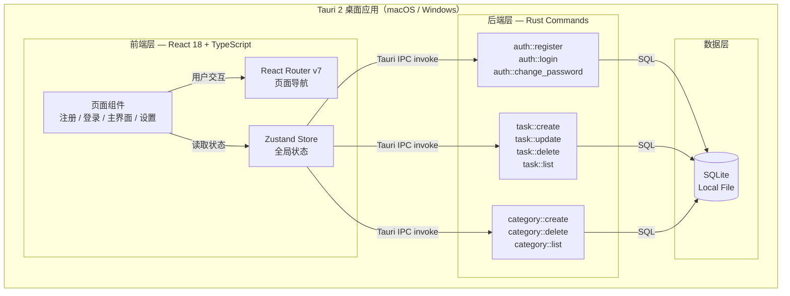

# FlowTask 技术架构概要

> 最后更新：2026/04/07
> 项目阶段：Phase 3 Step 0 — 架构设计

---

## 一、产品技术全貌

FlowTask 是一款**本地优先的个人桌面任务管理工具**，支持 macOS 和 Windows 双平台。产品核心约束如下：

- **完全本地化**：数据存储于设备本地 SQLite，无任何网络依赖
- **隐私优先**：密码加密存储，数据不离开本机
- **单人独立开发**：技术选型以简洁、开发效率优先，避免过度设计

场景复杂度评估：4 个核心场景（S01~S04），无实时推送、无后台任务、无第三方服务依赖。定性为**简单项目**，采用**单体桌面架构**。

---

## 二、系统架构

### 2.1 架构模式

**Tauri 2 桌面应用 — 前后端一体化本地架构**

```
┌─────────────────────────────────────────────────┐
│                Tauri 2 桌面应用                  │
│                                                 │
│  ┌──────────────────────┐  ┌──────────────────┐ │
│  │  前端 React + TS      │  │  后端 Rust 命令层 │ │
│  │                      │  │                  │ │
│  │  • 页面路由           │  │  • 认证命令       │ │
│  │  • UI 组件            │◄─►  • 任务 CRUD      │ │
│  │  • 状态管理 (Zustand) │  │  • 分类 CRUD      │ │
│  │  • 表单校验           │  │  • 密码 bcrypt    │ │
│  └──────────────────────┘  └────────┬─────────┘ │
│                                     │           │
│                              ┌──────▼─────────┐ │
│                              │  SQLite 数据库  │ │
│                              └────────────────┘ │
└─────────────────────────────────────────────────┘
```

### 2.2 系统架构图（Mermaid）



### 2.3 数据流说明

| 层级 | 职责 | 说明 |
|------|------|------|
| 前端 React | UI 渲染、路由跳转、表单校验、状态读写 | 所有 UI 逻辑在 TypeScript 中处理 |
| Zustand Store | 全局状态（当前用户、任务列表、分类列表） | 调用 Tauri IPC 命令，更新本地状态 |
| Tauri Rust 命令 | 数据库操作、密码 bcrypt 加密/验证 | 最小化 Rust 代码，仅处理本地存储相关 |
| SQLite | 持久化存储 | 通过 tauri-plugin-sql 管理 |

---

## 三、技术选型

| 维度 | 选型 | 版本 | 选型理由 | 备选方案 |
|------|------|------|---------|---------|
| 桌面框架 | **Tauri 2** | v2.x | 跨平台（macOS/Windows）、包体积小（~10MB vs Electron ~150MB）、系统 WebView 无需内置 Chromium | Electron（生态更成熟但包体大） |
| 前端框架 | **React 18** | v18.x | 生态最大、HTML 原型组件化迁移容易、TypeScript 支持完善 | Vue 3（模板语法更接近原型写法） |
| 语言 | **TypeScript** | v5.x | 类型安全、前端全覆盖、与现有 HTML 原型同语言体系 | JavaScript |
| 样式方案 | **Tailwind CSS** | v4.x | 与设计系统 CSS 变量对齐、工具类快速实现原型样式 | CSS Modules |
| 状态管理 | **Zustand** | v5.x | 轻量（<1KB），无模板代码，适合中小型单人项目 | Jotai、React Context |
| 路由 | **React Router** | v7.x | 声明式路由，支持路由守卫（认证跳转逻辑清晰） | TanStack Router |
| 数据库 | **SQLite** | via tauri-plugin-sql | 完全本地、零服务器、符合产品约束、需求文档明确推荐 | 本地 JSON 文件 |
| 密码加密 | **bcrypt** | Rust crate | 安全的单向哈希算法，Rust 侧原生支持，无需引入额外服务 | argon2（更安全但更复杂） |
| 构建工具 | **Vite** | v6.x | Tauri 官方默认搭配，热更新极快，开箱即用 | — |
| 包管理器 | **pnpm** | v10.x | 安装速度快，磁盘占用小 | npm、yarn |

---

## 四、数据库 Schema 概要

```sql
-- 用户表（本地单用户场景，但保留多用户结构以备扩展）
CREATE TABLE users (
    id       INTEGER PRIMARY KEY AUTOINCREMENT,
    username TEXT    NOT NULL UNIQUE,
    password TEXT    NOT NULL,  -- bcrypt hash
    created_at TEXT  NOT NULL DEFAULT (datetime('now'))
);

-- 任务分类表
CREATE TABLE categories (
    id      INTEGER PRIMARY KEY AUTOINCREMENT,
    user_id INTEGER NOT NULL REFERENCES users(id),
    name    TEXT    NOT NULL,
    UNIQUE (user_id, name)
);

-- 任务表
CREATE TABLE tasks (
    id          INTEGER PRIMARY KEY AUTOINCREMENT,
    user_id     INTEGER NOT NULL REFERENCES users(id),
    category_id INTEGER REFERENCES categories(id) ON DELETE SET NULL,
    name        TEXT    NOT NULL,
    note        TEXT,
    done        INTEGER NOT NULL DEFAULT 0,  -- 0: 未完成, 1: 已完成
    created_at  TEXT    NOT NULL DEFAULT (datetime('now')),
    updated_at  TEXT    NOT NULL DEFAULT (datetime('now'))
);
```

---

## 五、非功能性约束

### 5.1 性能目标

| 指标 | 目标值 | 说明 |
|------|--------|------|
| 应用启动时间 | < 2s | Tauri 启动 + 页面首次渲染 |
| UI 交互响应 | < 100ms | 任务增删改查、分类切换 |
| SQLite 查询 | < 50ms | 本地查询，数据量极小 |

### 5.2 安全要求

- 密码使用 **bcrypt** 单向哈希存储，cost factor = 12
- SQLite 文件存储在系统应用数据目录（`app_data_dir`），非用户可随意访问路径
- 不在任何日志中记录明文密码

### 5.3 可扩展性

- 当前定位单用户，数据库 Schema 预留 `user_id` 外键，后续可支持多用户
- 首期不做数据导入/导出，Schema 设计不引入迁移障碍

### 5.4 开发体验

| 项目 | 方案 |
|------|------|
| 本地开发 | `pnpm tauri dev`（Vite 热更新 + Tauri 应用窗口） |
| 类型检查 | TypeScript strict 模式 |
| 代码风格 | ESLint + Prettier |
| 构建打包 | `pnpm tauri build`（生成 macOS `.dmg` / Windows `.msi`） |

---

## 六、外部服务依赖

**无外部依赖。** FlowTask 完全本地化运行，不依赖任何第三方网络服务。编排测试阶段可直接调用本地 SQLite，无需 mock 策略。

---

## 七、关键架构决策记录（ADR）

### ADR-01：选择 Tauri 2 而非 Electron

- **决策**：使用 Tauri 2
- **原因**：产品面向个人用户，包体积是重要体验指标；Tauri 使用系统 WebView，安装包约 10MB，而 Electron 约 150MB。单人开发 MVP 阶段性价比更高。
- **权衡**：Tauri 后端需要 Rust，但 FlowTask 的 Rust 代码极少（仅 SQLite 操作和 bcrypt），前端 TypeScript 承担绝大部分业务逻辑。

### ADR-02：业务逻辑放在前端 TypeScript 而非 Rust

- **决策**：Rust Commands 仅做数据库读写和密码哈希，所有业务逻辑（表单校验、状态管理、路由控制）放在 TypeScript 层
- **原因**：降低 Rust 代码量，让熟悉 TypeScript 的开发者可快速实现；SQLite 操作本身无复杂逻辑，Rust 只需透传 SQL 即可。

### ADR-03：使用 Zustand 而非 Redux

- **决策**：使用 Zustand
- **原因**：FlowTask 状态模型简单（用户信息、任务列表、分类列表），Redux 的模板代码对单人小项目是过度设计。Zustand 5 行代码即可定义一个 store。
