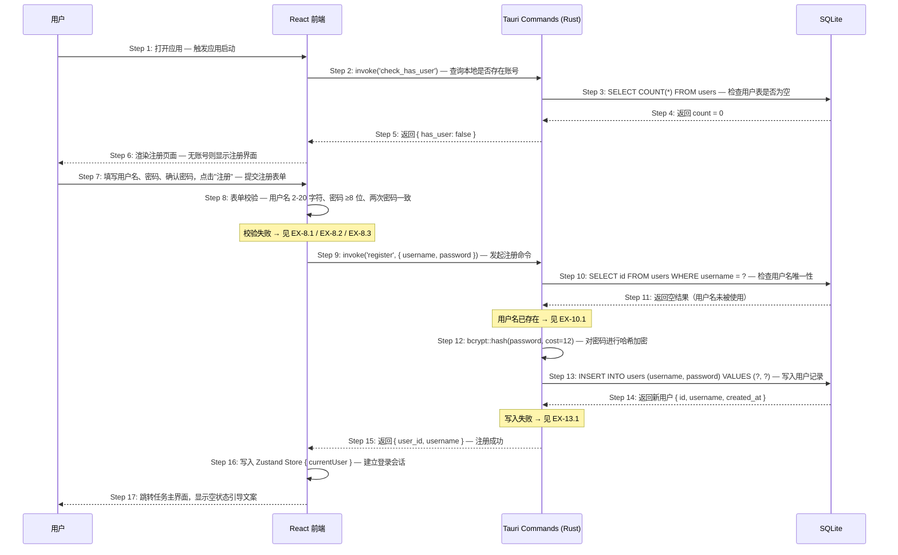

# S01: 新用户注册并开始使用 — 时序图

> Phase 1 优先级：P0
> 涉及页面：注册页 → 任务主界面
> 参与方：用户 / React 前端 / Tauri Rust 命令层 / SQLite

---

## 时序图

---

## 步骤说明

1. **用户**打开 FlowTask 桌面应用。
2. **React 前端**调用 `invoke('check_has_user')`，询问 Rust 命令层本地是否已有账号。
3. **Tauri Rust 命令层**向 SQLite 发起查询：`SELECT COUNT(*) FROM users`。
4. **SQLite** 返回 `count = 0`，表明尚无本地账号。
5. **Rust 命令层**返回 `{ has_user: false }` 给前端。
6. **React 前端**根据返回值渲染注册页面（有账号则显示登录页）。
7. **用户**填写用户名、密码、确认密码，点击"注册"按钮。
8. **React 前端**执行客户端表单校验：用户名 2-20 字符、密码 ≥8 位、两次密码一致。校验失败则在输入框下方显示错误提示，不调用后端命令。→ 见 EX-8.1 / EX-8.2 / EX-8.3
9. **React 前端**调用 `invoke('register', { username, password })`，将原始密码传给 Rust 命令层（IPC 通信在进程内完成，不经过网络）。
10. **Rust 命令层**向 SQLite 查询该用户名是否已存在：`SELECT id FROM users WHERE username = ?`。
11. **SQLite** 返回空结果，确认用户名可用。→ 见 EX-10.1（用户名已存在）
12. **Rust 命令层**使用 bcrypt 对密码进行单向哈希（cost factor = 12），原始密码不落盘。
13. **Rust 命令层**将用户名和密码哈希写入数据库：`INSERT INTO users (username, password) VALUES (?, ?)`。→ 见 EX-13.1（写入失败）
14. **SQLite** 返回新创建的用户记录（含 id、username、created_at）。
15. **Rust 命令层**将 `{ user_id, username }` 返回给前端。
16. **React 前端**将当前用户信息写入 Zustand Store，建立本地登录会话（无需 Token，桌面应用内存状态管理）。
17. **React 前端**跳转至任务主界面，任务列表为空，显示引导文案"还没有任务，点击 + 开始添加"。

---

## 异常用例

### EX-8.1: 用户名为空或不符合长度要求

- **触发条件**：Step 8 校验时，用户名为空，或长度不在 2-20 字符范围内
- **期望响应**：用户名输入框下方显示对应错误提示；若为空则显示"用户名不能为空"；若长度不符则显示"用户名需为 2-20 个字符"
- **副作用**：不调用 `invoke('register')`，焦点回到用户名输入框

### EX-8.2: 密码少于 8 位

- **触发条件**：Step 8 校验时，密码字段长度 < 8
- **期望响应**：密码输入框下方显示"密码至少需要 8 位字符"
- **副作用**：不调用 `invoke('register')`

### EX-8.3: 两次密码不一致

- **触发条件**：Step 8 校验时，密码与确认密码字段值不相同
- **期望响应**：确认密码输入框下方显示"两次输入的密码不一致"
- **副作用**：不调用 `invoke('register')`

### EX-10.1: 用户名已被使用

- **触发条件**：Step 10 查询返回非空结果，该用户名已存在于 users 表
- **期望响应**：Rust 命令层返回错误 `{ code: "USERNAME_EXISTS" }`；前端在用户名输入框下方显示"该用户名已被使用，请换一个"
- **副作用**：不执行 bcrypt 哈希，不写入数据库

### EX-13.1: 数据库写入失败

- **触发条件**：Step 13 的 INSERT 操作失败（如磁盘空间不足、数据库锁定）
- **期望响应**：Rust 命令层返回错误 `{ code: "DB_WRITE_ERROR" }`；前端显示通用错误提示"注册失败，请重试"
- **副作用**：不创建任何记录，用户停留在注册页
