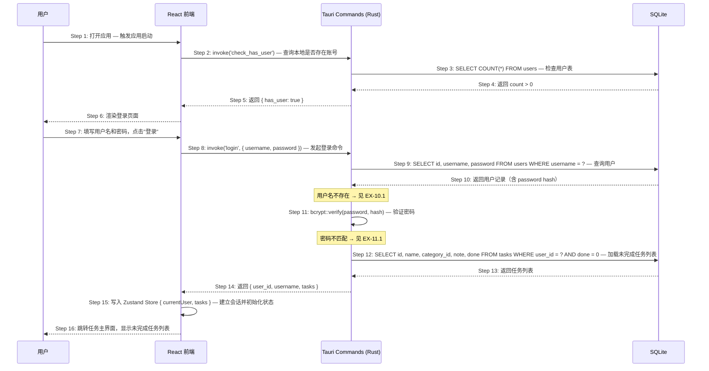
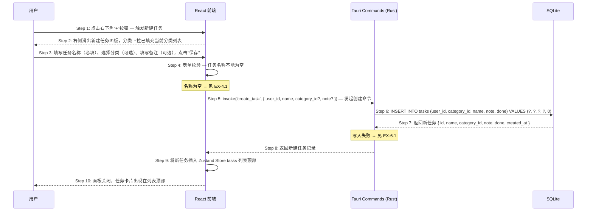
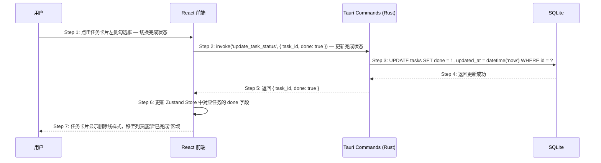
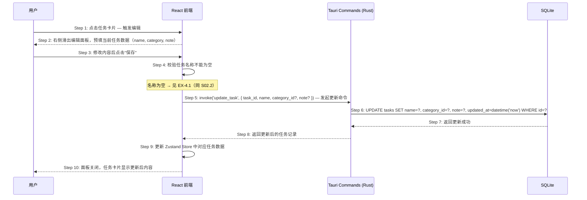
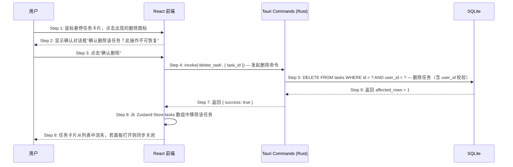

# S02: 用户登录并管理当日任务 — 时序图

> Phase 1 优先级：P0
> 涉及页面：登录页 → 任务主界面（含任务面板）
> 参与方：用户 / React 前端 / Tauri Rust 命令层 / SQLite

本场景包含三个子场景：

- **S02.1** 用户登录
- **S02.2** 创建任务
- **S02.3** 完成 / 编辑 / 删除任务

---

## S02.1: 用户登录

### 时序图

### 步骤说明

1. **用户**打开 FlowTask 桌面应用。
2. **React 前端**调用 `invoke('check_has_user')` 检测本地是否存在账号。
3. **Rust 命令层**查询 SQLite：`SELECT COUNT(*) FROM users`。
4. **SQLite** 返回 `count > 0`，本地有账号数据。
5. **Rust 命令层**返回 `{ has_user: true }`。
6. **React 前端**渲染登录页面。
7. **用户**填写用户名和密码，点击"登录"。
8. **React 前端**调用 `invoke('login', { username, password })`。
9. **Rust 命令层**按用户名查询用户记录。
10. **SQLite** 返回用户记录（含 bcrypt 哈希）。→ 见 EX-10.1（用户名不存在）
11. **Rust 命令层**调用 `bcrypt::verify` 验证密码。→ 见 EX-11.1（密码错误）
12. **Rust 命令层**顺带加载该用户的未完成任务列表（减少前端启动时的二次 invoke）。
13. **SQLite** 返回任务列表。
14. **Rust 命令层**将 `{ user_id, username, tasks }` 返回给前端。
15. **React 前端**写入 Zustand Store，完成会话初始化。
16. **React 前端**跳转任务主界面，渲染未完成任务列表。

### 异常用例

#### EX-10.1: 用户名不存在

- **触发条件**：Step 10 的 SELECT 查询返回空结果
- **期望响应**：Rust 命令层返回 `{ code: "INVALID_CREDENTIALS" }`（不区分用户名错误/密码错误，避免信息泄露）；前端在密码输入框下方显示"用户名或密码错误"，密码框清空，焦点回到密码框
- **副作用**：不创建会话，不跳转页面

#### EX-11.1: 密码验证失败

- **触发条件**：Step 11 的 `bcrypt::verify` 返回 false
- **期望响应**：同 EX-10.1，返回 `{ code: "INVALID_CREDENTIALS" }`；前端显示"用户名或密码错误"，密码框清空
- **副作用**：不创建会话，不跳转页面

---

## S02.2: 创建任务

### 时序图

### 步骤说明

1. **用户**点击任务主界面右下角"+"浮动按钮。
2. **React 前端**从右侧滑出新建任务面板；分类下拉从 Zustand Store 读取当前分类列表（无需额外 invoke）。
3. **用户**填写表单后点击"保存"。
4. **React 前端**校验任务名称不能为空。→ 见 EX-4.1
5. **React 前端**调用 `invoke('create_task', { user_id, name, category_id, note })`，`category_id` 为 null 表示无分类。
6. **Rust 命令层**执行 INSERT，`done` 字段默认为 0（未完成）。→ 见 EX-6.1（写入失败）
7. **SQLite** 返回新任务完整记录。
8. **Rust 命令层**将新任务返回给前端。
9. **React 前端**将新任务追加到 Zustand Store `tasks` 数组头部（不重新拉取全量列表）。
10. **React 前端**关闭面板，新任务卡片出现在列表顶部。

### 异常用例

#### EX-4.1: 任务名称为空

- **触发条件**：Step 4 校验时任务名称输入框为空字符串
- **期望响应**：任务名称输入框下方显示"任务名称不能为空"，输入框边框变红，面板不关闭
- **副作用**：不调用 `invoke('create_task')`

#### EX-6.1: 数据库写入失败

- **触发条件**：Step 6 的 INSERT 操作失败
- **期望响应**：Rust 命令层返回 `{ code: "DB_WRITE_ERROR" }`；前端在面板内显示"保存失败，请重试"
- **副作用**：任务未创建，面板保持打开

---

## S02.3: 完成 / 编辑 / 删除任务

### S02.3a: 标记任务完成

**步骤说明：**

1. **用户**点击任务卡片左侧圆形勾选框。
2. **React 前端**调用 `invoke('update_task_status', { task_id, done: true })`。
3. **Rust 命令层**执行 `UPDATE tasks SET done = 1`，同步更新 `updated_at`。
4. **SQLite** 返回更新成功。
5. **Rust 命令层**返回 `{ task_id, done: true }` 给前端。
6. **React 前端**更新 Zustand Store 中对应任务对象的 `done` 字段（局部更新，不重拉列表）。
7. **React 前端**重新渲染，任务卡片显示删除线，移动至"已完成"区域。

> 点击已完成任务的勾选框可取消完成（`done: false`），流程完全对称，`done` 值取反即可。

---

### S02.3b: 编辑任务

**步骤说明：**

1. **用户**点击任务卡片主体区域（非勾选框、非删除图标）。
2. **React 前端**从 Zustand Store 读取该任务数据，滑出编辑面板并预填字段。
3. **用户**修改内容后点击"保存"。
4. **React 前端**校验名称非空。→ 见 EX-4.1
5. **React 前端**调用 `invoke('update_task', { task_id, name, category_id, note })`。
6. **Rust 命令层**执行 UPDATE，同步更新 `updated_at`。
7. **SQLite** 返回成功。
8. **Rust 命令层**返回更新后的任务完整记录。
9. **React 前端**局部更新 Zustand Store 中该任务对象。
10. **React 前端**关闭面板，任务卡片呈现更新后的内容。

---

### S02.3c: 删除任务

**步骤说明：**

1. **用户**鼠标悬停任务卡片，卡片右侧出现删除图标，点击删除图标。
2. **React 前端**弹出确认对话框，明确告知操作不可恢复。
3. **用户**确认删除（点击"确认删除"；若点击"取消"则关闭对话框，不执行任何操作）。
4. **React 前端**调用 `invoke('delete_task', { task_id })`。
5. **Rust 命令层**执行 DELETE，WHERE 条件同时包含 `user_id` 防止越权删除。
6. **SQLite** 返回 `affected_rows = 1`，确认删除成功。→ 见 EX-6.1（任务不存在）
7. **Rust 命令层**返回 `{ success: true }`。
8. **React 前端**从 Zustand Store 的 `tasks` 数组中过滤掉该任务（不重新拉取全量列表）。
9. **React 前端**重新渲染，任务从界面消失；若当前编辑面板展示的正是被删除的任务，面板同步关闭。

### 异常用例（S02.3c）

#### EX-6.1: 任务不存在（并发场景）

- **触发条件**：Step 6 的 DELETE 返回 `affected_rows = 0`（任务已被其他操作删除，极少发生）
- **期望响应**：Rust 命令层返回 `{ code: "TASK_NOT_FOUND" }`；前端静默处理，从 Store 中移除该任务（结果一致）
- **副作用**：无，状态最终一致
