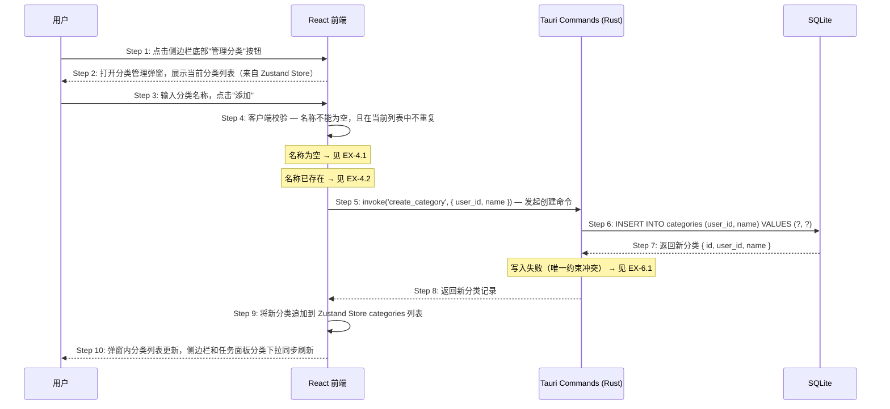
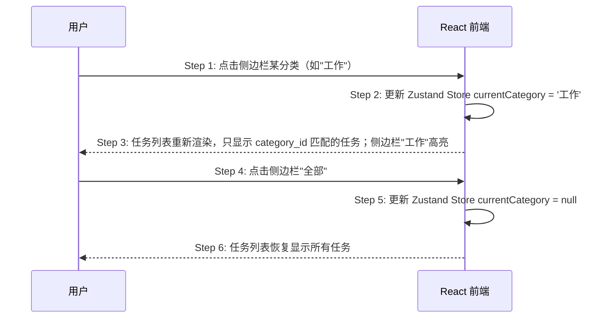
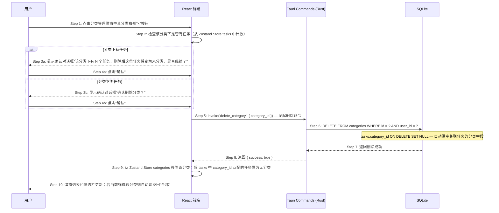

# S03: 用户按分类整理任务 — 时序图

> Phase 1 优先级：P1
> 涉及页面：任务主界面（分类侧边栏 + 分类管理弹窗）
> 参与方：用户 / React 前端 / Tauri Rust 命令层 / SQLite

本场景包含三个子流程：

- **S03.1** 创建分类
- **S03.2** 按分类筛选任务（纯前端，无后端调用）
- **S03.3** 删除分类

---

## S03.1: 创建分类

### 时序图

### 步骤说明

1. **用户**点击侧边栏底部"管理分类"按钮。
2. **React 前端**打开分类管理弹窗，分类列表直接从 Zustand Store 读取（无需额外 invoke）。
3. **用户**在输入框内填写分类名称，点击"添加"。
4. **React 前端**执行客户端校验：名称不能为空，且 Zustand Store 中不存在同名分类（快速响应，避免不必要的后端调用）。→ 见 EX-4.1 / EX-4.2
5. **React 前端**调用 `invoke('create_category', { user_id, name })`。
6. **Rust 命令层**执行 INSERT，数据库层有 `UNIQUE(user_id, name)` 约束作为最终保障。→ 见 EX-6.1
7. **SQLite** 返回新分类记录（含自增 id）。
8. **Rust 命令层**返回新分类给前端。
9. **React 前端**将新分类追加到 Zustand Store 的 `categories` 数组。
10. **React 前端**触发重渲染：弹窗列表、侧边栏分类列表、任务创建/编辑面板的分类下拉全部同步更新。

### 异常用例

#### EX-4.1: 分类名称为空

- **触发条件**：Step 4 校验时输入框为空字符串
- **期望响应**：输入框下方显示"分类名称不能为空"
- **副作用**：不调用 `invoke('create_category')`

#### EX-4.2: 分类名称已存在（客户端检测）

- **触发条件**：Step 4 校验时，Zustand Store `categories` 中已有同名分类
- **期望响应**：显示"该分类名称已存在"
- **副作用**：不调用 `invoke('create_category')`

#### EX-6.1: 数据库唯一约束冲突

- **触发条件**：Step 6 的 INSERT 违反 `UNIQUE(user_id, name)` 约束（理论上客户端已拦截，此处为双重保障）
- **期望响应**：Rust 命令层返回 `{ code: "CATEGORY_EXISTS" }`；前端显示"该分类名称已存在"
- **副作用**：不创建分类

---

## S03.2: 按分类筛选任务

### 时序图

### 步骤说明

1. **用户**点击侧边栏某分类。
2. **React 前端**更新 Zustand Store 的 `currentCategory` 字段。

> 分类筛选是纯客户端操作——任务已在登录时全量加载到 Store，筛选只是前端过滤，无需调用后端。这也意味着任务数量在极端情况下（数千条）可能有性能问题，但个人任务管理场景不会触及此上限。

3. **React 前端**根据 `currentCategory` 对 `tasks` 数组做 filter，重渲染任务列表；侧边栏对应分类高亮。
4. **用户**点击"全部"。
5. **React 前端**将 `currentCategory` 置为 null。
6. **React 前端**恢复显示所有任务。

---

## S03.3: 删除分类

### 时序图

### 步骤说明

1. **用户**点击分类管理弹窗中某分类右侧的删除按钮"×"。
2. **React 前端**从 Zustand Store 中统计该 `category_id` 下的任务数量。
3. **React 前端**根据任务数量显示不同措辞的确认对话框（有任务时需明确告知后果）。
4. **用户**点击"确认"。（点击"取消"则关闭对话框，不执行删除）
5. **React 前端**调用 `invoke('delete_category', { category_id })`。
6. **Rust 命令层**执行 DELETE；SQLite Schema 已设置 `tasks.category_id ON DELETE SET NULL`，删除分类后关联任务的 `category_id` 自动置为 NULL。
7. **SQLite** 返回删除成功。
8. **Rust 命令层**返回 `{ success: true }`。
9. **React 前端**从 Zustand Store `categories` 数组移除该分类；同时遍历 `tasks`，将 `category_id` 匹配的任务的 `category_id` 置为 null（与数据库行为保持一致）。
10. **React 前端**重渲染：弹窗列表、侧边栏更新；若当前正在按该分类筛选，自动切换回"全部"。

### 异常用例

#### EX-6.1: 分类不存在（并发场景）

- **触发条件**：Step 6 的 DELETE 返回 `affected_rows = 0`
- **期望响应**：Rust 命令层返回 `{ code: "CATEGORY_NOT_FOUND" }`；前端静默处理，从 Store 中移除该分类（结果一致）
- **副作用**：无
