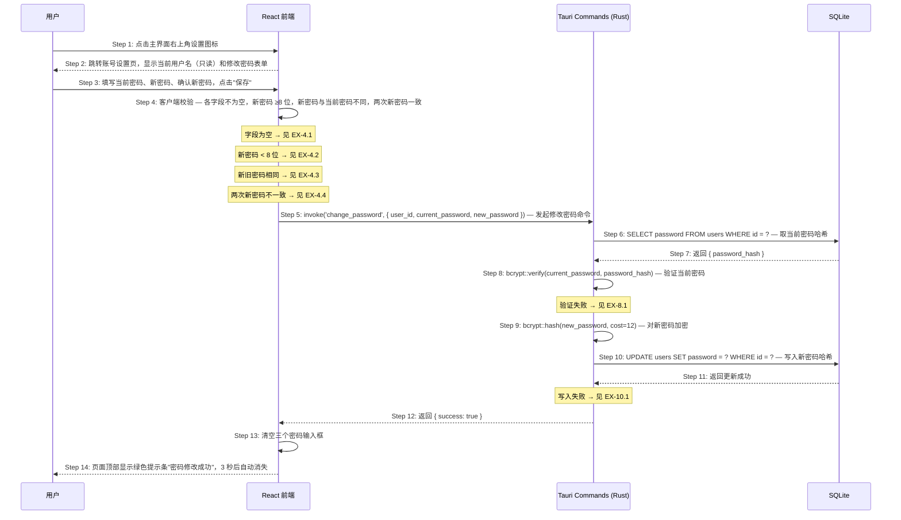

# S04: 用户修改账号密码 — 时序图

> Phase 1 优先级：P1
> 涉及页面：账号设置页（从主界面设置图标进入）
> 参与方：用户 / React 前端 / Tauri Rust 命令层 / SQLite

---

## 时序图

---

## 步骤说明

1. **用户**点击任务主界面右上角设置图标（⚙）。
2. **React 前端**跳转至账号设置页；当前用户名从 Zustand Store 读取并只读展示，无需额外 invoke。
3. **用户**填写当前密码、新密码、确认新密码，点击"保存修改"。
4. **React 前端**执行客户端四项校验：字段完整性、新密码长度、新旧密码不同、两次新密码一致。任一失败则在对应输入框下方显示错误提示，不调用后端。→ 见 EX-4.1 ~ EX-4.4

> 新旧密码相同的检查放在客户端，避免一次无意义的 bcrypt 计算（bcrypt 是 CPU 密集型操作）。

5. **React 前端**调用 `invoke('change_password', { user_id, current_password, new_password })`，其中 `user_id` 来自 Zustand Store 的当前会话。
6. **Rust 命令层**按 `user_id` 查询当前密码哈希：`SELECT password FROM users WHERE id = ?`。
7. **SQLite** 返回 `{ password_hash }`。
8. **Rust 命令层**调用 `bcrypt::verify(current_password, password_hash)` 验证当前密码是否正确。→ 见 EX-8.1（验证失败）
9. **Rust 命令层**对新密码进行 bcrypt 哈希（cost = 12），原始新密码不落盘。
10. **Rust 命令层**执行 `UPDATE users SET password = new_hash WHERE id = ?`。→ 见 EX-10.1（写入失败）
11. **SQLite** 返回更新成功（`affected_rows = 1`）。
12. **Rust 命令层**返回 `{ success: true }` 给前端。
13. **React 前端**清空三个密码输入框，重置显示/隐藏状态。
14. **React 前端**在页面顶部显示绿色成功提示条"密码修改成功"，3 秒后自动消失；当前登录会话保持不变（不强制重新登录）。

---

## 异常用例

### EX-4.1: 必填字段为空

- **触发条件**：Step 4 校验时，当前密码、新密码或确认新密码中有任一字段为空
- **期望响应**：对应输入框下方显示"请输入当前密码" / "请输入新密码" / "请输入确认密码"
- **副作用**：不调用 `invoke('change_password')`

### EX-4.2: 新密码不符合长度要求

- **触发条件**：Step 4 校验时，新密码字段长度 < 8
- **期望响应**：新密码输入框下方显示"密码至少需要 8 位字符"
- **副作用**：不调用 `invoke('change_password')`

### EX-4.3: 新密码与当前密码相同

- **触发条件**：Step 4 校验时，新密码字段值与当前密码字段值完全相同
- **期望响应**：新密码输入框下方显示"新密码不能与当前密码相同"
- **副作用**：不调用 `invoke('change_password')`

### EX-4.4: 两次新密码不一致

- **触发条件**：Step 4 校验时，新密码与确认新密码字段值不相同
- **期望响应**：确认新密码输入框下方显示"两次输入的密码不一致"
- **副作用**：不调用 `invoke('change_password')`

### EX-8.1: 当前密码验证失败

- **触发条件**：Step 8 的 `bcrypt::verify` 返回 false（当前密码输入错误）
- **期望响应**：Rust 命令层返回 `{ code: "WRONG_PASSWORD" }`；前端在当前密码输入框下方显示"当前密码不正确"，当前密码输入框清空，焦点回到当前密码框
- **副作用**：不执行新密码哈希，不更新数据库

### EX-10.1: 数据库写入失败

- **触发条件**：Step 10 的 UPDATE 操作失败（如磁盘空间不足）
- **期望响应**：Rust 命令层返回 `{ code: "DB_WRITE_ERROR" }`；前端显示通用错误提示"保存失败，请重试"
- **副作用**：密码未更新，当前密码仍然有效
