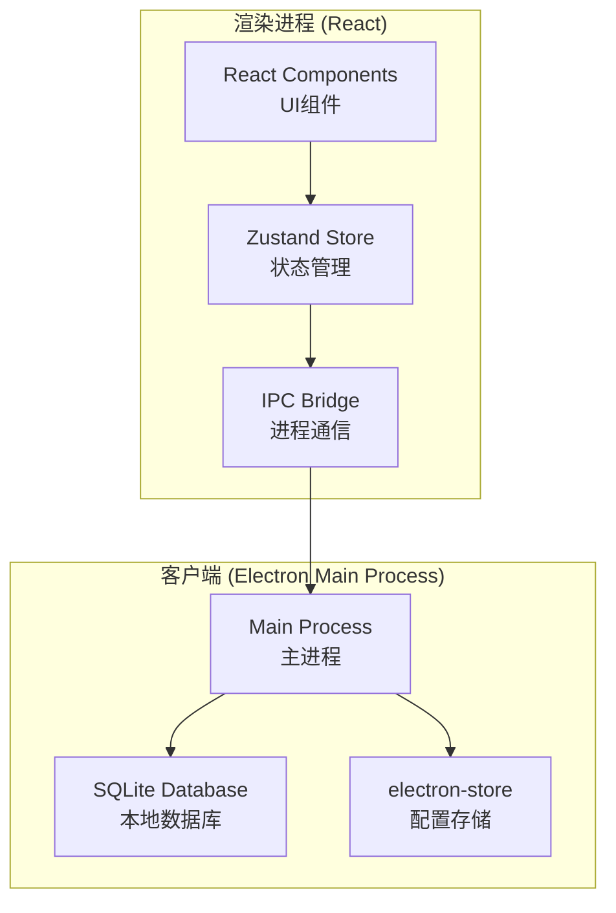

# 技术架构设计

> 最后更新：2026-04-09

## 一、系统架构概览

### 1.1 项目定位

轻记账是一款面向职场人群的轻量级桌面记账工具，用于快速记录日常开销并查看消费统计。

### 1.2 技术选型

| 维度 | 选型 | 理由 |
|------|------|------|
| 框架 | Electron 41 | 桌面应用开发首选，跨平台（Windows/macOS），生态成熟 |
| 前端 | React 18 + TypeScript | 组件化开发，类型安全，生态丰富 |
| 构建工具 | Vite | 快速启动，热更新快，配置简单 |
| UI组件 | 自定义组件 + Tailwind CSS | 轻量灵活，满足桌面端交互需求 |
| 状态管理 | Zustand | 轻量、简单、适合中小型应用 |
| 本地存储 | SQLite (better-sqlite3) | 嵌入式数据库，无需额外服务，Electron 原生支持 |
| 打包工具 | electron-builder | 一键打包 Windows/macOS 安装包 |

### 1.3 系统架构图



### 1.4 项目结构

```
money-log/
├── src/
│   ├── main/                 # Electron 主进程
│   │   ├── index.ts          # 入口文件
│   │   ├── database.ts      # SQLite 操作
│   │   ├── ipc.ts           # IPC 处理器
│   │   └── store.ts         # 配置存储
│   ├── renderer/             # React 渲染进程
│   │   ├── App.tsx          # 根组件
│   │   ├── components/      # UI 组件
│   │   ├── pages/           # 页面组件
│   │   ├── stores/          # Zustand 状态
│   │   ├── hooks/           # 自定义 Hooks
│   │   └── styles/          # 样式文件
│   └── preload/             # 预加载脚本
│       └── index.ts
├── resources/                # 静态资源
│   └── icons/
├── electron-builder.json     # 打包配置
├── package.json
├── tsconfig.json
├── vite.config.ts
└── tailwind.config.js
```

---

## 二、非功能性约束

### 2.1 性能目标

- 应用启动时间：< 3 秒
- 记账操作响应：< 100ms
- 统计页面加载：< 500ms（1000条记录内）

### 2.2 安全要求

- 数据库文件存储在用户目录，文件级加密
- 密码使用 SHA-256 + salt 哈希存储
- 敏感操作需要密码确认

### 2.3 可扩展性

- 支持后续增加数据导出功能
- 支持多语言（中文/英文）
- 预留主题切换接口（浅色/深色）

### 2.4 开发体验

- TypeScript 严格模式
- ESLint + Prettier 代码规范
- 热更新开发

---

## 三、数据模型

### 3.1 核心实体

| 实体 | 说明 |
|------|------|
| Record | 记账记录（金额、分类、时间、备注） |
| Category | 支出分类（预设 + 自定义） |
| Settings | 用户设置（密码锁配置等） |

### 3.2 数据库表结构

```sql
-- 记账记录表
CREATE TABLE records (
    id INTEGER PRIMARY KEY AUTOINCREMENT,
    amount REAL NOT NULL,
    category_id INTEGER NOT NULL,
    created_at TEXT NOT NULL,
    remark TEXT,
    FOREIGN KEY (category_id) REFERENCES categories(id)
);

-- 分类表
CREATE TABLE categories (
    id INTEGER PRIMARY KEY AUTOINCREMENT,
    name TEXT NOT NULL UNIQUE,
    icon TEXT,
    is_default INTEGER DEFAULT 0,
    created_at TEXT NOT NULL
);

-- 设置表
CREATE TABLE settings (
    key TEXT PRIMARY KEY,
    value TEXT NOT NULL
);
```

---

## 四、外部依赖与测试策略

本项目为桌面端纯本地应用，无外部服务依赖（无 API 调用、无第三方登录），测试策略如下：

| 场景 | 策略 |
|------|------|
| 记账功能 | 直接测试 SQLite 写入/读取 |
| 统计功能 | 构造测试数据验证聚合计算 |
| 分类管理 | 测试 CRUD 操作及约束 |
| 密码锁 | 测试哈希验证、数据清除 |

---

## 五、后续步骤

架构设计完成后，进入 **Phase 3-1 · 场景建模**，绘制时序图确定各场景的参与方和交互流程。
