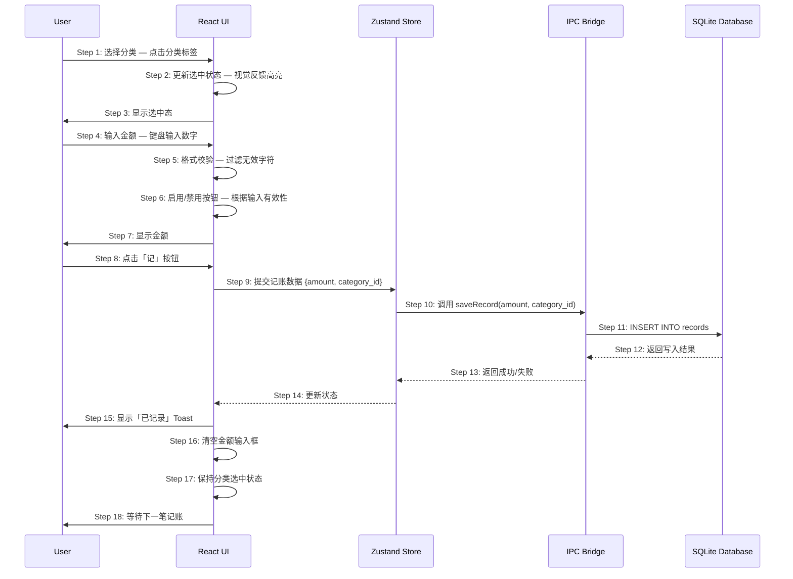

# S01: 快速记账 — 时序图

## 场景概述

| 属性 | 值 |
|------|-----|
| 场景编号 | S01 |
| 场景名称 | 快速记账 |
| 触发条件 | 用户打开 App 记账入口 |
| 用户价值 | 3 秒内完成一笔记账，无心理负担 |
| 优先级 | P0 |

## 时序图

## 步骤说明

1. **用户**点击分类标签（如「餐饮」）。
2. **React UI**更新选中状态，在视觉上高亮当前分类。
3. **UI**向用户显示选中态反馈。

4. **用户**通过键盘输入金额。
5. **React UI**对输入进行格式校验，过滤非数字和小数点以外的字符。
6. **React UI**根据输入有效性启用或禁用「记」按钮（未选分类或金额为0时禁用）。
7. **UI**实时显示用户输入的金额。

8. **用户**点击「记」按钮提交记账。
9. **Zustand Store**接收记账数据 `{amount, category_id}`。
10. **Store**通过 IPC 调用主进程的 `saveRecord` 方法。
11. **SQLite Database**执行 INSERT 语句写入记录。
12. **数据库**返回写入结果（成功或错误）。
13. **IPC**将结果返回给 Store。
14. **Store**更新状态，通知 UI。
15. **UI**显示「已记录 ✓」Toast 提示。

16. **React UI**清空金额输入框，方便用户继续下一笔。
17. **React UI**保持分类选中状态，减少重复选择。
18. **UI**进入等待状态，用户可以继续输入下一笔。

> 保持分类选中是为了让用户连续记账时无需重复选择，提升操作效率。

## 异常用例

### EX-8.1: 按钮禁用时点击

- **触发条件**：用户未选择分类或金额为0时点击「记」按钮
- **期望响应**：按钮不触发提交，或点击后 Toast 提示「请选择分类」/「请输入有效金额」
- **副作用**：无数据写入

### EX-8.2: 金额格式错误

- **触发条件**：用户在金额输入框输入非数字字符（如「abc」）或负数
- **期望响应**：输入框拒绝显示无效字符，或自动过滤
- **副作用**：无

### EX-11.1: 数据库写入失败

- **触发条件**：SQLite 写入操作失败（如磁盘空间不足、权限问题）
- **期望响应**：显示错误 Toast「保存失败，请重试」
- **副作用**：数据未写入，用户需重新输入

### EX-11.2: 金额精度问题

- **触发条件**：输入金额超过两位小数（如「12.345」）
- **期望响应**：自动截断为两位小数（12.34）
- **副作用**：无
