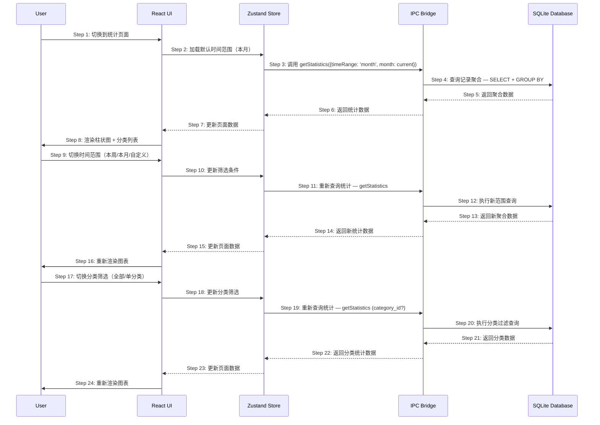

# S02: 查看统计报表 — 时序图

## 场景概述

| 属性 | 值 |
|------|-----|
| 场景编号 | S02 |
| 场景名称 | 查看统计报表 |
| 触发条件 | 用户点击「统计」入口进入统计页面 |
| 用户价值 | 快速了解某段时间内各类别的支出汇总 |
| 优先级 | P0 |

## 时序图

## 步骤说明

1. **用户**点击「统计」Tab 切换到统计页面。
2. **Zustand Store**加载默认时间范围（本月）和当前月份。
3. **Store**调用 IPC 的 `getStatistics` 方法，传入 `{timeRange: 'month', month: current}`。
4. **SQLite Database**执行聚合查询，按日期和分类分组统计支出。
5. **数据库**返回聚合数据（每日支出、分类汇总、总计）。
6. **IPC**将统计数据返回给 Store。
7. **Store**更新状态，通知 UI 重新渲染。
8. **UI**渲染柱状图（显示每日支出趋势）和分类列表（显示各分类金额和占比）。

9. **用户**切换时间范围（本周/本月/自定义）。
10. **React UI**更新筛选条件（时间范围）。
11. **Store**重新调用 `getStatistics` 方法获取新数据。
12. **SQLite Database**执行新时间范围的聚合查询。
13. **数据库**返回新聚合数据。
14. **IPC**返回新统计数据。
15. **Store**更新状态，UI 重新渲染图表和列表。

> 时间范围切换时，分类筛选保持不变，让用户可以同时调整多个筛选条件。

17. **用户**切换分类筛选（全部/某个分类）。
18. **React UI**更新分类筛选条件。
19. **Store**重新调用 `getStatistics`，传入 `category_id` 参数。
20. **SQLite Database**执行带分类过滤的查询。
21. **数据库**返回分类数据。
22. **IPC**返回分类统计数据。
23. **Store**更新状态，UI 重新渲染。

## 异常用例

### EX-1.1: 首次访问无数据

- **触发条件**：用户首次使用 App，没有任何记账记录
- **期望响应**：显示空状态图 + 文字提示「该时间段暂无记录，开始记账吧」
- **副作用**：无

### EX-4.1: 查询超时

- **触发条件**：数据库查询耗时过长（数据量大于10000条）
- **期望响应**：显示加载状态，加载完成后显示结果
- **副作用**：无

### EX-4.2: 数据库错误

- **触发条件**：SQLite 查询失败
- **期望响应**：显示错误提示「加载失败，请重试」
- **副作用**：无数据展示

### EX-9.1: 自定义时间范围无效

- **触发条件**：用户选择自定义时间，但结束日期早于开始日期
- **期望响应**：提示「结束日期不能早于开始日期」
- **副作用**：不执行查询
