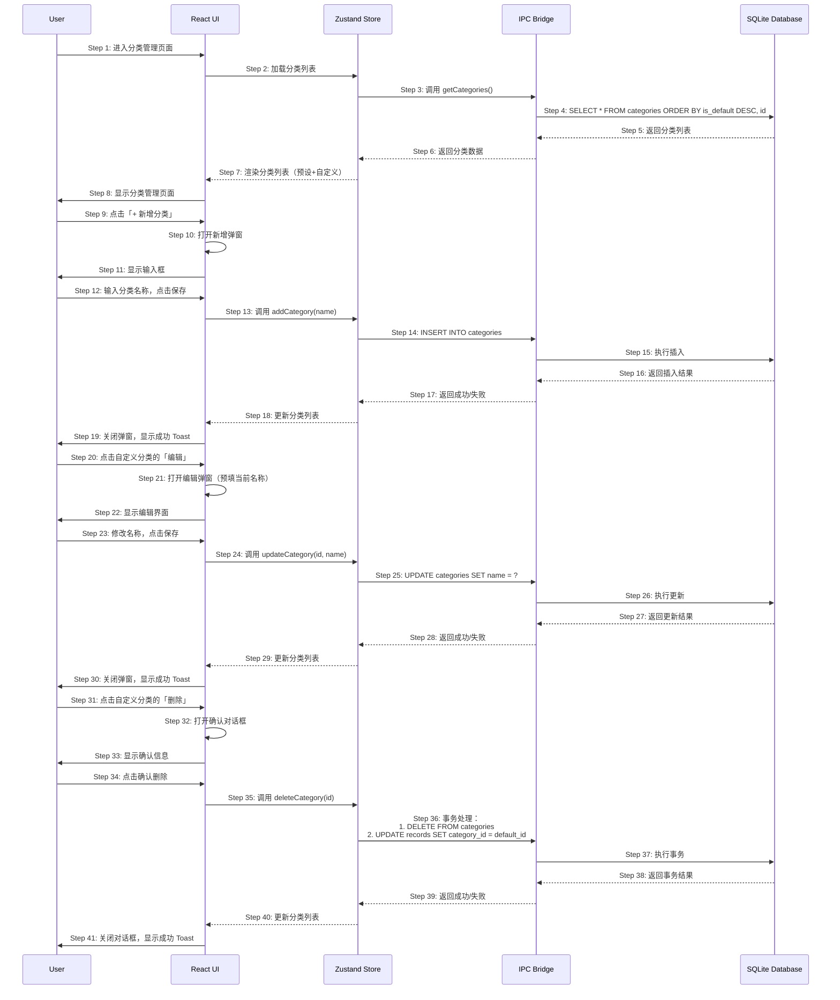

# S03: 管理支出分类 — 时序图

## 场景概述

| 属性 | 值 |
|------|-----|
| 场景编号 | S03 |
| 场景名称 | 管理支出分类 |
| 触发条件 | 用户在设置页进入「分类管理」 |
| 用户价值 | 自定义符合个人消费习惯的分类 |
| 优先级 | P1 |

## 时序图

## 步骤说明

1. **用户**进入分类管理页面。
2. **Zustand Store**触发加载分类列表。
3. **Store**调用 IPC 的 `getCategories()` 方法。
4. **SQLite Database**查询所有分类，按预设优先排序返回。
5. **数据库**返回分类列表数据。
6. **IPC**返回分类数据给 Store。
7. **Store**更新状态，UI 渲染分类列表。
8. **UI**显示分类管理页面，区分预设分类（不可删除）和自定义分类。

> 预设分类按 id 排序，自定义分类按创建时间排序。

9. **用户**点击「+ 新增分类」按钮。
10. **React UI**打开新增弹窗。
11. **UI**显示输入框，提示用户输入分类名称。

12. **用户**输入分类名称，点击保存。
13. **Zustand Store**调用 `addCategory(name)` 方法。
14. **IPC**执行 INSERT 语句插入新分类。
15. **SQLite Database**执行插入操作。
16. **数据库**返回插入结果（成功或错误，如名称重复）。
17. **IPC**返回成功/失败给 Store。
18. **Store**更新分类列表状态。
19. **UI**关闭弹窗，显示成功 Toast「分类已添加」。

20. **用户**点击自定义分类的「编辑」按钮。
21. **React UI**打开编辑弹窗，预填当前分类名称。
22. **UI**显示编辑界面。

23. **用户**修改名称，点击保存。
24. **Zustand Store**调用 `updateCategory(id, name)` 方法。
25. **IPC**执行 UPDATE 语句更新分类名称。
26. **SQLite Database**执行更新操作。
27. **数据库**返回更新结果。
28. **IPC**返回成功/失败。
29. **Store**更新分类列表。
30. **UI**关闭弹窗，显示成功 Toast。

31. **用户**点击自定义分类的「删除」按钮。
32. **React UI**打开确认对话框。
33. **UI**显示确认信息「确定要删除分类 X 吗？删除后，该分类下的记录将归入其他分类」。

34. **用户**点击确认删除。
35. **Zustand Store**调用 `deleteCategory(id)` 方法。
36. **IPC**执行事务：首先删除分类，然后将该分类下的记录归属改为「其他」。
37. **SQLite Database**执行事务操作。
38. **数据库**返回事务结果。
39. **IPC**返回成功/失败。
40. **Store**更新分类列表。
41. **UI**关闭对话框，显示成功 Toast「分类已删除」。

## 异常用例

### EX-12.1: 分类名称为空

- **触发条件**：用户提交空分类名称
- **期望响应**：弹窗内显示「请输入分类名称」
- **副作用**：不执行插入

### EX-12.2: 分类名称重复

- **触发条件**：用户输入的分类名已存在
- **期望响应**：弹窗内显示「分类名已存在」
- **副作用**：不执行插入

### EX-12.3: 预设分类不可删除

- **触发条件**：用户尝试删除预设分类
- **期望响应**：删除按钮不存在或不可点击
- **副作用**：无

### EX-36.1: 删除失败（有关联记录）

- **触发条件**：数据库事务执行失败
- **期望响应**：显示错误 Toast「删除失败，请重试」
- **副作用**：事务回滚，数据不变

### EX-36.2: 默认分类不可删除

- **触发条件**：用户尝试删除最后一个预设分类
- **期望响应**：显示提示「系统预设分类不可删除」
- **副作用**：无
