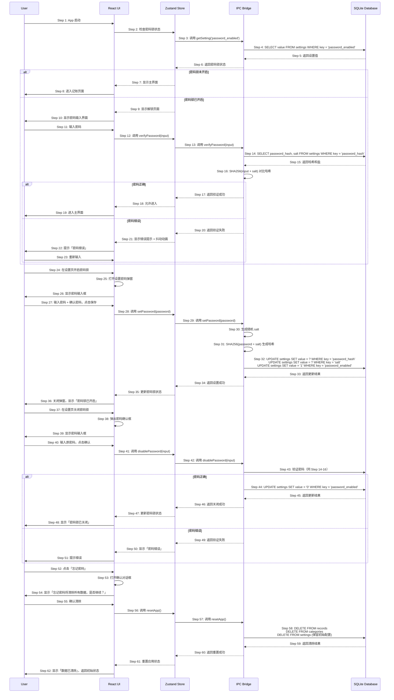

# S04: 设置密码锁 — 时序图

## 场景概述

| 属性 | 值 |
|------|-----|
| 场景编号 | S04 |
| 场景名称 | 设置密码锁 |
| 触发条件 | 用户在设置页点击「密码锁」开关 |
| 用户价值 | 保护记账数据隐私，防止他人查看或修改 |
| 优先级 | P1 |

## 时序图

## 步骤说明

1. **用户**启动 App。
2. **Zustand Store**检查密码锁是否开启。
3. **Store**调用 IPC 的 `getSetting('password_enabled')` 方法。
4. **SQLite Database**查询设置表。
5. **数据库**返回 `password_enabled` 的值（0 或 1）。
6. **IPC**返回密码锁状态。

**密码锁未开启分支：**
7. **Store**通知 UI 显示主界面。
8. **UI**直接进入记账页面。

**密码锁已开启分支：**
9. **Store**通知 UI 显示解锁页面。
10. **UI**显示密码输入界面（6位圆点）。

11. **用户**输入密码。
12. **UI**调用 Store 的 `verifyPassword(input)` 方法。
13. **Store**调用 IPC 的 `verifyPassword` 方法。
14. **IPC**从数据库获取存储的密码哈希和盐。
15. **数据库**返回哈希和盐。
16. **IPC**对输入密码加盐后进行 SHA256 哈希，与存储的哈希对比。

**密码正确：**
17. **IPC**返回验证成功。
18. **Store**允许进入主界面。
19. **UI**进入主界面。

**密码错误：**
20. **IPC**返回验证失败。
21. **Store**通知 UI 显示错误。
22. **UI**显示「密码错误」提示和抖动动画。
23. **用户**重新输入密码。

---

24. **用户**在设置页开启密码锁。
25. **UI**打开设置密码弹窗（输入密码 + 确认密码）。
26. **UI**显示两个密码输入框。

27. **用户**输入密码和确认密码，点击保存。
28. **Store**调用 `setPassword(password)` 方法。
29. **IPC**执行设置密码操作。
30. **IPC**生成随机 salt。
31. **IPC**使用 SHA256(password + salt) 生成哈希。
32. **SQLite Database**更新 settings 表中的 password_hash、salt、password_enabled。
33. **数据库**返回更新结果。
34. **IPC**返回设置成功。
35. **Store**更新密码锁状态为开启。
36. **UI**关闭弹窗，显示成功 Toast「密码锁已开启」。

---

37. **用户**在设置页关闭密码锁。
38. **UI**弹出密码确认框（输入原密码）。
39. **UI**显示密码输入框。

40. **用户**输入原密码，点击确认。
41. **Store**调用 `disablePassword(input)` 方法。
42. **IPC**调用 `disablePassword` 方法。
43. **IPC**验证密码（同 Step 14-16）。

**密码正确：**
44. **IPC**更新 settings，将 password_enabled 设为 0。
45. **数据库**返回更新结果。
46. **IPC**返回关闭成功。
47. **Store**更新密码锁状态为关闭。
48. **UI**显示「密码锁已关闭」。

**密码错误：**
49. **IPC**返回验证失败。
50. **Store**通知 UI 显示错误。
51. **UI**显示「密码错误」提示。

---

52. **用户**在解锁页点击「忘记密码」。
53. **UI**打开确认对话框。
54. **UI**显示警告信息。

55. **用户**确认清除。
56. **Store**调用 `resetApp()` 方法。
57. **IPC**执行重置操作。
58. **SQLite Database**删除所有数据（records、categories，保留初始设置）。
59. **数据库**返回清除结果。
60. **IPC**返回重置成功。
61. **Store**重置应用状态（清除所有本地状态）。
62. **UI**显示「数据已清除」，返回初始状态（未开启密码锁）。

> 密码使用 SHA-256 + salt 哈希存储，不可逆。忘记密码只能清除所有数据，不可恢复。

## 异常用例

### EX-11.1: 密码输入不完整

- **触发条件**：用户输入密码未满6位
- **期望响应**：不触发验证，等待用户继续输入
- **副作用**：无

### EX-27.1: 两次密码不一致

- **触发条件**：用户输入密码与确认密码不一致
- **期望响应**：弹窗内显示「两次密码不一致」
- **副作用**：不执行设置

### EX-27.2: 密码长度不足

- **触发条件**：用户输入密码少于6位
- **期望响应**：提示「密码至少6位」
- **副作用**：不执行设置

### EX-43.1: 关闭密码锁验证失败

- **触发条件**：用户输入原密码错误
- **期望响应**：显示「密码错误」，不关闭密码锁
- **副作用**：密码锁保持开启状态

### EX-58.1: 数据清除失败

- **触发条件**：数据库删除操作失败
- **期望响应**：显示错误 Toast「操作失败，请重试」
- **副作用**：数据未清除

### EX-58.2: 忘记密码确认

- **触发条件**：用户在确认对话框点击「取消」
- **期望响应**：关闭对话框，返回密码输入页面
- **副作用**：无，数据保留
