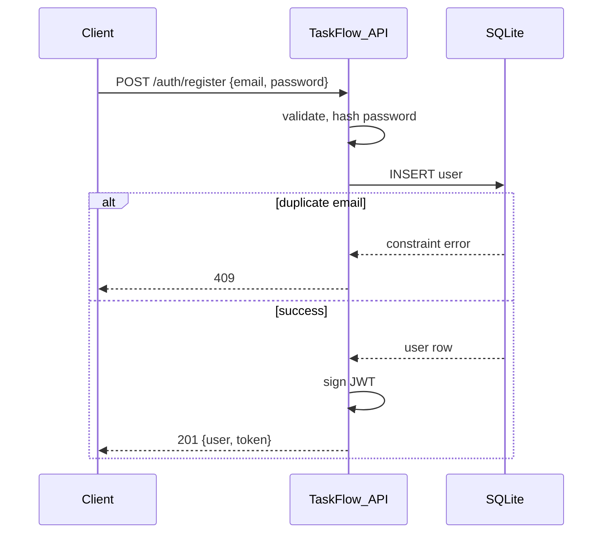
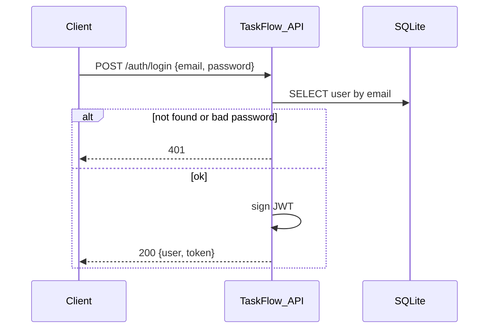

# S01: Authentication — sequence

> Phase 3 Step 1 · scenario implementation

## Register

```mermaid
sequenceDiagram
  participant C as Client
  participant API as TaskFlow_API
  participant DB as SQLite

  C->>API: POST /auth/register {email, password}
  API->>API: validate, hash password
  API->>DB: INSERT user
  alt duplicate email
    DB-->>API: constraint error
    API-->>C: 409
  else success
    DB-->>API: user row
    API->>API: sign JWT
    API-->>C: 201 {user, token}
  end
```

## Login

```mermaid
sequenceDiagram
  participant C as Client
  participant API as TaskFlow_API
  participant DB as SQLite

  C->>API: POST /auth/login {email, password}
  API->>DB: SELECT user by email
  alt not found or bad password
    API-->>C: 401
  else ok
    API->>API: sign JWT
    API-->>C: 200 {user, token}
  end
```
