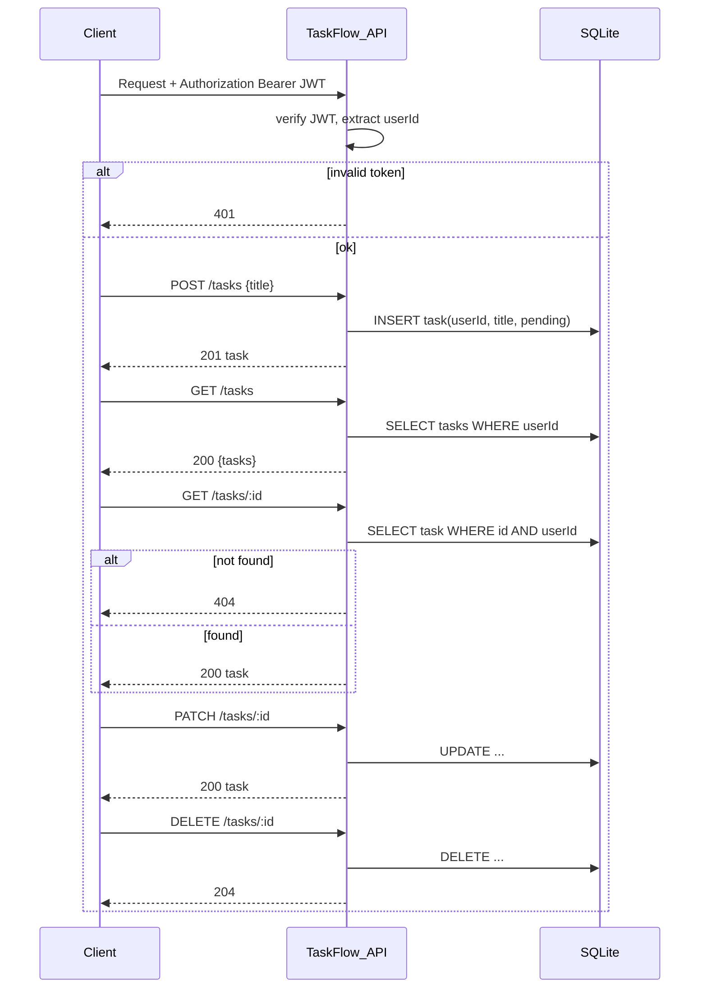

# S02: Task CRUD — sequence

> Phase 3 Step 1 · scenario implementation

## Authenticated task operations

```mermaid
sequenceDiagram
  participant C as Client
  participant API as TaskFlow_API
  participant DB as SQLite

  C->>API: Request + Authorization Bearer JWT
  API->>API: verify JWT, extract userId
  alt invalid token
    API-->>C: 401
  else ok
    C->>API: POST /tasks {title}
    API->>DB: INSERT task(userId, title, pending)
    API-->>C: 201 task

    C->>API: GET /tasks
    API->>DB: SELECT tasks WHERE userId
    API-->>C: 200 {tasks}

    C->>API: GET /tasks/:id
    API->>DB: SELECT task WHERE id AND userId
    alt not found
      API-->>C: 404
    else found
      API-->>C: 200 task
    end

    C->>API: PATCH /tasks/:id
    API->>DB: UPDATE ...
    API-->>C: 200 task

    C->>API: DELETE /tasks/:id
    API->>DB: DELETE ...
    API-->>C: 204
  end
```
