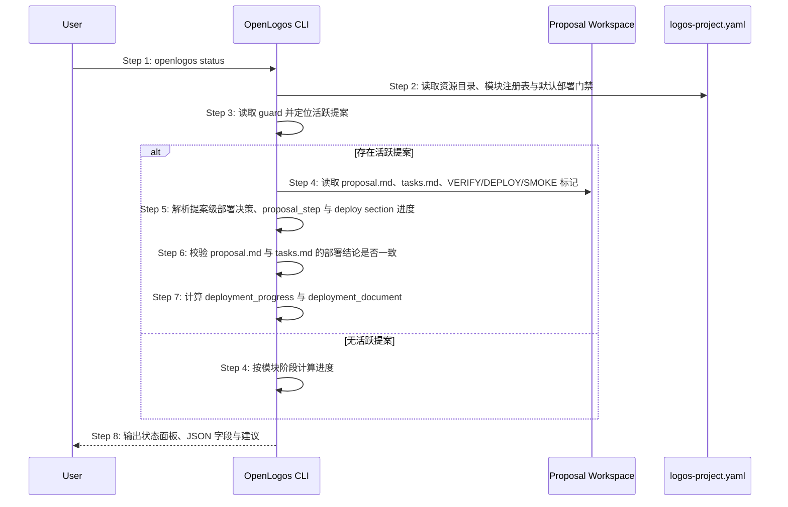

## MODIFIED — S11: 查看阶段进度与活跃变更 — 时序图
# S11: 查看阶段进度与活跃变更 — 时序图

## 步骤说明
1. **用户**执行 `openlogos status`。
2. **CLI** 读取资源目录、模块和模块级部署门禁。
3. **CLI** 读取 guard 判断是否存在活跃提案。
4. **CLI** 在存在活跃提案时读取提案工作区。
5. **CLI** 优先使用提案级部署决策计算提案步骤，并单独统计 `[deploy]` section 的完成度。
6. **CLI** 校验 `proposal.md` 与 `tasks.md` 是否冲突。
7. **CLI** 生成 `deployment_progress` 与 `deployment_document`，其中任务文档入口必须指向 `tasks.md`。
8. **CLI** 输出状态面板；JSON 模式下输出部署决策字段与部署进度摘要，供 RunLogos 判断按钮。

## 异常用例
### EX-2.1: 模块过滤不存在
- **触发条件**：用户传入不存在的 `--module`。
- **期望响应**：输出模块不存在错误。

### EX-6.1: 提案级部署决策缺失
- **触发条件**：历史提案没有结构化 `## 部署影响`。
- **期望响应**：CLI 回退到 `[deploy]` section 和模块默认门禁，并在 JSON 中标注 `deployment_decision_source` 为兼容来源。

### EX-6.2: 部署决策冲突
- **触发条件**：`proposal.md` 声明无需部署但 `tasks.md` 存在 `[deploy]` section，或声明需要部署但缺少 `[deploy]` section。
- **期望响应**：CLI 输出冲突警告，JSON 中设置 `deployment_decision_conflict=true`，并阻止 deploy、smoke 或 archive 成为主动作。
