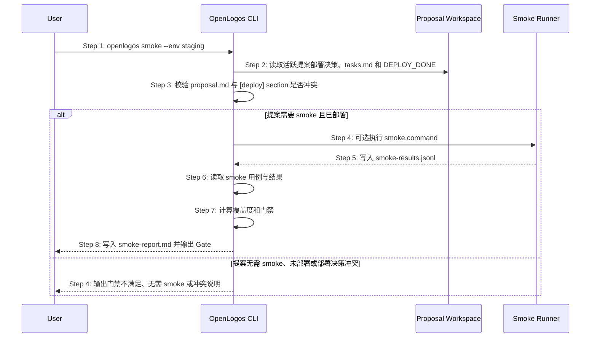

## MODIFIED — S19: 执行部署后 smoke 门禁 — 时序图
# S19: 执行部署后 smoke 门禁 — 时序图

## 步骤说明
1. **用户**明确授权运行 smoke。
2. **CLI** 读取提案级部署决策、`tasks.md` 和 `DEPLOY_DONE`。
3. **CLI** 先校验 `proposal.md` 与 `[deploy]` section 是否冲突；冲突时不得进入 smoke。
4. **CLI** 只有在 `smoke_required: true` 且 `DEPLOY_DONE` 存在时才继续；`deployment_progress` 仅用于展示，不替代 `DEPLOY_DONE` 门禁。
5. **Smoke Runner** 写入结果。
6. **CLI** 读取用例与结果。
7. **CLI** 判断 smoke 门禁。
8. **CLI** 输出报告。

## 异常用例
### EX-4.1: 缺少 smoke 用例
- **触发条件**：`logos/resources/test/smoke/` 没有用例。
- **期望响应**：输出错误并退出。

### EX-2.1: 提案无需 smoke
- **触发条件**：活跃提案声明 `smoke_required: false`。
- **期望响应**：不要求运行部署后 smoke，下一步应允许 archive。

### EX-3.1: 部署决策冲突
- **触发条件**：`proposal.md` 与 `tasks.md` 的部署结论不一致。
- **期望响应**：输出冲突警告并拒绝进入 smoke。
