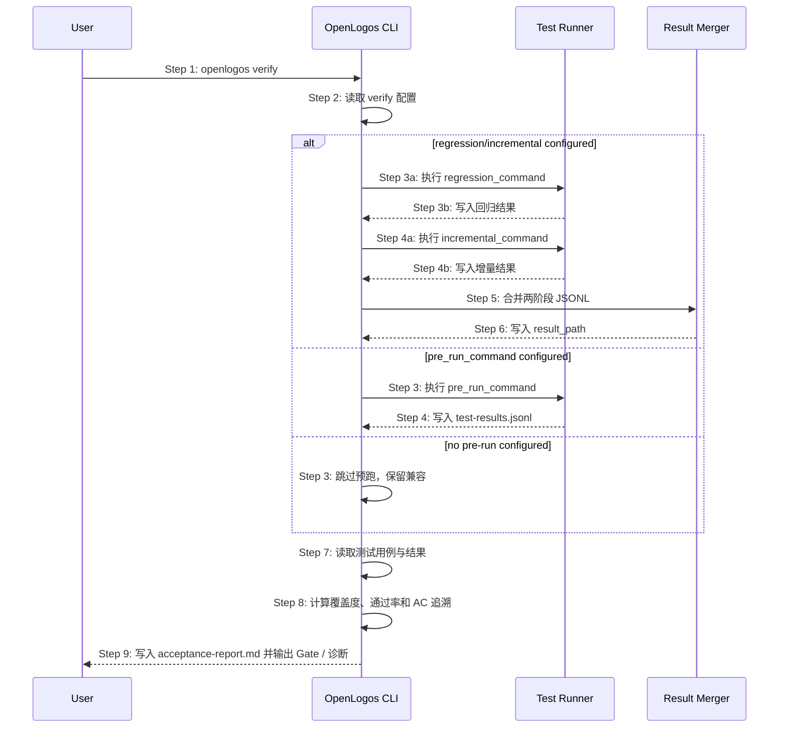

## MODIFIED — 时序图

## MODIFIED — 步骤说明
1. **用户**执行 `openlogos verify`。
2. **CLI** 读取 `logos.config.json` 的 `verify` 配置。
3. **CLI** 若检测到 `regression_command` 或 `incremental_command`，进入两阶段模型；若仅检测到 `pre_run_command`，走旧兼容路径；若都不存在，直接读取现有结果。
4. **测试运行器**写入阶段结果。阶段结果路径可由 `regression_result_path` / `incremental_result_path` 指定。
5. **结果合并器**将回归与增量结果合并到 `result_path`。同一用例 ID 多次出现时，最后一次结果生效。
6. **CLI** 读取测试规格和合并后的结果。
7. **CLI** 计算验收指标。
8. **CLI** 输出 PASS/FAIL，并在覆盖不足且无预跑配置时输出局部测试诊断。

## ADDED — EX-2.1: 两阶段与 pre_run_command 同时配置
- **触发条件**：`verify.pre_run_command` 与 `verify.regression_command` / `verify.incremental_command` 同时存在。
- **期望响应**：优先执行两阶段模型；在文本和 JSON 输出中标记 `pre_run_command` 被兼容保留但未执行。

## ADDED — EX-5.1: 第二阶段清空第一阶段结果
- **触发条件**：增量测试 reporter 清空默认 `result_path`。
- **期望响应**：CLI 通过阶段化结果路径、临时快照或等价机制保留回归阶段结果，并在合并后写入最终 `result_path`。

## ADDED — EX-8.1: 覆盖不足且无预跑配置
- **触发条件**：未配置任何预跑命令，且存在未覆盖用例。
- **期望响应**：verify FAIL，输出覆盖不足列表，同时提示可能只运行了局部测试，并建议配置 `verify.pre_run_command` 或 `verify.regression_command`。
