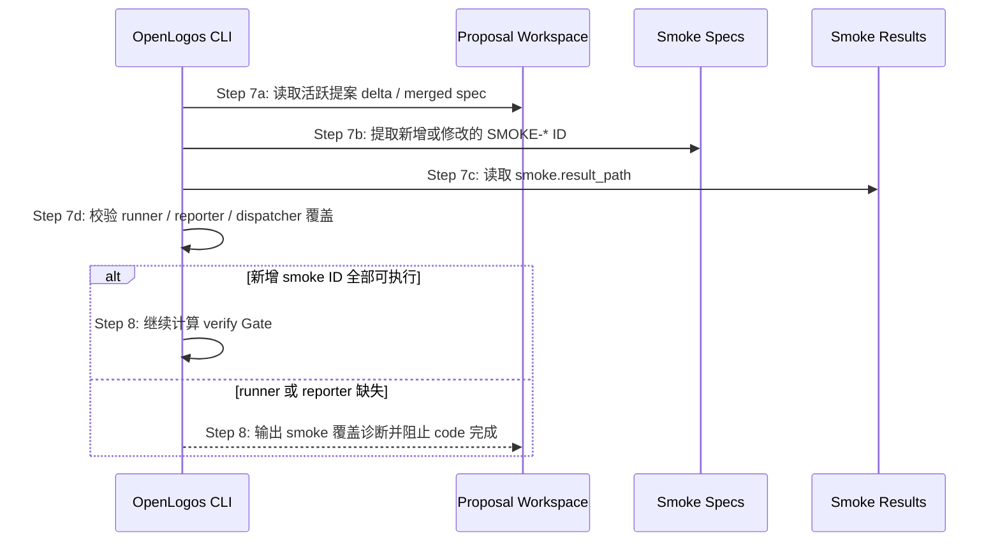

## ADDED — smoke 覆盖预检步骤

在 Step 7 读取测试用例与结果之后、Step 8 计算验收指标之前，`openlogos verify` 或 code completion gate 应增加 smoke 覆盖预检：

### 规则
1. 预检只针对当前提案新增或修改的 smoke 用例；历史未执行 smoke 用例仍由部署后 `openlogos smoke` 统一判定。
2. 新增 smoke 用例 ID 来自 `logos/changes/<slug>/deltas/test/smoke/*.md`，merge 后也可从 `logos/resources/test/smoke/*.md` 与变更范围推导。
3. 若新增 `SMOKE-*` ID 没有对应执行结果，且无法发现 runner/dispatcher 接入证据，预检必须返回失败诊断。
4. 预检不得伪造 `SMOKE_PASS` / `SMOKE_FAIL`，不得替代部署后 `openlogos smoke`。

### 诊断
- `smoke_runner_missing`：找不到当前提案新增 smoke 用例对应 runner 或 dispatcher 注册。
- `smoke_reporter_missing`：runner 存在但没有写入 `smoke.result_path`。
- `smoke_cases_uncovered`：结果文件存在但缺少新增 `SMOKE-*` ID。
