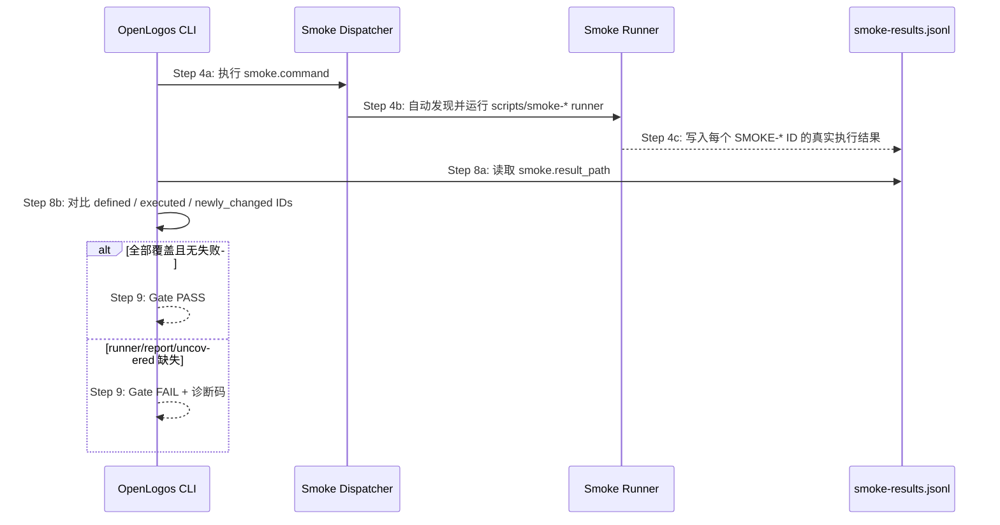

## ADDED — smoke runner / reporter / dispatcher 覆盖检查

`openlogos smoke` 在执行 `smoke.command` 后，读取 smoke 用例与结果时必须同时检查 runner 覆盖来源：

### runner 接入要求
- `smoke.command` 可以直接执行单个 runner，也可以执行统一 dispatcher。
- 推荐 dispatcher 自动发现 `scripts/smoke-*.sh`、`scripts/smoke-*.mjs` 或项目声明的等效 runner。
- runner 必须使用配置声明的 `smoke.result_path` 写入 JSONL；不得写入硬编码路径后让 CLI 读取不到。
- runner 对每个实际执行的 smoke case 写入 `{ "id": "SMOKE-...", "status": "pass"|"fail"|"skip", ... }`。
- smoke PASS 只能来自真实执行结果；禁止为了满足覆盖率直接追加伪造 PASS。

### Gate 判定补充
- defined 来自 `logos/resources/test/smoke/*.md`。
- executed 来自 `smoke.result_path`。
- uncovered = defined 中不存在于 executed 的 ID。
- 若 uncovered 包含当前提案新增或修改的 smoke ID，`gate.reason` 应优先表达为 `smoke_cases_uncovered`，并保留 `uncovered_cases` 列表。
- 若没有结果文件或结果文件为空，诊断应区分为 `smoke_reporter_missing`。
- 若 `smoke.command` 缺失、没有 dispatcher 或无法发现 runner，诊断应区分为 `smoke_runner_missing`。

### 与 deploy-done 的关系
本检查不改变 S19 的前置门禁：仍必须先满足 `VERIFY_PASS`、`DEPLOY_DONE`、`[deploy]` 全勾和 `smoke_required=true`。runner 覆盖检查只负责判断 smoke 用例是否真的执行，不替代部署完成状态。
