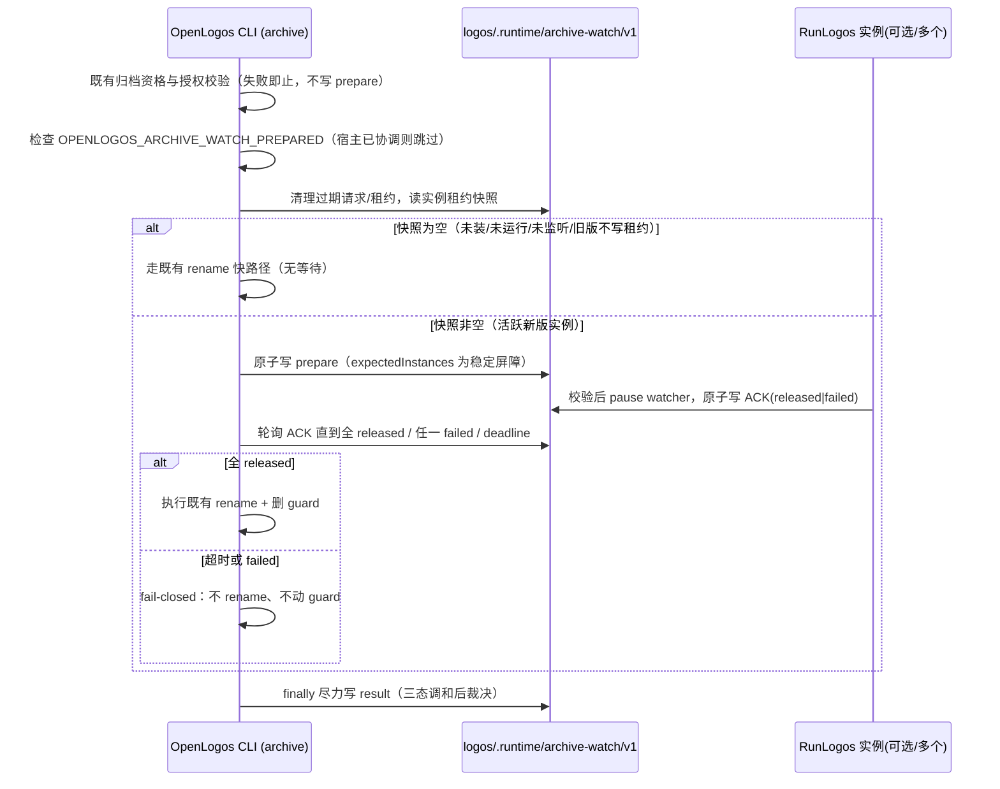

## ADDED — Windows 外部归档 watcher 握手时序（win32-archive-watcher-handshake）

## Windows 外部归档 watcher 握手时序（win32-archive-watcher-handshake）

仅当 `process.platform === 'win32'` 且用户从外部终端执行 `openlogos archive <slug>` 时，Step 13→14 之间插入以下有界握手；非 Windows 平台此段完全不执行，直接走既有 rename 归档。

## ADDED — EX-10.1: Windows 外部归档无活跃监听走快路径

### EX-10.1: Windows 外部归档无活跃监听走快路径
- **触发条件**：Windows 平台，runtime 目录不存在或快照无「未过期+projectId 匹配+capabilities 含 prepare」的活跃实例（未装/未运行/未监听/旧版不写租约）。
- **期望响应**：不写 prepare、不等待，直接 rename 归档；runtime 缺失视为空快照的正常路径，不作为错误。

## ADDED — EX-10.2: Windows 归档握手成功后才 rename

### EX-10.2: Windows 归档握手成功后才 rename
- **触发条件**：Windows 平台，快照存在一或多个活跃实例，全部在 deadline 前 ACK released。
- **期望响应**：released 前 rename 次数=0；全 released 后才 rename 与删 guard；随后写 archived result。多实例须全部 released 才放行。

## ADDED — EX-10.3: Windows 归档握手超时或实例失败 fail-closed

### EX-10.3: Windows 归档握手超时或实例失败 fail-closed
- **触发条件**：Windows 平台，已写 prepare，但 deadline 前未收齐 released 或任一 ACK failed。
- **期望响应**：不 rename、不删 guard、不改状态；返回 `ARCHIVE_WATCH_ACK_TIMEOUT`/`ARCHIVE_WATCH_INSTANCE_FAILED` 与脱敏诊断；尽力写 cancelled/not-archived result。

## ADDED — EX-10.4: Windows 归档遇不可协调监听者

### EX-10.4: Windows 归档遇不可协调监听者
- **触发条件**：Windows 平台，(a) 旧版 RunLogos 持句柄但不写租约，走快路径时 rename 抛 EPERM/EACCES/EBUSY；或 (b) 租约可见但 capabilities 不含 prepare、或协议主版本高于本 CLI 认知。
- **期望响应**：均 fail-closed（不 rename、不动 guard、不自动重试）：(a) 提示「可能有旧版 RunLogos 或其他程序正在监听，请升级或关闭后重试」；(b) 提示「检测到能力不足或更高版本的 RunLogos，请升级 openlogos CLI 或关闭该实例」。

## ADDED — EX-10.5: 宿主已协调时去递归跳过握手

### EX-10.5: 宿主已协调时去递归跳过握手
- **触发条件**：Windows 平台，RunLogos spawn CLI 时注入 `OPENLOGOS_ARCHIVE_WATCH_PREPARED=<token>`。
- **期望响应**：仅当 token 结构有效、cwd/projectId 与绑定项目一致、slug 一致、未过期时跳过握手直接 rename；任一不满足则不跳过；无长期全局逃生开关。

## ADDED — EX-10.6: CLI 崩溃 result 缺失的三态调和

### EX-10.6: CLI 崩溃 result 缺失的三态调和
- **触发条件**：Windows 平台，CLI 在 rename 前后崩溃致 result 缺失，或命令报错但磁盘已完成 rename。
- **期望响应**：CLI 重跑与 RunLogos 均以 live/archive/guard 三态裁决——live 仍在则可恢复，已归档则调和为成功并标记 `reconciledFromDisk`，矛盾则 fail-closed 保留诊断；不凭 exitCode/status 反转磁盘真相。

## ADDED — EX-10.7: 非 Windows 平台不启用握手协议

### EX-10.7: 非 Windows 平台不启用握手协议
- **触发条件**：平台为 macOS 或 Linux。
- **期望响应**：archive 不创建/读取/监听协议文件、不校验 token、不增加等待，逐字节沿用原 archive 路径；无论 CLI/RunLogos 版本新旧。
