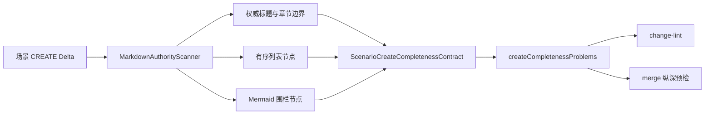

## ADDED — 场景 CREATE 的结构化 Markdown 完整性架构（S39）

### 组件边界与所有权

- **`ScenarioCreateCompletenessContract`**：持有 canonical 标题、受控读取别名和各结构维度阈值；它是 CLI 校验器的单一事实源。Skill 以文字引用该合同，不在运行时维护第二份正则集合。
- **`MarkdownAuthorityScanner`**：在原始 delta 中识别 fenced code、HTML 注释、ATX 标题、章节边界、有序列表和 Mermaid fence；只返回权威正文节点，不判断 S39 业务适用性。
- **`createCompletenessProblems()`**：消费 scanner 结果并按目标类别运行结构校验；scenario 分支不再对整段 payload 执行关键词正则。
- **change-lint / merge**：继续调用同一个 baseline closure evaluator，前者前移诊断，后者作为纵深防御；二者不得复制标题或完整性算法。
- **change-writer / scenario-architect**：只负责生成 canonical 文档并在交付前运行 lint，不决定 CLI 如何解析 Markdown。

### 数据与控制流



扫描器只读取当前 change 的目标 delta 字节，不读取其它 change、archive 或 partial seed staging。该能力不持久化新状态，不引入 API/数据库边界。

### 结构合同

```ts
interface ScenarioCreateCompletenessContract {
  canonicalStepHeading: '步骤说明';
  acceptedStepHeadingAliases: readonly [
    '步骤说明', '主路径步骤', '主路径', '主流程', '正常流程', 'main path'
  ];
  minimumOrderedSteps: 3;
  minimumParticipants: 2;
  minimumMessages: 1;
}
```

标题匹配对去除首尾空白后的完整标题文本做大小写不敏感比较，不做子串命中。步骤别名只在围栏与 HTML 注释之外的 ATX 标题节点生效；散文、链接、表格、代码样例或 Mermaid 消息中的相同文字均不生效。

### 校验算法

1. 复用 authority scan 状态机划分普通正文、fenced code 与 HTML 注释；未闭合围栏按现有 Markdown 安全策略保守排除其后内容。
2. 收集权威标题及其章节范围；步骤别名命中的章节必须恰好一个，缺失或重复均失败。
3. 在步骤章节直属正文中收集有序列表项；至少 3 项，每项去除 marker 后正文非空。普通段落、无序列表和其它章节中的编号不计入。
4. 收集 info string 为 `mermaid` 的 fenced block；其中必须有 `sequenceDiagram`、至少 2 个 `participant|actor` 声明和至少 1 条 `->>|-->>|->|-->` 消息。普通 fence、散文或注释中的字符串不计入。
5. 异常/边界章节与追溯章节必须各有唯一权威标题，并在排除注释、围栏和空白后含非空正文或列表。
6. 将所有缺口稳定排序后返回；同一文件可一次报告多个精确缺口，方便 producer 一轮修复。

### 失败策略与诊断

外层 violation code 保持 `create_target_incomplete` 兼容，`message`/`missingEvidence`/`fix_hint` 精确区分：步骤章节缺失或重复、步骤列表少于 3 项或有空项、Mermaid 围栏无效、参与者或消息不足、异常/边界为空、追溯为空。解析器异常、未知结构或目标模式漂移均 fail-closed，不退回全文正则。

change-lint 只读返回 exit 2；merge 在任何资源写入和 `MERGE_PROMPT.md` 生成前重跑同一 evaluator。任一失败不得修改资源、guard、counter、resource index、`SPEC_MERGED` 或其它 marker。

### 实现映射

- `cli/src/lib/baseline-closure.ts`：用结构化 scenario 分支替换现有全文正则表，并保持其它类别判据不变。
- 现有 authority scan 模块或提取后的共享 Markdown scanner：输出标题、章节、有序列表与 fenced block 结构；不得为 S39 复制第二个 fence/comment 状态机。
- `cli/test/s39-baseline-on-touch.test.ts`：覆盖 canonical/alias 矩阵、围栏与注释反例、列表阈值、Mermaid 结构和空章节。
- change-lint/merge 场景测试：覆盖四份历史 fixture 与真实缺步骤时的原子失败。

### 架构不变量

1. canonical 写入与兼容读取分离；兼容别名不能改变新文档输出格式。
2. 结构证据只来自权威 Markdown 节点，关键词本身永远不是完整性证据。
3. change-lint 与 merge 对同一字节必须得出相同问题集合。
4. 本修复只改变 scenario CREATE 完整性，不放宽其它类别、不删除 merge 纵深预检。
5. RunLogos 的 write-delta lint barrier 是独立 companion change；本仓只保证 CLI/Skill 合同完整。
