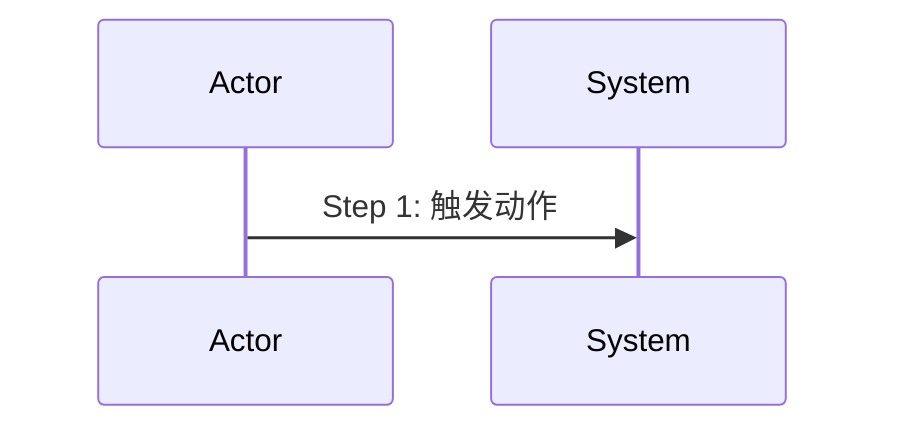

## ADDED — S39 场景 CREATE canonical 模板与结构 lint 收据

### 强制适用

proposal 的 `baseline_closure.targets` 中只要存在 `category: scenario, mode: CREATE`，Step 6 写该唯一 Delta 时必须应用本节。专业 scenario-architect 只返回内容与检查结论，当前 change-writer 仍持有 canonical delta 文件所有权。

### canonical 输出模板

Markdown CREATE 继续使用一个 `## ADDED — <真实标题>` Delta 段；段内必须是可独立成立的完整场景文档，新写入章节固定为：

````markdown
# SXX：场景名称

## 场景目标
<非空目标与用户价值>

## 参与者
- <至少两个适用参与者及职责>

## 前置条件
<非空前置条件>

## 成功后置条件
<非空成功状态>

## 时序图



## 步骤说明

1. **参与者 A** 执行与时序 Step 1 对应的动作。
2. **参与者 B** 校验输入并执行核心行为。
3. **参与者 B** 返回可验证结果并形成成功后置条件。

## 异常与边界
### EX-1.1：明确异常
- **触发条件**：<可复现条件>
- **期望响应**：<精确结果>
- **副作用**：<无或明确补偿>

## 追溯
- 需求：SXX-AC-XX
- 测试：UT-SXX-XX、ST-SXX-XX
````

模板中的尖括号与示例 ID 只用于说明 Skill 规则，实际 Delta 必须替换为当前场景真实内容、真实 ID，不得原样落盘。

### 写入与读取兼容边界

- writer 只输出 `## 步骤说明`，不得选择 `主流程` 等同义标题作为新格式。
- CLI 读取兼容 `步骤说明`、`主路径步骤`、`主路径`、`主流程`、`正常流程`、`main path`；这是 `spec/baseline-closure.md` §17 的受控集合，writer 不另建正则或扩展模糊别名。
- 步骤章节唯一且至少 3 个非空有序列表项，并与 Mermaid Step 主路径逐项对应。
- Mermaid 必须位于 `mermaid` fence，含 `sequenceDiagram`、至少 2 个 participant/actor 与 1 条消息。
- 异常/边界和追溯必须有非空权威正文；fence、HTML 注释或样例中的文字不能补足缺口。

### Step 6 完成收据

全部 Delta 文件落盘并逐项勾选后，必须在项目根执行 `openlogos change-lint --slug <slug> --format json`。只有 exit 0 且 `data.pass=true` 才能向 driver/用户报告完成，并在交付摘要记录 slug、执行时间、exit code、pass 值。

exit 2 时逐条消费 `code/path/message/fix_hint`，只修当前提案被指向的产物后重跑；不得把红灯交给 merge 兜底。该收据不写新 marker，不替代后续独立 merge 授权。RunLogos 是否在 WorkUnit 完成屏障再次强制 lint 属 companion change，不改变本 Skill 自检义务。
