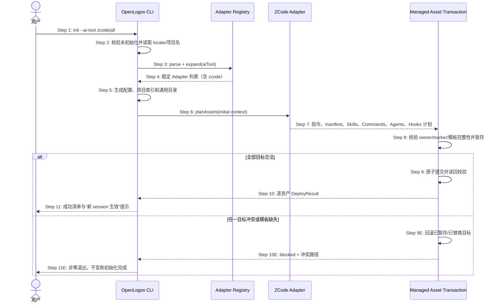

## ADDED — S01 ZCode 初始化与 Adapter Registry 扩展时序

### 场景目标

用户通过 `openlogos init --ai-tool zcode` 或 `--ai-tool all` 初始化项目时，由统一 Registry 解析宿主并原子部署完整 ZCode 插件、根指令和 Hook runtime，同时保护既有用户资产。

### 参与者

- **用户**：选择 ZCode 或 all 并接收逐资产结果。
- **OpenLogos CLI**：编排初始化、配置写入和部署事务。
- **Adapter Registry**：解析工具、展开 all 并返回 ZCode Adapter。
- **ZCode Adapter**：规划插件、指令和 Hook 资产。
- **Managed Asset Transaction**：预检冲突、暂存、原子提交或回滚。

### 前置条件

- 当前目录尚未存在 `logos/logos.config.json`。
- ZCode 模板、共享 Hook runtime 与所有方法论 Skills/Commands 已随 CLI 包可读。
- 不存在无法恢复的 baseline seed commit journal。

### 成功后置条件

- 配置持久化规范工具值 `zcode`，或 `all` 展开结果包含 ZCode。
- 根 `AGENTS.md` OpenLogos 托管片段和完整 ZCode 插件资产落盘，用户内容保持不变。
- 所有目标通过读回校验，CLI 输出可审计的 created/updated/unchanged/preserved 清单。

### 时序图

### 步骤说明

1. 用户选择单独 ZCode 或 all。
2. CLI 在任何写入前完成既有初始化前置校验。
3. CLI 把原始配置交给 Registry，不手写宿主枚举。
4. Registry 返回稳定去重的 Adapter；all 包含所有可部署宿主但不包含 other。
5. CLI 准备通用 OpenLogos 配置，其中只持久化规范工具 ID。
6. ZCode Adapter 按 initial lifecycle 生成资产计划。
7. 计划包含 `.zcode-plugin/plugin.json`、Skills、Commands、Agents、`hooks/hooks.json`、共享 runtime 和根 `AGENTS.md` 托管片段。
8. 事务层先校验全部目标的所有权、marker 完整性、内容与随包模板。
9. 所有校验通过后才按稳定顺序原子写入，并从磁盘读回哈希和权限。
10. CLI 汇总真实结果；all 中其它 Adapter 复用同一事务合同。
11. 用户获得明确路径、保留项和新 ZCode session 才加载 Hook 的提示。

### 异常与边界

#### EX-ZC-1：ZCode 模板未随包

- **触发条件**：`.zcode-plugin/plugin.json`、Hooks 或共享 runtime 任一缺失。
- **期望响应**：在写用户项目文件前失败，指出缺失的包内相对路径。
- **副作用**：不留下半初始化目录或伪造的 ZCode 成功行。

#### EX-ZC-2：同名插件不属于 OpenLogos

- **触发条件**：目标插件目录已有不同 manifest identity 或未知 owner。
- **期望响应**：标记 `blocked`，建议用户改名或备份；不得合并未知插件内容。
- **副作用**：既有插件逐字节不变。

#### EX-ZC-3：根指令 marker 残缺

- **触发条件**：根 `AGENTS.md` 只有一个 OpenLogos marker。
- **期望响应**：在事务预检阶段 fail loud。
- **副作用**：配置、插件和根指令均不提交。

### 追溯

- 需求：S01 ZCode 初始化验收、公共能力要求、ZCode 资产与协议要求。
- 架构：二十八、AI Tool Adapter Registry 与 ZCode 薄适配架构。
- 测试：UT-S01-100～UT-S01-107、ST-S01-15～ST-S01-17。
