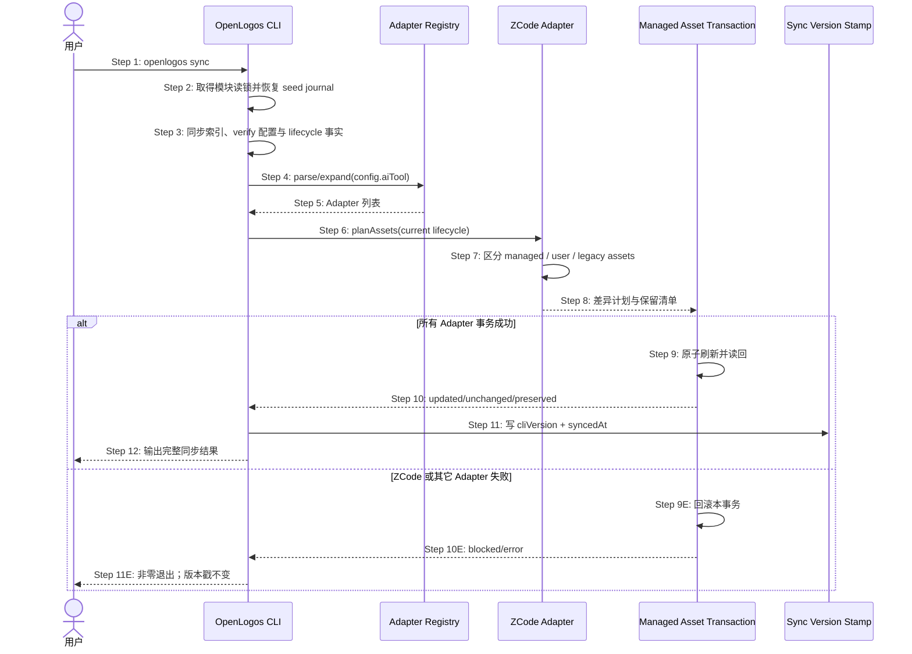

## ADDED — S08 ZCode 托管资产幂等同步时序

### 场景目标

在不改变用户 ZCode 配置和项目自有插件资产的前提下，`openlogos sync` 通过 Registry 幂等刷新 OpenLogos ZCode 插件、根指令和当前 lifecycle 变体，并且只在所有同步事务成功后刷新版本戳。

### 参与者

- **用户**：触发同步并查看保留/刷新结果。
- **OpenLogos CLI**：持有同步总事务和版本戳写入时机。
- **Adapter Registry**：从历史或当前配置解析 Adapter 集合。
- **ZCode Adapter**：计算当前模板与目标的差异。
- **Managed Asset Transaction**：原子写入托管资产并保护未知 owner。

### 前置条件

- 项目已有合法 `logos.config.json` 与 `logos-project.yaml`。
- baseline seed commit journal 已恢复或不存在。
- ZCode Adapter 可读取随包模板；既有项目可能含旧版 OpenLogos ZCode 资产或用户自有资产。

### 成功后置条件

- OpenLogos 拥有的 ZCode 资产与当前 CLI、locale 和 lifecycle 一致。
- 用户 `.zcode` 配置、非 OpenLogos 插件、托管 marker 外内容保持不变。
- `.openlogos-sync.json` 记录本次全部同步成功后的版本和时间。

### 时序图

### 步骤说明

1. 用户在项目根执行 sync。
2. CLI 在读取资源前完成既有 seed journal 恢复门。
3. CLI 处理宿主无关同步工作，但尚不刷新最终版本戳。
4. 配置中的标量、数组、历史值或 all 统一交给 Registry。
5. Registry 返回去重且稳定的 Adapter 列表。
6. ZCode Adapter 根据 module lifecycle 选择 initial/launched 指令和插件资产。
7. Adapter 只把 manifest identity、managed marker 或已知哈希可证明的文件视为 OpenLogos owner；其余列入 preserved 或 blocked。
8. 事务计划包含精确目标、变更状态和冲突原因。
9. 全部预检通过后原子刷新，并确认 Hooks JSON、manifest 和 Markdown frontmatter 可解析。
10. 结果明确区分更新、未变化和用户保留项。
11. 只有全部 Adapter 都成功，CLI 才覆盖写同步版本戳。
12. 输出提醒 ZCode Hook 配置仅对新 session 生效。

### 异常与边界

#### EX-ZC-1：历史配置不含 zcode

- **触发条件**：旧项目 aiTool 为既有单值或数组。
- **期望响应**：按原配置同步，不擅自加入 ZCode；只有 `all` 使用新 Registry 展开后自动包含 ZCode。
- **副作用**：既有宿主行为保持兼容。

#### EX-ZC-2：用户修改 OpenLogos 托管文件

- **触发条件**：目标有 OpenLogos identity，但托管边界外出现用户文件。
- **期望响应**：只刷新声明资产；未知文件 preserved 并逐项报告。
- **副作用**：不得用目录镜像删除用户文件。

#### EX-ZC-3：同步中途失败

- **触发条件**：暂存、rename、权限或读回校验失败。
- **期望响应**：回滚该事务并使 sync 整体失败。
- **副作用**：原版本戳不变；不得打印“Sync complete”。

### 追溯

- 需求：S08 同步验收、ZCode 资产与协议要求。
- 架构：28.3 资产规划与原子部署、28.6 状态读取与缓存边界。
- 测试：UT-S08-15～UT-S08-20、ST-S08-16～ST-S08-18。
