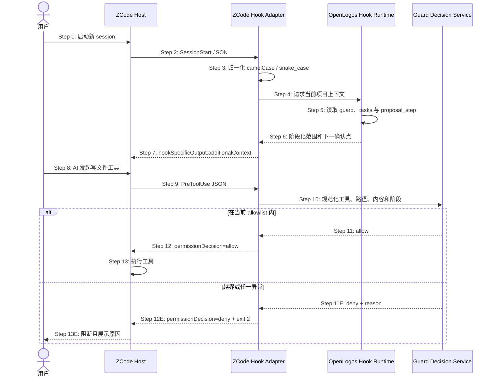

## ADDED — S09 ZCode SessionStart 与 PreToolUse 收敛时序

### 场景目标

ZCode 新会话通过插件级 `SessionStart` 获得与当前 `proposal_step` 一致的 OpenLogos 上下文，并由 `PreToolUse` 在工具真正执行前复用同一决策服务约束写入范围；协议解析、运行时或路径判定异常均 fail-closed。

### 参与者

- **用户**：启动 ZCode 会话并发起文件操作。
- **ZCode Host**：发现插件 Hooks、传递事件 JSON 并消费 Hook 输出。
- **ZCode Hook Adapter**：归一化 ZCode/Claude 兼容字段与退出语义。
- **OpenLogos Hook Runtime**：读取 guard、提案事实与 `proposal_step`。
- **Guard Decision Service**：对规范化工具调用作 allow/deny 决策。

### 前置条件

- ZCode 已启用 OpenLogos 插件，`hooks/hooks.json` 指向随包 Node.js runtime。
- 项目存在 OpenLogos 配置；若存在 guard，则能唯一解析活跃提案。
- 本场景只信任磁盘事实，不信任上一个会话缓存的 lifecycle 或 `proposal_step`。

### 成功后置条件

- `SessionStart` 输出当前阶段、允许范围和下一人类确认点。
- 每次写工具调用均在执行前得到显式 allow 或 deny；deny 含原因并以阻断语义返回。
- ZCode 与既有宿主共享同一 guard 决策，不形成宿主特例绕过。

### 时序图

### 步骤说明

1. 每个新 session 都重新装载插件 Hook 配置；配置变更不得声称热更新到既有 session。
2. Adapter 从标准输入只读取一条 JSON 事件。
3. `sessionId/session_id`、`hookEventName/hook_event_name` 等别名先归一化；同义字段冲突视为不可信输入。
4. Runtime 定位项目根，不接受事件提供的路径直接扩张信任边界。
5. Runtime 从磁盘重新推导当前状态：`delta-writing` 仅允许本提案 `deltas/**` 与对应 `tasks.md`，`ready-to-merge` 停止写 delta，`coding` 才允许既定源码和测试切片。
6. SessionStart 上下文必须明确当前 slug、阶段、可写范围、禁止动作及人类确认点。
7. Adapter 通过 ZCode `hookSpecificOutput` 注入上下文，不向标准输出混入日志。
8. 模型提出写、改名、删除或可间接写盘的工具调用。
9. PreToolUse 在工具执行前收到完整输入。
10. Adapter 将工具名、绝对规范路径、symlink 解析结果与内容意图交给共享决策服务。
11. 服务只按当前磁盘事实和阶段 allowlist 决策。
12. allow 显式返回；deny 同时返回 `permissionDecision: "deny"`、可读 reason，并采用 exit 2 阻断快捷语义。
13. ZCode 仅在 allow 后执行工具。

### 异常与边界

#### EX-ZC-1：兼容字段互相冲突

- **触发条件**：camelCase 与 snake_case 同义字段同时存在但值不同。
- **期望响应**：拒绝事件并返回可诊断原因。
- **副作用**：不得任选其一继续执行。

#### EX-ZC-2：路径或符号链接逃逸

- **触发条件**：表面路径在 allowlist 内，但规范化后落到提案外、源码或工作区外。
- **期望响应**：PreToolUse deny 并以 exit 2 阻断。
- **副作用**：目标文件不得发生变化。

#### EX-ZC-3：协议或运行时失败

- **触发条件**：JSON 损坏、未知写工具、项目根解析失败、guard 状态矛盾或决策服务抛错。
- **期望响应**：显式 deny；错误详情写 stderr，stdout 保持合法 Hook 响应。
- **副作用**：非零但非阻断的可恢复退出不得被用作安全失败路径。

#### EX-ZC-4：会话内阶段变化

- **触发条件**：会话启动后 `proposal_step` 从 delta-writing 变为 ready-to-merge。
- **期望响应**：每次 PreToolUse 重新读取状态并立即收紧；SessionStart 文案只作为上下文，不是授权缓存。
- **副作用**：建议新建 session 获取最新指导，但旧 session 也不得绕过新门禁。

### 追溯

- 需求：S09 guard 验收、ZCode Hook 协议与 fail-closed 要求。
- 架构：28.4 共享 Hook runtime、28.6 状态读取与缓存边界。
- 测试：UT-S09-188～UT-S09-197、ST-S09-73～ST-S09-76。
