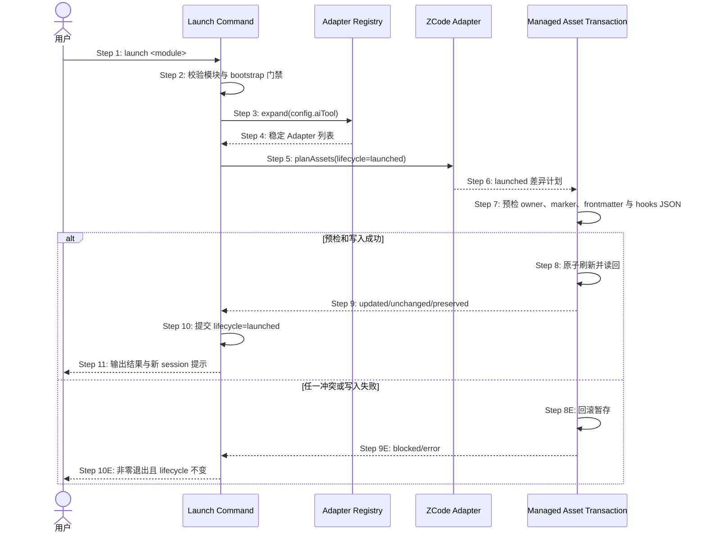

## ADDED — S14 Registry 驱动的 ZCode launched 资产刷新时序

### 场景目标

模块切换到 launched 生命周期时，CLI 通过 Adapter Registry 选择已配置宿主并原子刷新 ZCode 的 launched 指令、Skills、Agents、AGENTS 托管片段与 Hooks；normal/adopted 两种 bootstrap 均保持原门禁语义，重复 launch 不产生漂移。

### 参与者

- **用户**：授权模块进入 launched。
- **Launch Command**：执行模块门禁、状态提交与结果汇总。
- **Adapter Registry**：解析配置并选择能力匹配的 Adapter。
- **ZCode Adapter**：规划 launched 资产变体。
- **Managed Asset Transaction**：预检、原子刷新和回滚。

### 前置条件

- 目标模块存在且 bootstrap/lifecycle 状态可解析。
- normal 模块满足既有 verify、部署与 smoke 门；adopted 模块按既有豁免规则执行。
- ZCode 仅在 `aiTool` 明确选择 `zcode` 或 `all` 展开包含它时参与刷新。

### 成功后置条件

- 模块 lifecycle 与 ZCode launched 资产一致，不出现一方成功、一方失败。
- 根 `AGENTS.md` 只更新 OpenLogos 托管片段；用户内容和非 OpenLogos ZCode 资产保留。
- 输出提示新建 ZCode session 以装载新的 Hook/指令快照。

### 时序图

### 步骤说明

1. 用户指定唯一模块；多模块缺参、未知模块仍按既有规则拒绝。
2. normal 分支验证验收链；adopted/历史 skipped 分支仅应用既有 Initial 豁免，不豁免资产安全预检。
3. Launch Command 不再写死宿主分支，而向 Registry 请求配置集合。
4. Registry 去重并保持确定顺序，既有四宿主行为不变。
5. ZCode Adapter 根据 capability manifest 选择 launched 模板。
6. 计划覆盖插件 manifest、Skills、Commands、Agents、Hooks/runtime 与根 AGENTS 托管片段。
7. 不完整 marker、未知 owner、非法 frontmatter 或 Hook 配置立即阻断。
8. 仅预检全通过后替换托管资产；不得镜像删除用户文件。
9. 结果区分 updated、unchanged、preserved 和 blocked。
10. lifecycle 提交必须晚于全部已选 Adapter 成功；失败保持旧值。
11. 成功输出 ZCode 资产位置与新 session 生效提示。

### 异常与边界

#### EX-ZC-1：已 launched 的 normal 模块

- **触发条件**：normal 模块已为 launched，再次执行 launch。
- **期望响应**：保持既有零码 no-op 行为，不刷新任何宿主。
- **副作用**：Registry 不得让 ZCode 改变该兼容语义。

#### EX-ZC-2：已 launched 的 adopted 模块

- **触发条件**：adopted 模块重复 launch，托管 ZCode 资产可能落后。
- **期望响应**：经 Registry 幂等刷新 launched 资产，lifecycle 值不改写。
- **副作用**：用户配置和托管片段外内容保持原样。

#### EX-ZC-3：ZCode 资产冲突

- **触发条件**：目标路径已存在不同 owner 文件，或 AGENTS marker 不完整。
- **期望响应**：阻断整个 launch 事务，列出精确路径和修复建议。
- **副作用**：lifecycle、既有资产及其它宿主资产保持提交前状态。

### 追溯

- 需求：S14 launched 刷新与兼容性验收。
- 架构：28.2 Adapter Registry、28.3 资产规划与原子部署。
- 测试：UT-S14-06～UT-S14-09、ST-S14-19～ST-S14-20。
