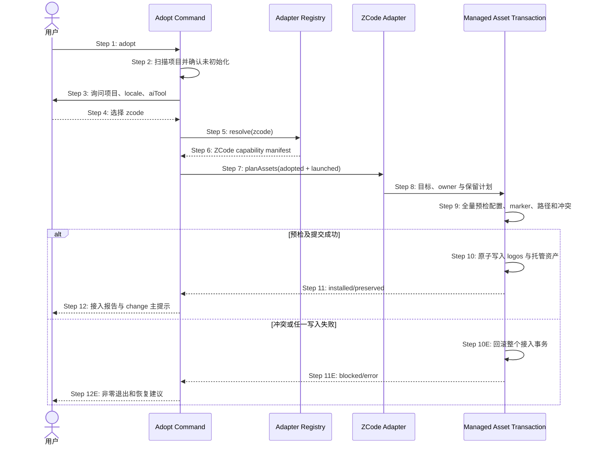

## ADDED — S20 存量项目选择 ZCode 的安全接入时序

### 场景目标

存量项目执行 adopt 时可选择 `zcode`，在保留已有根 `AGENTS.md`、`.zcode` 配置与非 OpenLogos 插件的前提下，以同 init 等级的原子事务部署 Registry、ZCode 插件和 guard 基础设施，并保持“接入后可直接 change”的主路径。

### 参与者

- **用户**：确认项目元数据、locale 与 ZCode 宿主。
- **Adopt Command**：扫描存量项目、编排接入事务和输出交接。
- **Adapter Registry**：解析 `zcode`/`all` 并提供资产能力。
- **ZCode Adapter**：规划插件、指令、AGENTS 与 Hooks 资产。
- **Managed Asset Transaction**：保护存量 owner、原子提交或回滚。

### 前置条件

- 当前目录尚无 `logos/logos.config.json`。
- 存量项目可以包含用户 `AGENTS.md`、`.zcode/config.json`、`.zcode` 其它内容或已安装插件。
- 随包 ZCode 模板和共享 Hook runtime 均可读取。

### 成功后置条件

- 配置持久化 `aiTool: zcode`，模块为 `bootstrap: adopted`、`lifecycle: launched`。
- OpenLogos ZCode 资产完整可发现，存量用户资产逐项 preserved。
- 接入报告仍以 `openlogos change <slug>` 为下一主动作，不增加 ZCode 特有前置门。

### 时序图

### 步骤说明

1. 用户在存量项目根执行 adopt。
2. CLI 读取项目事实并拒绝覆盖已初始化项目。
3. 交互选项由 Registry 枚举，ZCode 与既有宿主并列；非交互参数同样接受 `zcode`。
4. 用户选择被规范化为稳定 id，不用自由文本触发宿主分支。
5. Adopt Command 向 Registry 解析单宿主或 `all`。
6. capability manifest 声明 ZCode 支持 init/sync/launch/adopt、AGENTS、插件与 Hooks。
7. adopted 模块直接选 launched 资产变体，不先部署 initial 再覆盖。
8. 计划区分 OpenLogos 托管目标、已存在用户目标和不可安全合并的冲突。
9. 根 AGENTS 必须能安全插入完整 marker 对；现有 `.zcode/config.json` 和非 OpenLogos 插件只读不覆盖。
10. logos 结构、配置、索引、spec 与 Adapter 资产作为一个接入提交单元处理。
11. 成功结果列出 installed、unchanged、preserved；不得把 preserved 误报为 installed。
12. 交接明确 ZCode 需新 session 装载插件，同时保留可直接创建 change 的路径。

### 异常与边界

#### EX-ZC-1：AGENTS marker 不完整

- **触发条件**：根 AGENTS 只有 BEGIN 或 END marker。
- **期望响应**：在任何写入前阻断，给出人工修复路径。
- **副作用**：不得创建半套 logos 或 ZCode 资产。

#### EX-ZC-2：ZCode 目标存在不同 owner

- **触发条件**：OpenLogos 插件 identity 或目标文件名已被非 OpenLogos 资产占用。
- **期望响应**：默认阻断，不覆盖、不改名规避、不删除。
- **副作用**：完整回滚接入事务，用户资产保持字节不变。

#### EX-ZC-3：存量 `.zcode/config.json`

- **触发条件**：项目已有 ZCode 配置，包含用户模型、权限或其它插件配置。
- **期望响应**：不把项目级配置当 Hook 安装点，不改写用户设置；OpenLogos Hooks 随插件交付。
- **副作用**：配置保留结果进入接入报告。

#### EX-ZC-4：接入后首个 change

- **触发条件**：adopt 成功后执行 status/next/change。
- **期望响应**：与其它宿主相同，直接进入 S39 规格闭包；不得要求先运行 ZCode 专用 seed。
- **副作用**：ZCode 只是宿主能力，不改变 OpenLogos 方法论前沿。

### 追溯

- 需求：S20 ZCode 存量接入、保护与后续 change 可达性。
- 架构：28.2 Adapter Registry、28.3 资产事务、28.5 打包边界。
- 测试：UT-S20-20～UT-S20-26、ST-S20-14～ST-S20-16。
