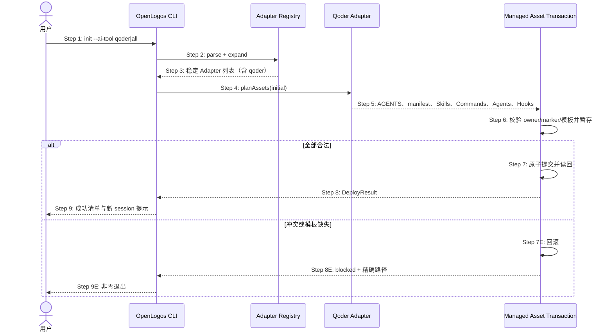

## ADDED — S01 Qoder 初始化与原生插件原子部署时序

### 场景目标

用户以 `--ai-tool qoder` 或 `all` 初始化时，由 Registry 解析 Qoder，并在保护用户资产的前提下原子部署根指令、原生插件、Skills、Commands、Agents 与 Hooks。

### 参与者

- **用户**：选择宿主并接收逐资产结果。
- **OpenLogos CLI**：编排初始化和总事务。
- **Adapter Registry**：解析/展开宿主集合。
- **Qoder Adapter**：规划 Qoder 资产与 owner。
- **Managed Asset Transaction**：预检、暂存、提交/回滚与读回。

### 前置条件

- 项目尚未初始化，seed journal 已恢复或不存在。
- Qoder 模板与共享 runtime 均存在于当前 CLI 安装包。

### 成功后置条件

- 配置持久化 `qoder`，或 `all` 结果包含 Qoder。
- 根 AGENTS 托管片段与完整 Qoder 插件落盘，用户资产不变。
- 逐资产结果与磁盘读回一致。

### 时序图

### 步骤说明

1. CLI 在写入前完成未初始化、locale、项目名与 seed journal 校验。
2. 原始宿主选择交给 Registry，`all` 按稳定顺序展开且排除 `other`。
3. Registry 返回规范 id，CLI 不维护 Qoder 名称分支。
4. Qoder Adapter 按 initial lifecycle 生成完整资产计划。
5. 计划至少包含 `.qoder-plugin/plugin.json`、约定组件目录、`hooks/hooks.json`、runtime 与 AGENTS managed block。
6. 事务层校验 manifest/hooks/frontmatter、owner、marker 和所有目标可写性。
7. 全部预检通过后按稳定顺序提交，任何失败恢复备份。
8. 结果按 created/updated/unchanged/preserved/blocked 汇总。
9. 成功提示新 Qoder CLI session 才装载插件/Hook 快照。

### 异常与边界

#### EX-QD-S01-1：随包模板缺失
- **触发条件**：manifest、声明组件或 runtime 任一未进入 tarball。
- **期望响应**：首个项目写入前失败并点名包内路径。
- **副作用**：无半初始化目录或伪造成功行。

#### EX-QD-S01-2：插件 owner 冲突
- **触发条件**：目标已有不同 identity 或未知 owner。
- **期望响应**：blocked，禁止覆盖/吸收未知插件。
- **副作用**：用户插件字节不变。

#### EX-QD-S01-3：AGENTS marker 残缺
- **触发条件**：只有 BEGIN 或 END。
- **期望响应**：总事务预检失败并给出修复位置。
- **副作用**：配置、logos 与插件均不提交。

### 追溯

- 需求：S01 Qoder 初始化验收。
- 架构：29.2 Qoder 资产模型、29.6 资产事务与提交顺序。
- 测试：UT-S01-108～UT-S01-115、ST-S01-18～ST-S01-20。
