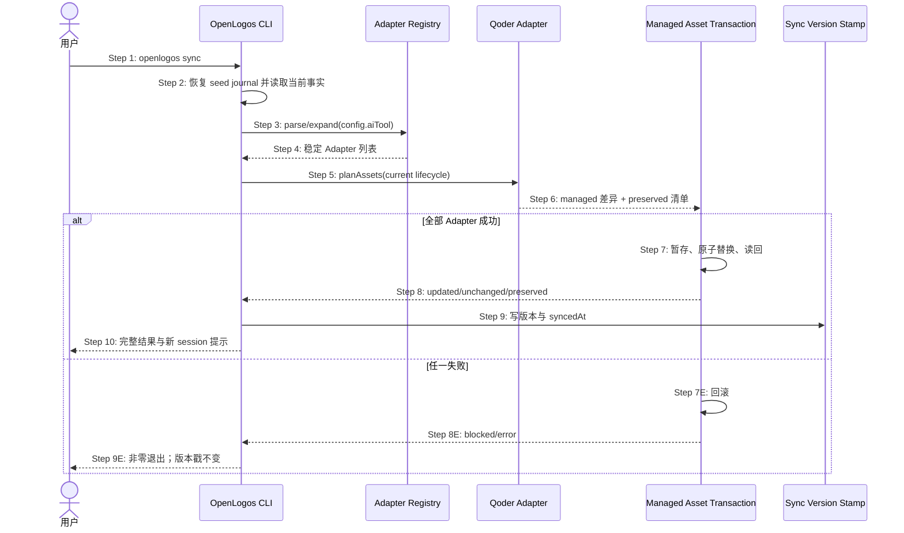

## ADDED — S08 Qoder 托管资产幂等同步时序

### 场景目标

`openlogos sync` 经 Registry 幂等刷新 OpenLogos Qoder 插件、根指令和 lifecycle 变体，保留 Qoder 用户 settings、其它插件与未知文件，并在全部 Adapter 成功后才更新同步版本戳。

### 参与者

- **用户**：触发同步并查看刷新/保留结果。
- **OpenLogos CLI**：持有同步总事务与版本戳。
- **Adapter Registry**：解析历史/当前配置。
- **Qoder Adapter**：计算托管资产差异。
- **Managed Asset Transaction**：原子刷新或回滚。

### 前置条件

- 项目配置、资源索引与 lifecycle 可解析，seed journal 已恢复或不存在。
- 随包 Qoder 模板可读；目标可能混合旧托管资产和用户资产。

### 成功后置条件

- Qoder 托管资产与 CLI 版本、locale、lifecycle 一致。
- 用户 settings、其它插件、未知文件和 marker 外内容哈希不变。
- 同步版本戳只记录完整成功结果。

### 时序图

### 步骤说明

1. 用户从项目根触发 sync。
2. CLI 在读取 effective view 前通过 seed journal 恢复门。
3. 配置标量、数组、历史值与 all 统一交给 Registry。
4. 历史配置未选 Qoder 时不擅自加入；all 新展开包含 Qoder。
5. Qoder Adapter 选择当前 initial/launched 模板。
6. 仅 manifest identity、managed marker 或已知哈希可证明的文件进入更新计划，未知目标 preserved/blocked。
7. 校验 manifest/hooks/frontmatter 后原子替换，失败恢复备份。
8. 结果明确区分托管更新、未变化和用户保留项。
9. 只有所有 Adapter 成功才写同步版本戳。
10. 成功提示创建新 Qoder CLI session 获取插件/Hook 快照。

### 异常与边界

#### EX-QD-S08-1：历史配置未选择 Qoder
- **触发条件**：aiTool 为既有单值/数组且无 qoder。
- **期望响应**：只同步原宿主；all 才按新 Registry 包含 Qoder。
- **副作用**：历史行为零漂移。

#### EX-QD-S08-2：托管目录混入用户文件
- **触发条件**：插件中存在未声明文件或不同 owner 组件。
- **期望响应**：用户文件 preserved，冲突目标 blocked，不做目录镜像删除。
- **副作用**：用户哈希不变。

#### EX-QD-S08-3：提交/读回失败
- **触发条件**：rename、权限、内容或读回校验失败。
- **期望响应**：回滚总事务并非零退出。
- **副作用**：版本戳保持旧值，不输出 Sync complete。

### 追溯

- 需求：S08 Qoder 同步验收。
- 架构：29.5 状态读取与路径安全、29.6 资产事务与提交顺序。
- 测试：UT-S08-21～UT-S08-26、ST-S08-19～ST-S08-21。
