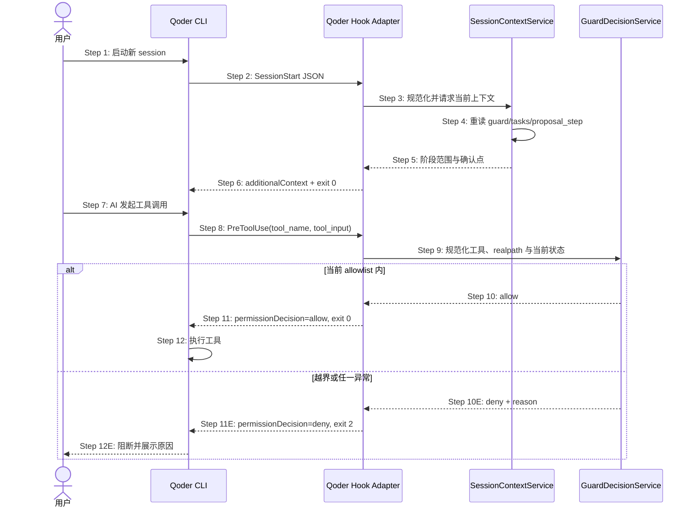

## ADDED — S09 Qoder SessionStart 与 PreToolUse hard guard 时序

### 场景目标

Qoder CLI 新会话通过 SessionStart 获得当前 OpenLogos 阶段上下文；每次 PreToolUse 在工具执行前重新读取磁盘状态并复用共享 guard 决策。协议、路径、状态或运行时异常一律 fail-closed。

### 参与者

- **用户**：启动 Qoder CLI session 并发起工具操作。
- **Qoder CLI**：发现插件 Hook、发送事件并消费输出/退出码。
- **Qoder Hook Adapter**：校验 snake_case 输入与映射宿主协议。
- **SessionContextService**：派生阶段上下文。
- **GuardDecisionService**：对规范化工具调用 allow/deny。

### 前置条件

- OpenLogos Qoder 插件已启用，`hooks/hooks.json` 指向随包 runtime。
- 项目配置可定位；若有 guard，可唯一解析 active change。
- 权限只信任当前磁盘事实，不信任会话启动缓存。

### 成功后置条件

- SessionStart 上下文包含 module、slug、`proposal_step`、允许范围和下一确认点。
- 每次写入在执行前得到显式 allow/deny；deny 带非空原因并以 exit 2 阻断。
- Qoder 与既有宿主得到同一共享 guard 结论。

### 时序图

### 步骤说明

1. 新 session 装载当前插件/Hook 快照；刷新后不宣称旧 session 热更新。
2. Hook 从 stdin 限长读取单个 JSON 对象。
3. Adapter 校验 `session_id`、`cwd`、`hook_event_name` 和 `source`，再调用共享上下文服务。
4. 服务从磁盘派生 lifecycle、active slug、tasks 与 `proposal_step`。
5. 上下文明确允许/禁止范围与 merge/verify 等人类确认点。
6. Adapter 输出 `hookSpecificOutput.hookEventName="SessionStart"` 与 `additionalContext`；stdout 无日志。
7. 模型提出读、写、改名、删除或间接写盘操作。
8. PreToolUse 提供 `tool_name` 与 `tool_input`；matcher 不替代共享决策。
9. Adapter 规范化路径、symlink、命令意图并把最新磁盘状态交给 guard 服务。
10. 服务按当前 proposal-step allowlist 决策；SessionStart 不作为授权缓存。
11. allow/deny 显式映射；deny 同时输出 reason 与 exit 2。
12. Qoder 仅在 allow 后执行工具。

### 异常与边界

#### EX-QD-S09-1：损坏或缺字段事件
- **触发条件**：空输入、非法 JSON、类型错误或缺失 tool_name/tool_input。
- **期望响应**：输出合法 deny、非空原因并 exit 2；详情写 stderr。
- **副作用**：工具不执行。

#### EX-QD-S09-2：路径逃逸
- **触发条件**：`..`、绝对路径或 symlink 解析后落到 allowlist 外。
- **期望响应**：deny + exit 2。
- **副作用**：所有候选目标哈希不变。

#### EX-QD-S09-3：一般非零不是安全阻断
- **触发条件**：runtime 抛错或误用 exit 1。
- **期望响应**：包装器捕获并转换为协议 deny + exit 2；测试拒绝把 exit 1 计为通过。
- **副作用**：不能因 Qoder 将一般错误视为非阻断而绕过 guard。

#### EX-QD-S09-4：同会话阶段变化
- **触发条件**：tasks 从 delta-writing 收敛到 ready-to-merge。
- **期望响应**：下一次 PreToolUse 立即重读并拒绝后续 delta 写入。
- **副作用**：旧 SessionStart 文案不扩大权限。

### 追溯

- 需求：S09 Qoder Hook 与 hard guard 验收。
- 架构：29.4 事件归一化与映射、29.5 状态读取与路径安全。
- 测试：UT-S09-198～UT-S09-207、ST-S09-77～ST-S09-80。
