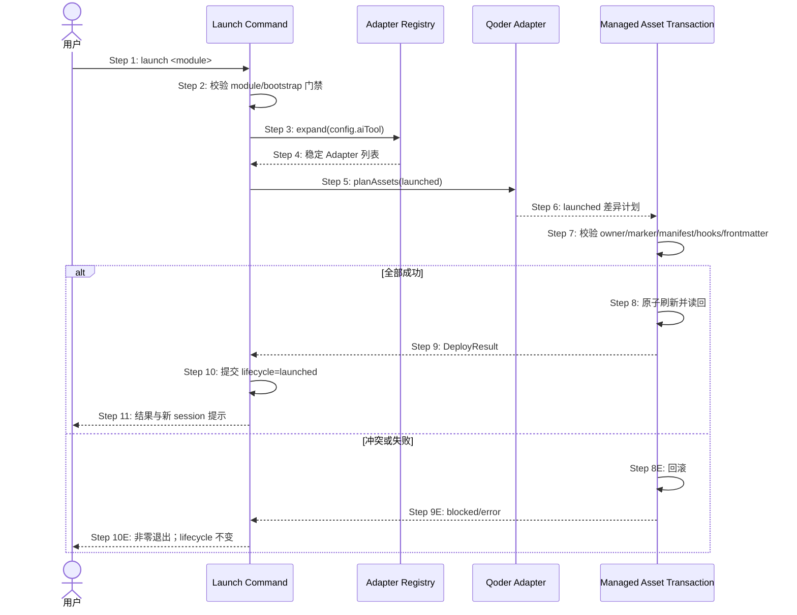

## ADDED — S14 Registry 驱动的 Qoder launched 资产刷新时序

### 场景目标

模块进入 launched 时，经 Registry 原子刷新 Qoder launched 指令、Skills、Commands、Agents 与 Hooks；所有已选 Adapter 成功后才提交 lifecycle，重复执行幂等。

### 参与者

- **用户**：授权 launch。
- **Launch Command**：校验门禁并持有 lifecycle 提交。
- **Adapter Registry**：选择已配置 Adapter。
- **Qoder Adapter**：规划 launched 资产。
- **Managed Asset Transaction**：预检、刷新或回滚。

### 前置条件

- module/bootstrap/lifecycle 可解析；normal/adopted 分支满足既有门禁。
- 仅 `aiTool=qoder` 或 `all` 展开包含 Qoder 时参与。

### 成功后置条件

- lifecycle 与 Qoder launched 资产一致。
- 用户 settings、其它插件和 AGENTS marker 外内容不变。
- 结果提示以新 Qoder CLI session 装载刷新快照。

### 时序图

### 步骤说明

1. 用户指定唯一 module。
2. normal 与 adopted/历史 skipped 只沿用既有门禁，不因 Qoder 改义。
3. Launch Command 只调用 Registry，不手写宿主判断。
4. Registry 稳定去重，历史未选择 Qoder 时不加入。
5. Qoder Adapter 根据 capability 选择 launched 模板。
6. 计划覆盖插件、Skills、Commands、Agents、Hooks/runtime 与 AGENTS managed block。
7. 任一非法或 owner 冲突在首个提交前阻断。
8. 事务只替换托管目标，不镜像删除用户文件。
9. 结果区分 updated/unchanged/preserved/blocked。
10. lifecycle 提交晚于所有 Adapter 成功。
11. 成功提示重开 Qoder CLI session。

### 异常与边界

#### EX-QD-S14-1：normal 已 launched
- **触发条件**：normal module 已 launched，再次执行。
- **期望响应**：保持既有零码 no-op，不因 Qoder 强制刷新。
- **副作用**：所有资产不变。

#### EX-QD-S14-2：adopted 已 launched
- **触发条件**：托管 Qoder 资产落后，重复 launch。
- **期望响应**：幂等刷新差异，lifecycle 值不重复改写。
- **副作用**：用户资产 preserved。

#### EX-QD-S14-3：Qoder 资产失败
- **触发条件**：模板缺失、owner 冲突或读回失败。
- **期望响应**：回滚整个已选 Adapter 事务。
- **副作用**：lifecycle 与其它宿主资产保持提交前状态。

### 追溯

- 需求：S14 Qoder launched 刷新验收。
- 架构：29.6 资产事务与提交顺序。
- 测试：UT-S14-10～UT-S14-13、ST-S14-21～ST-S14-22。
