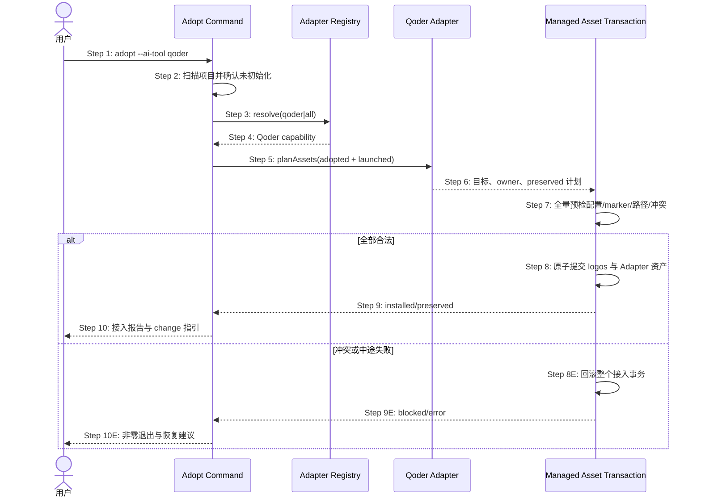

## ADDED — S20 存量项目选择 Qoder 的安全接入时序

### 场景目标

存量项目选择 `qoder` 后，在保留既有 AGENTS、Qoder settings、非 OpenLogos 插件和未知文件的前提下，以原子事务部署完整 Qoder 资产，并保持接入后可直接创建 change。

### 参与者

- **用户**：确认项目、locale 与 Qoder 宿主。
- **Adopt Command**：扫描存量事实并编排接入。
- **Adapter Registry**：解析 qoder/all 与 capability。
- **Qoder Adapter**：规划 launched 插件与指令。
- **Managed Asset Transaction**：保护 owner、提交或回滚。

### 前置条件

- 当前项目未存在 OpenLogos 配置。
- 项目可包含现有 AGENTS、Qoder settings、用户插件或未知 Qoder 文件。
- 随包模板与共享 runtime 可读。

### 成功后置条件

- 配置为 `aiTool: qoder`，module 为 `bootstrap: adopted`、`lifecycle: launched`。
- OpenLogos Qoder 资产完整，用户资产逐项 preserved。
- 下一主动作仍是 `openlogos change <slug>`，无 Qoder 专用 seed 前置。

### 时序图

### 步骤说明

1. 用户以交互或非交互方式选择 Qoder。
2. Adopt 扫描项目并拒绝覆盖已初始化项目。
3. 宿主选择由 Registry 枚举/解析。
4. capability 声明 Qoder 的 instructions、plugin、组件与 Hook 支持。
5. adopted module 直接选择 launched 变体，不先落 initial 再覆盖。
6. 计划区分 OpenLogos 托管目标、用户目标与不安全冲突。
7. AGENTS marker、Qoder settings/插件 owner、模板和所有目标在首个写入前全量校验。
8. logos、配置、索引、spec 与 Qoder 资产作为同一接入提交单元。
9. 结果区分 installed/unchanged/preserved/blocked。
10. 提示新 Qoder CLI session 装载插件，同时保留 change 主路径。

### 异常与边界

#### EX-QD-S20-1：AGENTS marker 不完整
- **触发条件**：根 AGENTS 仅有一个 OpenLogos marker。
- **期望响应**：任何写入前阻断并指出修复位置。
- **副作用**：不创建半套 logos 或插件。

#### EX-QD-S20-2：Qoder 插件 identity 冲突
- **触发条件**：同名路径属于非 OpenLogos 插件。
- **期望响应**：默认 blocked，不覆盖、删除或改名规避。
- **副作用**：总事务回滚，用户资产不变。

#### EX-QD-S20-3：既有 Qoder settings
- **触发条件**：项目/隔离用户目录已有模型、权限、市场源或插件配置。
- **期望响应**：只读验证并报告 preserved；OpenLogos Hook 由独立插件交付。
- **副作用**：settings 哈希不变。

#### EX-QD-S20-4：接入后首个 change
- **触发条件**：adopt 成功后执行 status/next/change。
- **期望响应**：直接进入既有 S39 规格闭包，不新增 Qoder 方法论前沿。
- **副作用**：Qoder 仅是宿主能力。

### 追溯

- 需求：S20 Qoder 存量接入验收。
- 架构：29.2 Qoder 资产模型、29.6 资产事务与提交顺序。
- 测试：UT-S20-27～UT-S20-33、ST-S20-17～ST-S20-19。
