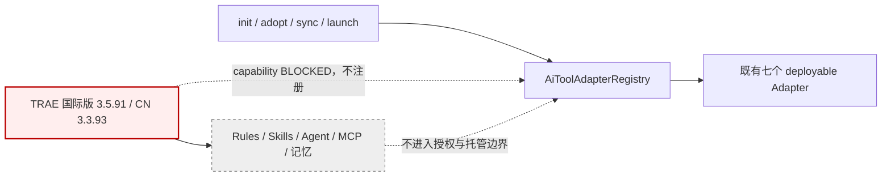

## ADDED — 三十一、TRAE capability BLOCKED 与架构排除边界

### 31.1 结论与组件边界

- 不创建 `TraeAdapter`、`TraeHookNormalizer`、插件/资产模板或宿主 wrapper；共享核心也不增加 TRAE 名称判断。
- Registry 继续独占规范 id、别名、capability、稳定顺序与 `all` 展开；不登记 non-deployable 占位。
- `ManagedAssetTransaction` 不接收 `.trae/**` 计划；`SessionContextService` 与 `GuardDecisionService` 不接受 TRAE 专有事件。

### 31.2 证据链与失败模型

两个真实客户端的内置 `Write` 均执行了目标改写，而项目 `.trae/hooks.json` 的拒绝脚本未生成 stdin 证据或拒绝理由。架构判定以“目标变化发生在 guard 之前或 guard 未执行”为硬失败，不因以下信号降级：

1. 客户端存在 Hooks UI、`PreToolUse` 字符串或 deny/block 处理代码；
2. Rules、Skills、自定义 Agent 或 MCP 能表达禁止写入；
3. 用户可手工将工作区加入 `enabled_folders`；
4. wrapper 可被直接调用并返回拒绝。

项目资产存在但需要每个工作区的用户信任开关，说明 Adapter 无法在不改变用户安全状态的前提下可靠部署。解析、运行、超时或状态异常若继续执行，则同样不满足 fail-closed。

### 31.3 所有权矩阵

| 对象 | OpenLogos owner | 架构策略 |
|---|---:|---|
| TRAE Rules、Skills、Agents、Commands、MCP | 否 | preserve；不扫描、不生成、不删除 |
| TRAE settings、账号与工作区信任状态 | 否 | 禁止静默改写 |
| TRAE 原生记忆 | 否 | 不读正文、不写入、不迁移、不用于授权 |
| TRAE Hook/normalizer/template | 不存在 | 不创建伪实现或占位 |
| 既有七宿主 Adapter 与托管资产 | 是/沿既有合同 | 顺序、路径、哈希与事务语义不变 |

### 31.4 重新开启架构门

未来独立提案只有在国际版与 CN 均可由项目可部署资产激活、且真实内置写/编辑/命令工具共同通过完整矩阵后，才能设计薄 Adapter。矩阵须覆盖路径边界、symlink、未知潜在写工具、非法输入、runtime 缺失、状态矛盾和超时；deny 必须先于工具执行，返回非空原因并保持目标哈希不变。任一客户端或异常路径 fail-open 即维持排除。

### 31.5 版本与部署影响

本架构决策面向 `0.13.29`，但没有源码、模板、package 或运行时变更。原定真实 `0.13.29` tarball 双客户端 staging 仅在 capability PASS 后成立；当前 BLOCKED，因此不构建、不安装、不回滚、不 smoke，也不公开发布。
