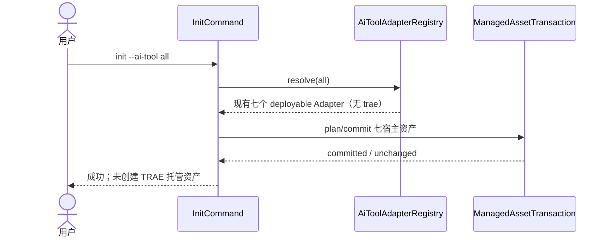
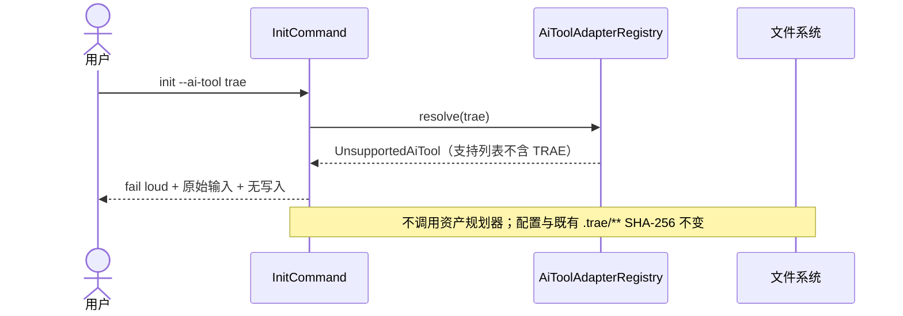

## ADDED — TRAE non-deployable 初始化负向时序

### 目标

S01 在 Registry 选择阶段即排除 TRAE：`all` 只选择既有七个 deployable Adapter；显式 `trae` 在任何资产规划、暂存或写入之前 fail loud。客户端已安装、已登录或存在 `.trae/**` 不改变该结论。

### `all` 初始化时序

### 显式 `trae` 失败时序

### 不变量

- 不把 `trae` 映射为 `other`，不创建 placeholder Adapter/capability。
- 帮助、交互列表和结构化支持值全部由 Registry 派生，保持七宿主稳定顺序。
- TRAE Rules、Skills、Agents、Hooks、MCP、settings、账号和记忆均为用户/宿主资产，初始化不扫描或修改。
