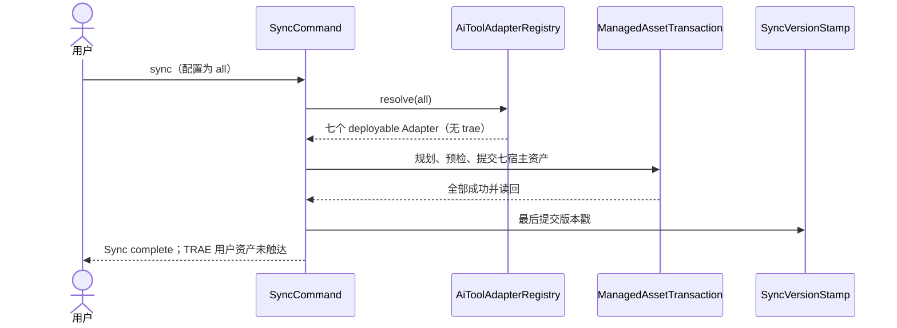
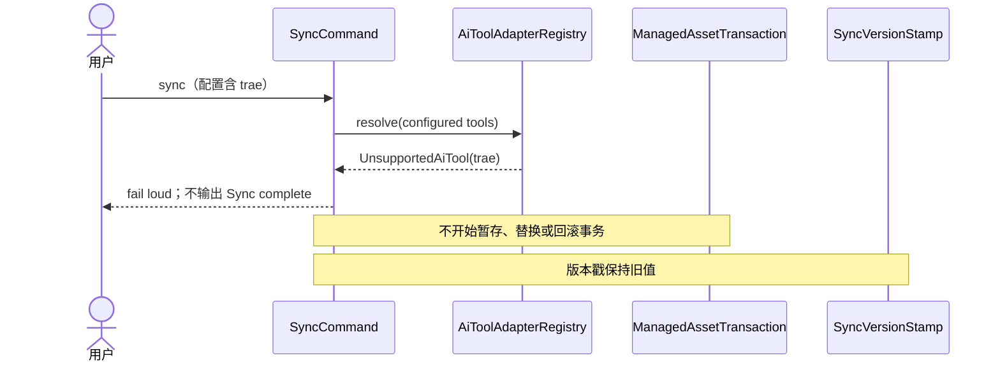

## ADDED — TRAE non-deployable 同步负向时序

### 目标

S08 不因客户端发现或工作区已有 `.trae/**` 自动增加 TRAE Adapter。`all` 只同步既有七宿主；手工配置中的 `trae` 必须在总事务开始前失败，且不刷新同步版本戳。

### `all` 同步时序

### 非法配置失败时序

### 不变量

- `.trae/` Rules、Skills、Agents、Hooks、MCP、settings、账号、记忆和未知文件不进入扫描、计划、暂存、备份、删除或回滚集合。
- 不因探测到 TRAE 国际版/CN 安装或登录状态而改变 Registry。
- 既有七宿主的目标顺序、内容哈希、结果分类、原子提交和版本戳语义保持不变。
