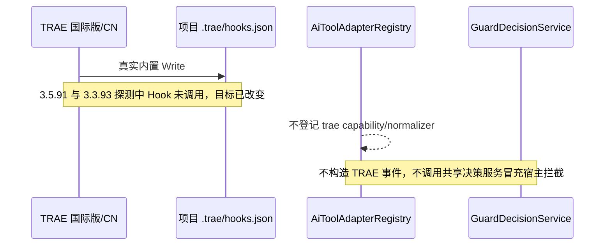
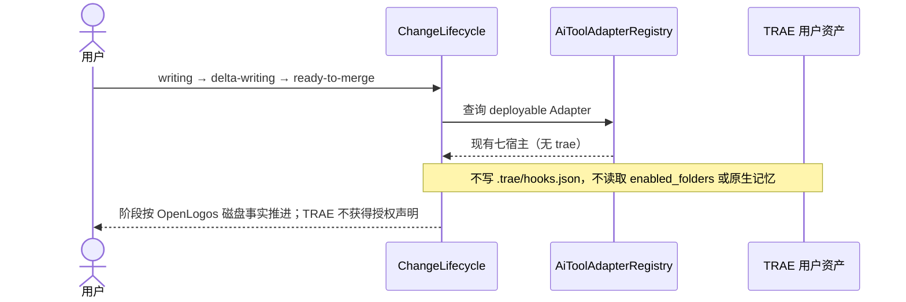

## ADDED — TRAE hard guard 不成立的生命周期负向时序

### 目标

S09 不为 TRAE 注册 SessionStart/PreToolUse normalizer，不把 Rules、Skills、Agent prompt、MCP、人工确认、工作区信任或原生记忆作为 OpenLogos 授权状态。当前双客户端真实基础 deny 已失败，故生命周期中不存在 TRAE hard guard 调用链。

### Registry 排除时序

### 生命周期状态变化

### 不变量与重新开启门

- wrapper 直调返回 deny、Hooks UI 存在或项目配置文件可解析，均不得产生 TRAE capability PASS。
- 已支持宿主仍按既有合同每次重读 guard、slug、tasks 与 `proposal_step`；deny 必须有非空 reason、正确退出语义且目标哈希不变。
- 未来独立提案只有在国际版与 CN 的真实内置工具共同通过 allow/deny、路径边界、symlink、未知工具及全部异常 fail-closed 矩阵后，才能新增 TRAE normalizer 与正向时序。
