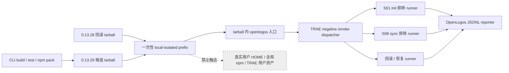
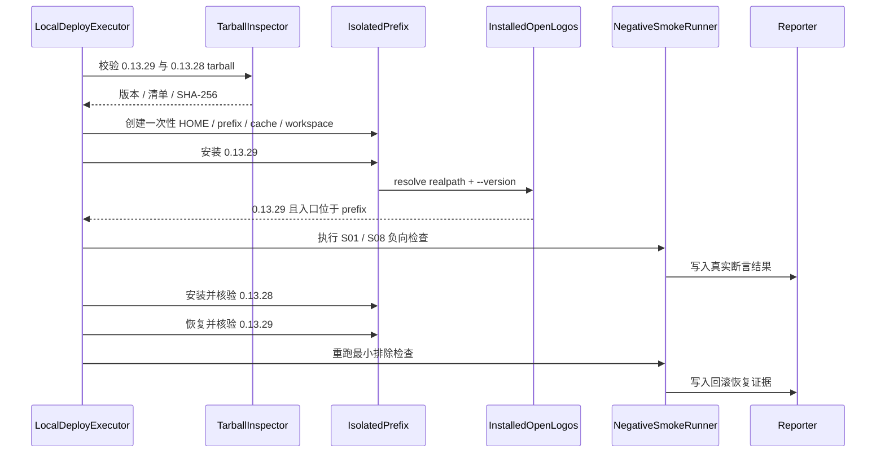

## ADDED — 三十二、TRAE 本地负向制品验证架构

### 32.1 架构边界

本节新增的是 OpenLogos CLI 候选制品验证链，不是 TRAE Adapter 架构。`AiToolAdapterRegistry`、`ManagedAssetTransaction`、`SessionContextService` 与 `GuardDecisionService` 的 TRAE 排除边界保持不变；新 runner 只能从公开 CLI 行为和隔离 fixture 观察 non-deployable 不变量，不接收 TRAE 专有事件。

### 32.2 组件职责

| 组件 | 职责 | 禁止行为 |
|---|---|---|
| Tarball Inspector | 校验包名、版本、清单、大小、SHA-256 和必要 runtime | 从网络下载未固定制品、接受版本漂移 |
| Isolation Allocator | 创建并验证 prefix、HOME、cache、workspace、evidence root | 复用真实 HOME、全局 prefix 或用户项目 |
| Installed CLI Resolver | 解析 tarball 内 `openlogos` 绝对路径并核验 realpath | 回退到 PATH 中全局 CLI、workspace link 或源码入口 |
| TRAE Negative Runner | 执行显式拒绝、`all`/sync 排除和合成用户边界哈希检查 | 启动真实 TRAE、读取记忆正文、构造 Adapter/模板 |
| Rollback Runner | 在同一 prefix 完成 `0.13.29 → 0.13.28 → 0.13.29` | 修改真实全局安装或把“可重新安装”当成已回滚 |
| Smoke Dispatcher / Reporter | 发现 SMOKE-core-124～129，执行真实断言并写 JSONL | 伪造 pass、把缺失或 skip 计为成功 |

### 32.3 隔离与所有权不变量

1. 所有可写路径必须位于一次性根目录的 realpath 下；环境变量、symlink 和命令解析不得逃逸。
2. fixture 可以包含合成 `.trae/**`、settings、账号占位、`enabled_folders` 与不透明记忆样本；runner 只比较文件清单、大小和 SHA-256。
3. 真实 TRAE 国际版/CN 的应用路径与版本只作为不变背景证据；不启动客户端，不重跑 hard guard 探测。
4. `trae` 不进入 Registry、`all`、帮助、交互、资产规划、版本戳或 reporter 的“支持宿主”字段。
5. 公共发布端点、Git 远端、Cloudflare 与用户全局 npm 均在架构边界外，runner 不提供调用路径。

### 32.4 执行与失败顺序

任何步骤失败都停止后续成功标记；失败清理不得改写被测证据。保留失败现场时只允许保留一次性根内的脱敏数据，并由显式开关控制。

### 32.5 版本与兼容边界

- `cli/package.json`、lockfile 和随包插件 manifest 统一为 `0.13.29`，版本读取以打包后内容为准。
- `0.13.28` 仅作明确提供且哈希固定的回滚输入，不从公共 registry 动态解析。
- 既有七宿主 Adapter、`all` 稳定顺序和用户资产所有权不变；新代码位于部署/smoke runner 与 reporter 边界，不向共享 Adapter 核心添加 TRAE 特例。
- 本架构不包含 npm publish、tag、Release、官网部署或 push。
