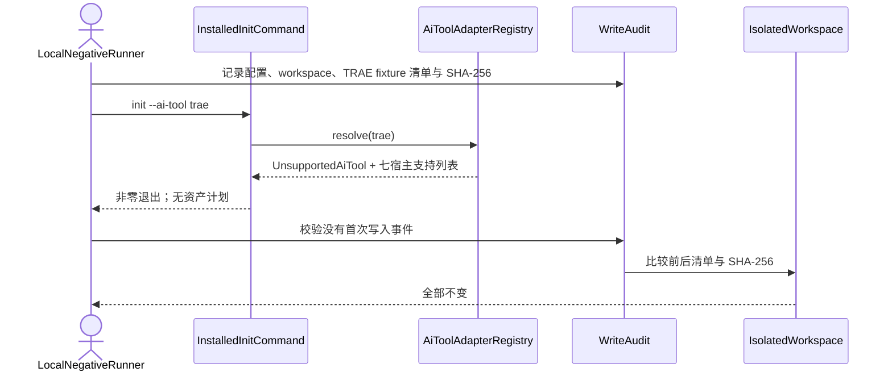
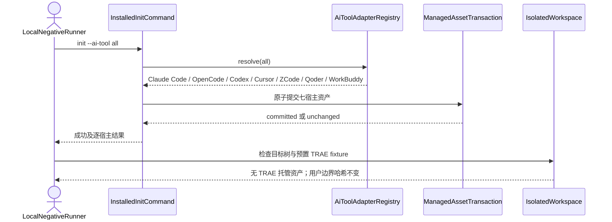

## ADDED — TRAE 候选 tarball 安装态初始化负向时序

### 目标与前置条件

在一次性 `local-isolated` 环境中，从 `OPENLOGOS_TRAE_LOCAL_TARBALL` 安装并解析真实 OpenLogos `0.13.29` CLI，复用 S01 的 Registry/初始化链证明：显式 `trae` 首写前失败，`all` 仍只部署既有七宿主，且合成 TRAE 用户资产保持不变。该入口不启动真实 TRAE 客户端。

前置条件包括：候选 tarball 包名、版本和 SHA-256 已校验；CLI realpath 位于隔离 prefix；HOME/workspace 均位于一次性根目录；fixture 仅含合成 `.trae/**` 和不透明边界数据。

### 显式 TRAE 首写前拒绝

runner 必须同时断言：错误保留原始输入；不映射为 `other`；配置文件、`logos/` 和 `.trae/**` 均未新增或变化；stderr 不宣称 TRAE 可部署或 hard guard PASS。

### `all` 七宿主安装态回归

### 异常与证据

- tarball 版本不是 `0.13.29`、入口 realpath 逃逸、发现 workspace link/源码入口或 fixture 指向真实 HOME 时，runner 在调用 init 前失败。
- 显式 TRAE 返回零退出、产生任何写入或支持列表含 TRAE 时，UT/ST 与对应 smoke 均失败。
- `all` 的集合、顺序或资产计划与既有七宿主 golden 不一致，或出现任何 `.trae/**` 新增/变化时失败。
- reporter 记录 tarball SHA-256、CLI realpath 类别、退出码、写入审计摘要和前后哈希；不得记录凭据、真实用户路径内容或记忆正文。

### 追溯

- 单元测试：UT-S01-128。
- 场景测试：ST-S01-26。
- Smoke：SMOKE-core-124、SMOKE-core-125、SMOKE-core-126。
