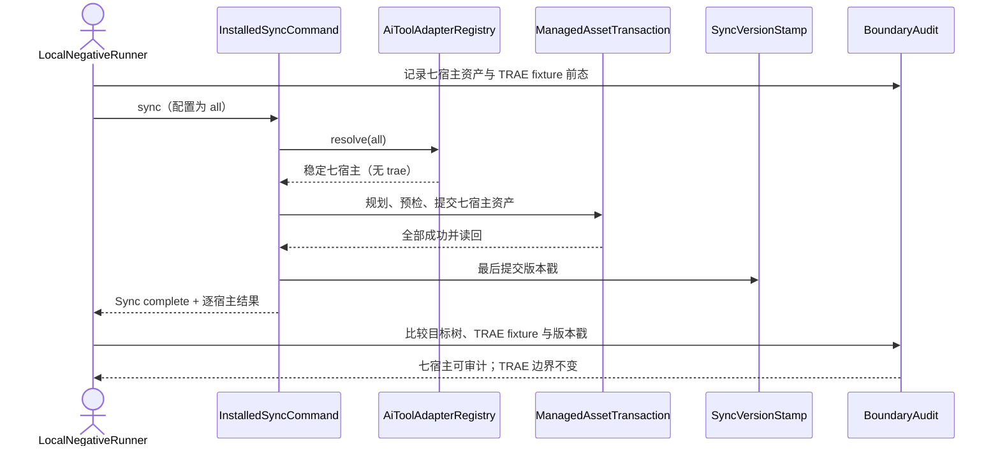
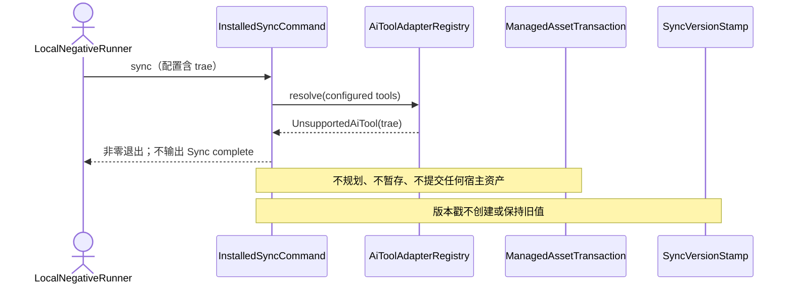

## ADDED — TRAE 候选 tarball 安装态同步负向时序

### 目标与前置条件

使用 `local-isolated` prefix 中真实 `0.13.29` CLI 验证 S08：`all` 同步仍只处理既有七宿主；配置显式包含 `trae` 时在总事务前失败；合成 `.trae/**` 与用户边界哈希始终不变。客户端安装/登录事实不得影响 Registry。

### `all` 同步与用户边界

### 严格配置失败

### 边界与失败模型

- `.trae/rules`、`.trae/skills`、Agents、Hooks、MCP、settings、账号占位、`enabled_folders`、不透明记忆和未知文件不进入扫描、计划、暂存、备份、删除或回滚集合。
- runner 只使用合成 fixture 并比较路径清单、大小和 SHA-256；不读取记忆正文，不启动 TRAE，不修改信任状态。
- `all` 出现 TRAE、七宿主顺序漂移、严格配置被静默忽略、部分宿主先提交、版本戳变化或任一用户边界哈希变化时失败。
- 候选 CLI 入口不在隔离 prefix、版本不是 `0.13.29` 或命令引用仓库源码时，在调用 sync 前失败。
- reporter 记录真实命令、脱敏配置摘要、逐宿主结果、版本戳与哈希证据；失败不得写 pass。

### 追溯

- 单元测试：UT-S08-37。
- 场景测试：ST-S08-27。
- Smoke：SMOKE-core-127、SMOKE-core-128。
