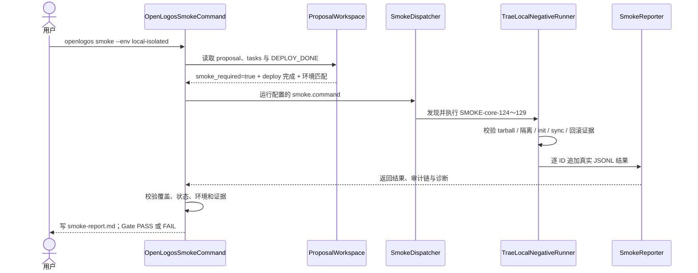

## ADDED — `local-isolated` TRAE 负向 Smoke 门禁时序

### 目标

S19 接受字符串环境 `local-isolated`，但只为当前提案调度 OpenLogos `0.13.29` 候选 tarball 的负向 runner。它不将 TRAE 注册为 deployable，也不启动真实 TRAE 写工具。smoke 与部署仍是两个独立的人类确认点。

### 主时序

### 前置门禁

1. 活跃提案必须声明 `deployment_required=true`、`smoke_required=true`，且 `[deploy]` 全部勾选。
2. `DEPLOY_DONE` 必须属于 `local-isolated`，并关联本次 `0.13.29` 候选 tarball SHA-256；缺失或环境不匹配时拒绝调度。
3. `OPENLOGOS_TRAE_LOCAL_TARBALL` 与 `OPENLOGOS_TRAE_ROLLBACK_TARBALL` 必须存在，并分别解析为版本精确的 `0.13.29` 与 `0.13.28` 真实 tarball。
4. dispatcher 必须发现覆盖 SMOKE-core-124～SMOKE-core-129 的 runner；缺失 runner/reporter 时不得将其它历史结果补位。

### 结果与失败路径

- 每个结果至少含 `id`、`status`、`timestamp`、`duration_ms`、`environment="local-isolated"`、候选/回滚 tarball SHA-256 和脱敏 evidence；status 只允许按真实执行写入。
- 任一 ID 缺失、skip、fail、重复矛盾、环境不匹配、制品 SHA 不匹配或证据链不完整，Gate 为 FAIL 并写 `SMOKE_FAIL`，不得写 `SMOKE_PASS`。
- runner 若尝试访问真实 HOME、全局 npm、仓库外用户项目、真实 `.trae/**`、TRAE 账号/记忆，或启动客户端/内置写工具，立即失败。
- wrapper 直调、项目 Hook 文件存在、Rules/MCP 软拒绝、客户端 UI 或人工确认不能作为 hard guard 结果；出现此类证据时报告 capability 误判。
- 公开发布命令不属于 runner 调用图；若检测到 publish/tag/release/官网部署意图，门禁失败。

### 追溯

- 单元测试：UT-S19-10、UT-S19-11。
- 场景测试：ST-S19-09。
- Smoke：SMOKE-core-124～SMOKE-core-129。
