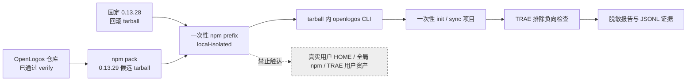

## ADDED — TRAE 本地负向制品验证部署方案（0.13.29）

### 一、部署目标与门禁

- 部署对象：本仓库构建的真实 `@miniidealab/openlogos@0.13.29` npm tarball，而非 TRAE Adapter 或插件。
- 环境：仅 `local-isolated`；一次性 npm prefix、HOME、cache、workspace 和 evidence root。
- 前置门禁：规格已合并、代码完成、`openlogos verify` 已通过且用户明确授权部署。
- 完成标记：全部部署检查和回滚恢复通过、`[deploy]` 勾满后，才允许受控执行 `openlogos deploy-done --env local-isolated`。
- 后续 smoke：部署完成后须再次获得明确授权，才执行 `openlogos smoke --env local-isolated`。

### 二、隔离部署拓扑

### 三、输入、环境变量与目录

| 输入/变量 | 必需 | 合同 |
|---|---:|---|
| `OPENLOGOS_TRAE_LOCAL_TARBALL` | 是 | 本次真实 tarball；包名正确、版本精确 `0.13.29`、SHA-256 可追溯 |
| `OPENLOGOS_TRAE_ROLLBACK_TARBALL` | 是 | 已校验真实 tarball；版本精确 `0.13.28`、SHA-256 可追溯且可离线安装 |
| `OPENLOGOS_TRAE_LOCAL_ROOT` | 由执行器创建 | `mktemp -d` 产生的一次性根，禁止指向仓库根、`$HOME`、`~` 或 `/` |
| `HOME` | 隔离覆盖 | `$OPENLOGOS_TRAE_LOCAL_ROOT/home`，不得继承真实用户 HOME |
| npm prefix/cache | 隔离覆盖 | 分别位于 `$OPENLOGOS_TRAE_LOCAL_ROOT/prefix` 与 `cache` |
| workspace/evidence | 隔离创建 | 位于一次性根的 `workspace` 与 `evidence`；报告不得含凭据或记忆正文 |

执行器必须先解析所有目录 realpath，并证明可写目标均位于一次性根下；不得通过 symlink、PATH 或 npm 配置逃逸。无需任何网络密钥、TRAE 凭据或发布凭据。

### 四、构建、打包与身份核验

1. 在仓库 `cli/` 执行既有测试与 build，再执行 `npm pack` 生成候选 tarball；任一步失败即停止。
2. 校验源码版本元数据：`cli/package.json`、`cli/package-lock.json` 与随包插件 manifest 均为 `0.13.29`。
3. 对打包产物执行只读清单检查，记录包名、version、文件列表、字节数和 SHA-256；清单必须含 CLI 运行入口及负向 smoke runner/reporter 所需文件。
4. 独立校验回滚 tarball 的包名、版本 `0.13.28`、清单和 SHA-256；禁止从公共 registry 临时解析或用目录/link 替代。
5. 将两个输入 tarball 的绝对路径、大小、SHA-256 写入脱敏部署证据，不修改 tarball 字节。

### 五、`0.13.29` 隔离安装与检查

1. 创建一次性根及 home/prefix/cache/workspace/evidence 子目录，设置最小 PATH 使 tarball 内 CLI 优先。
2. 以本地 tarball 安装到隔离 prefix；禁止全局安装、workspace link 和源码直跑。
3. 解析 `openlogos` 可执行文件 realpath，断言位于隔离 prefix；执行版本检查，必须精确输出 `0.13.29`。
4. 在隔离 workspace 运行最小 init/sync 负向检查：显式 `trae` 首写前失败，`all` 只含既有七宿主，配置含 `trae` 的 sync 在总事务前失败。
5. 对合成 `.trae/**`、settings、账号占位、`enabled_folders` 和不透明记忆 fixture 比较前后清单/大小/SHA-256；不读取记忆正文。
6. 记录命令、退出码、脱敏 stderr、入口、版本、七宿主结果、写入审计和哈希证据。

### 六、回滚与恢复演练

1. 保存候选安装态证据后，在同一隔离 prefix 卸载/替换候选包并从固定输入安装 `0.13.28`。
2. 重新解析 CLI realpath，确认仍位于同一 prefix 且版本精确为 `0.13.28`；执行既有七宿主最小状态检查，TRAE fixture 哈希必须不变。
3. 再从原候选 tarball 恢复 `0.13.29`，核验入口、版本、tarball SHA 关联和最小 TRAE 排除检查。
4. 任一卸载、安装、入口、版本、用户边界或恢复检查失败时部署 FAIL；不得用“命令可执行”或“重新安装理论可行”替代实际演练。
5. 回滚只作用于一次性 prefix，不修改真实全局 CLI、真实项目、TRAE 应用或用户状态。

### 七、清理、失败保留与公开副作用

- 成功后可删除一次性根；清理目标必须先核验为本次显式创建的具体路径，禁止宽泛递归目标。
- 失败默认保留一次性根中的脱敏证据以供诊断；仅由显式保留策略决定，绝不保存凭据、账号内容或真实记忆正文。
- deployment report 必须声明：npm publish/dist-tag、Git tag、GitHub Release、官网/Cloudflare 部署和 `git push` 均未执行。
- 本方案无数据库、数据迁移、生产流量、域名、证书或远程服务变更。

### 八、部署完成检查清单

- [ ] 候选 tarball 包名、版本 `0.13.29`、清单、大小和 SHA-256 可追溯。
- [ ] 回滚 tarball 包名、版本 `0.13.28`、清单、大小和 SHA-256 可追溯。
- [ ] HOME、prefix、cache、workspace、evidence realpath 全部位于一次性根。
- [ ] 实际 CLI 入口来自隔离 prefix；不存在 workspace link、源码入口或全局回退。
- [ ] 显式 TRAE 首写前失败，`all`/sync 只含既有七宿主，TRAE fixture 哈希不变。
- [ ] `0.13.29 → 0.13.28 → 0.13.29` 已实际完成，恢复后最小排除检查通过。
- [ ] `deployment-report.md` 已记录脱敏证据、失败模型、清理策略和公开副作用为零。

### 九、Smoke 输入与门禁结论

部署后的独立 smoke 必须覆盖：SMOKE-core-124 真实制品身份、SMOKE-core-125 隔离边界、SMOKE-core-126 显式 TRAE 首写前拒绝、SMOKE-core-127 `all`/sync 七宿主排除、SMOKE-core-128 软控制不得判定 PASS 与用户资产零触达、SMOKE-core-129 真实回滚恢复。

六个 ID 任一缺失、skip 或失败即整体 FAIL。全部通过只证明 OpenLogos `0.13.29` 候选 tarball 在本地安装态保持 TRAE non-deployable，并且可在隔离环境回滚；不授权公开发布，也不改变 D06 hard guard BLOCKED。
