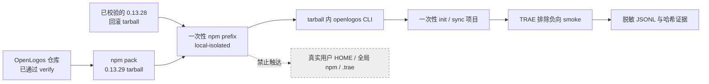

# 变更提案：TRAE 本地负向部署与 Smoke 闭环

> module: core | created: 2026-08-26

## 变更原因

`trae-adapter-foundation` 已用 TRAE 国际版 `3.5.91` 与 CN `3.3.93` 的真实客户端证据确认 hard guard 不成立，并完成 Registry 排除、写前拒绝与用户资产零触达实现。该提案因此正确收敛为 non-deployable，未构建或部署目标版本 `0.13.29`。

用户现在要求补充**仅本地**部署与 smoke。这里部署的对象必须是 OpenLogos CLI 的真实 `0.13.29` npm tarball，而不是 TRAE Adapter、TRAE 插件或 `.trae/**` 资产；smoke 的目标是证明安装产物仍能保持 TRAE 排除合同，而不是把既有 wrapper 直调或软控制重新解释为 hard guard PASS。通过隔离 npm prefix、HOME、一次性项目、真实 tarball 身份和 `0.13.28` 回滚演练，可以补齐“源码测试通过但安装产物未验证”的制品风险，同时不触碰真实用户状态或公开发布渠道。

## 变更类型

需求级变更。它把“能力门失败后完全跳过部署/smoke”细化为“仍禁止 TRAE deployable 部署，但允许对 OpenLogos 本地制品执行负向部署与 smoke”，并引入版本元数据、runner、reporter 和回滚实现。

## 变更范围

- 影响的决策记录：`logos/resources/decisions/core-D06-ai-tool-adapter-boundary.md` 的 TRAE 版本与部署边界。
- 影响的需求文档：`logos/resources/prd/1-product-requirements/core-01-requirements.md` 中 S01、S08、S19 的本地制品验收条件。
- 影响的功能规格：`logos/resources/prd/2-product-design/1-feature-specs/core-01-feature-specs.md` 中 non-deployable 与负向 smoke 的区分。
- 影响的技术架构：`logos/resources/prd/3-technical-plan/1-architecture/core-01-architecture-overview.md` 中 TRAE 排除边界和本地制品验证拓扑。
- 影响的业务场景：S19；复用 S01 的显式 `trae` 拒绝和 S08 的 `all`/sync 排除作为 smoke 被测能力，不改变其 deployable 语义。
- 影响的场景测试：`core-S01-test-cases.md`、`core-S08-test-cases.md`、`core-S19-test-cases.md`，补充安装态 runner/dispatcher 与本地部署门禁真实 UT/ST。
- 影响的部署方案：`logos/resources/prd/3-technical-plan/3-deployment/core-01-deployment-plan.md`，新增 `local-isolated` tarball 安装、证据、回滚和清理方案。
- 影响的 smoke：`logos/resources/test/smoke/core-smoke-test-cases.md`，新增 SMOKE-core-124～SMOKE-core-129。
- 影响的代码：统一版本元数据升级到 `0.13.29`；新增 TRAE 本地负向 smoke runner/driver、dispatcher 接入、Vitest 合同测试和 OpenLogos reporter。
- 不影响 API、数据库或 API 编排测试；不新增 TRAE Adapter、normalizer、模板、插件 identity 或宿主写入调用链。

## 变更概述

实现阶段将生成真实 `@miniidealab/openlogos@0.13.29` tarball，并要求包名、版本、清单、大小和 SHA-256 可追溯。部署执行只能在一次性目录中创建 npm prefix、HOME、缓存、项目和证据目录；实际执行的 `openlogos` 路径必须来自该 tarball，不得使用 workspace link、仓库源码入口或全局已安装版本。

负向 smoke 验证六类不变量：真实制品身份；安装隔离；显式 `trae` 在首写前失败；`all`/sync 仍只包含既有七宿主；`.trae/**`、账号占位、`enabled_folders` 和不透明记忆哈希不变；`0.13.28` 回滚 tarball 可在同一隔离 prefix 恢复并在演练后重新安装 `0.13.29`。runner 不启动 TRAE 内置写工具，不读取记忆正文，也不把文件存在、wrapper 直调或客户端 UI 当作 capability PASS。

## 部署影响

- 是否需要部署：是
- 部署原因：必须验证真实 `0.13.29` npm tarball 的安装态版本、入口、TRAE 排除合同和可恢复性；源码直跑不能替代制品证据。
- 影响环境：仅本地隔离环境 `local-isolated`；不使用 staging、生产、真实用户 HOME 或全局 npm prefix。
- 是否涉及数据迁移：否
- 是否需要回滚预案：是；要求提供并校验真实 `0.13.28` 回滚 tarball，完成 `0.13.29 → 0.13.28 → 0.13.29` 隔离演练。
- 是否需要 smoke：是
- 部署完成判据：`deployment-report.md` 记录两个 tarball 的版本/SHA-256、隔离路径、实际 CLI 解析路径、回滚与恢复结果，且公开发布副作用为零。

## 部署拓扑与安全边界



## 版本、回滚与失败模型

1. `cli/package.json`、`cli/package-lock.json` 与随包插件 manifest 的版本必须一致为 `0.13.29`；这只定义本地候选制品，不授权发布。
2. `OPENLOGOS_TRAE_LOCAL_TARBALL` 必须指向本次真实 `0.13.29` tarball；`OPENLOGOS_TRAE_ROLLBACK_TARBALL` 必须指向可离线安装且版本精确为 `0.13.28` 的 tarball。
3. 任一 build/test/pack、版本、清单、隔离检查、负向行为、用户边界哈希或回滚检查失败，部署与 smoke 均失败；不得写入成功 marker。
4. 回滚演练只作用于一次性 prefix：先安装 `0.13.28` 并验证入口与版本，再恢复同一候选 `0.13.29`。真实全局 CLI、用户项目与 TRAE 配置始终不变。
5. 成功后可以清理一次性目录；失败时可按显式保留开关保存脱敏证据，但不得保存账号凭据、记忆正文或真实用户路径内容。

## 非目标

- 不注册 `trae`，不把 TRAE 加入 `all`、帮助列表或交互选项。
- 不创建 TRAE Adapter、插件、Skills、Agent、Hook normalizer、wrapper 或托管 `.trae/**` 资产。
- 不启动 TRAE 国际版/CN 的真实写入工具，不重跑已经失败的 hard guard 矩阵。
- 不修改 `enabled_folders`、settings、账号、Rules、Skills、Agents、MCP 或原生记忆。
- 不执行 `npm publish`、Git tag、GitHub Release、官网/Cloudflare 部署或 `git push`。
- 不把本地 tarball 安装或负向 smoke 表述为 TRAE capability PASS。

## UI/UX 变更声明

```yaml
ui_impact: false
design_system_mode: generated
design_system_fallback_reason: ""
pages: []
```

## 基线闭包计划

```yaml
baseline_closure:
  policy: on-touch-v1
  schema_version: 1
  unit: canonical-merge-target-path
  delta_cardinality: exactly-one-per-non-skip-target
  effective_view: merged-resources-plus-current-change-deltas
  ambiguity: block-before-existing-plan-exit
  standalone_baseline_required: false
  jit_confirmation: disabled
  touched_scenario_ids: [S01, S08, S19]
  targets:
    - category: decision
      scenario_ids: [S01, S08, S19]
      mode: MODIFY
      delta_path: "deltas/decisions/core-D06-ai-tool-adapter-boundary.md"
      reason: "D06 需区分禁止 TRAE deployable 部署与允许 OpenLogos 本地候选 tarball 负向验证，避免部署一词造成 capability 误报。"
      evidence: ["target_exists: logos/resources/decisions/core-D06-ai-tool-adapter-boundary.md", "decision:D06#TRAE", "user_decision:local-only-negative-smoke"]
      missing_evidence: []
    - category: requirement
      scenario_ids: [S01, S08, S19]
      mode: MODIFY
      delta_path: "deltas/prd/1-product-requirements/core-01-requirements.md"
      reason: "需求需增加真实 0.13.29 tarball、隔离安装、写前拒绝、七宿主 all、用户资产零触达和回滚验收条件。"
      evidence: ["target_exists: logos/resources/prd/1-product-requirements/core-01-requirements.md", "scenarios:S01,S08,S19", "version:0.13.29"]
      missing_evidence: []
    - category: feature
      scenario_ids: [S01, S08, S19]
      mode: MODIFY
      delta_path: "deltas/prd/2-product-design/1-feature-specs/core-01-feature-specs.md"
      reason: "功能规格需定义本地候选制品部署不改变 TRAE non-deployable 状态，并锁定隔离、证据与失败语义。"
      evidence: ["target_exists: logos/resources/prd/2-product-design/1-feature-specs/core-01-feature-specs.md", "feature:F03,F05", "registry:no-trae"]
      missing_evidence: []
    - category: architecture
      scenario_ids: [S01, S08, S19]
      mode: MODIFY
      delta_path: "deltas/prd/3-technical-plan/1-architecture/core-01-architecture-overview.md"
      reason: "架构需增加 local-isolated tarball、runner/reporter、回滚制品和外部 TRAE 用户边界，同时保持 Registry 排除。"
      evidence: ["target_exists: logos/resources/prd/3-technical-plan/1-architecture/core-01-architecture-overview.md", "architecture:section-31", "boundary:no-managed-trae-assets"]
      missing_evidence: []
    - category: scenario
      scenario_ids: [S01]
      mode: MODIFY
      delta_path: "deltas/prd/3-technical-plan/2-scenario-implementation/core-S01-cli-init.md"
      reason: "S01 需补充真实候选 tarball 下显式 trae 仍在首写前失败、all 不产生 TRAE 资产的安装态验证入口。"
      evidence: ["target_exists: logos/resources/prd/3-technical-plan/2-scenario-implementation/core-S01-cli-init.md", "scenario:S01", "smoke:SMOKE-core-126"]
      missing_evidence: []
    - category: scenario
      scenario_ids: [S08]
      mode: MODIFY
      delta_path: "deltas/prd/3-technical-plan/2-scenario-implementation/core-S08-sync-ai-tools.md"
      reason: "S08 需补充候选 tarball 的 all/sync 排除与 .trae 用户资产哈希不变安装态时序。"
      evidence: ["target_exists: logos/resources/prd/3-technical-plan/2-scenario-implementation/core-S08-sync-ai-tools.md", "scenario:S08", "smoke:SMOKE-core-127"]
      missing_evidence: []
    - category: scenario
      scenario_ids: [S19]
      mode: MODIFY
      delta_path: "deltas/prd/3-technical-plan/2-scenario-implementation/core-S19-smoke-gate.md"
      reason: "S19 需表达本地隔离部署完成后由 openlogos smoke --env local-isolated 执行真实 tarball 负向 runner 的时序和门禁。"
      evidence: ["target_exists: logos/resources/prd/3-technical-plan/2-scenario-implementation/core-S19-smoke-gate.md", "scenario:S19", "cli:smoke-environment-string"]
      missing_evidence: []
    - category: deployment
      scenario_ids: [S01, S08, S19]
      mode: MODIFY
      delta_path: "deltas/prd/3-technical-plan/3-deployment/core-01-deployment-plan.md"
      reason: "部署方案需增加 0.13.29 本地真实 tarball 构建、隔离安装、证据、0.13.28 回滚演练、恢复和清理步骤。"
      evidence: ["target_exists: logos/resources/prd/3-technical-plan/3-deployment/core-01-deployment-plan.md", "proposal:deployment_required=true", "environment:local-isolated"]
      missing_evidence: []
    - category: test
      scenario_ids: [S01]
      mode: MODIFY
      delta_path: "deltas/test/core-S01-test-cases.md"
      reason: "新增 UT-S01-128 与 ST-S01-26，验证本地 runner 的初始化排除合同和真实候选 tarball 入口。"
      evidence: ["target_exists: logos/resources/test/core-S01-test-cases.md", "scenario:S01", "next_test_ids:UT-S01-128,ST-S01-26"]
      missing_evidence: []
    - category: test
      scenario_ids: [S08]
      mode: MODIFY
      delta_path: "deltas/test/core-S08-test-cases.md"
      reason: "新增 UT-S08-37 与 ST-S08-27，验证本地 runner 的同步排除合同、用户边界和安装态闭环。"
      evidence: ["target_exists: logos/resources/test/core-S08-test-cases.md", "scenario:S08", "next_test_ids:UT-S08-37,ST-S08-27"]
      missing_evidence: []
    - category: test
      scenario_ids: [S19]
      mode: MODIFY
      delta_path: "deltas/test/core-S19-test-cases.md"
      reason: "新增 UT-S19-10～11 与 ST-S19-09，锁定 tarball 输入校验、dispatcher/reporter 覆盖和 local-isolated deploy-done/smoke 门禁。"
      evidence: ["target_exists: logos/resources/test/core-S19-test-cases.md", "scenario:S19", "next_test_ids:UT-S19-10,UT-S19-11,ST-S19-09"]
      missing_evidence: []
    - category: smoke
      scenario_ids: [S01, S08, S19]
      mode: MODIFY
      delta_path: "deltas/test/smoke/core-smoke-test-cases.md"
      reason: "新增 SMOKE-core-124～129，覆盖候选制品、隔离、拒绝、all/sync 排除、软控制非 PASS 与真实回滚。"
      evidence: ["target_exists: logos/resources/test/smoke/core-smoke-test-cases.md", "proposal:smoke_required=true", "next_smoke_ids:124-129"]
      missing_evidence: []
    - category: api
      scenario_ids: [S01, S08, S19]
      mode: SKIP
      delta_path: null
      reason: "本案只涉及本地 CLI tarball、文件系统 fixture 与 smoke runner，不新增 HTTP、RPC 或消息 API。"
      evidence: ["architecture:local-cli", "deployment:no-remote-service"]
      missing_evidence: []
    - category: database
      scenario_ids: [S01, S08, S19]
      mode: SKIP
      delta_path: null
      reason: "没有数据库实体、迁移或持久化服务；TRAE 原生记忆仍是禁止读取的不透明外部资产。"
      evidence: ["deployment:data_migration=false", "ownership:trae-memory-external"]
      missing_evidence: []
    - category: orchestration
      scenario_ids: [S01, S08, S19]
      mode: SKIP
      delta_path: null
      reason: "API 维度为 SKIP；安装态闭环由 CLI smoke runner 与 JSONL reporter 覆盖。"
      evidence: ["api_disposition:SKIP", "test_strategy:SMOKE-core-124-129"]
      missing_evidence: []
```

## 决策澄清

```yaml
schema: openlogos/clarification@1
mode: adaptive
status: complete
impacts:
  data:
    status: none
    reason: "只使用一次性目录；无数据库迁移，不读取 TRAE 记忆正文，真实用户资产零触达。"
  compatibility:
    status: none
    reason: "版本提升到 0.13.29，但 Registry、all 顺序、既有七宿主和 TRAE non-deployable 结论保持不变；0.13.28 tarball 提供隔离回滚。"
  security_privacy:
    status: none
    reason: "HOME、npm prefix、缓存、项目和证据全部隔离；不启动 TRAE 写入工具，不修改信任状态或账号配置。"
  public_release:
    status: none
    reason: "用户明确限定本地部署与 smoke；npm publish、tag、GitHub Release、官网部署和 push 均不授权。"
  external_commitment:
    status: none
    reason: "不购买服务、不创建账号、不修改远端或真实客户端状态。"
decisions:
  - id: C01
    category: deployment
    question: "是否允许在 TRAE 仍 non-deployable 的前提下，部署 OpenLogos 0.13.29 本地候选 tarball 并执行负向 smoke？"
    answer: "允许；仅本地隔离 tarball 部署、0.13.28 回滚演练与负向 smoke，不公开发布。"
    rationale: "用户明确要求补齐安装产物和回滚证据。部署对象是 OpenLogos CLI，而非 TRAE Adapter；负向 smoke 只证明排除合同在安装态成立。"
    source: user
    affects:
      - "0.13.29 版本元数据与真实 npm tarball"
      - "local-isolated 部署、回滚和 deployment-report"
      - "SMOKE-core-124～SMOKE-core-129 runner/reporter"
      - "D06 的部署术语边界"
    rejected_options:
      - "直接在已归档 trae-adapter-foundation 中追加部署任务"
      - "把本地安装解释为 TRAE capability PASS"
      - "使用 workspace link 或源码直跑替代 tarball"
unresolved: []
defaults:
  - id: DFLT-01
    category: compatibility
    choice: "TRAE 继续不注册、不加入 all，不创建任何托管 .trae 资产。"
    reason: "真实 hard guard 失败事实未改变。"
  - id: DFLT-02
    category: deployment
    choice: "回滚 tarball 必须由部署执行者显式提供、版本精确为 0.13.28 且 SHA-256 可追溯。"
    reason: "避免通过网络或未固定来源临时获取回滚制品。"
  - id: DFLT-03
    category: security_privacy
    choice: "TRAE 应用安装状态只允许只读版本记录；runner 不启动客户端或触发真实写入。"
    reason: "本案验证的是 OpenLogos 安装产物排除合同，不重新开启失败的宿主能力探测。"
```
