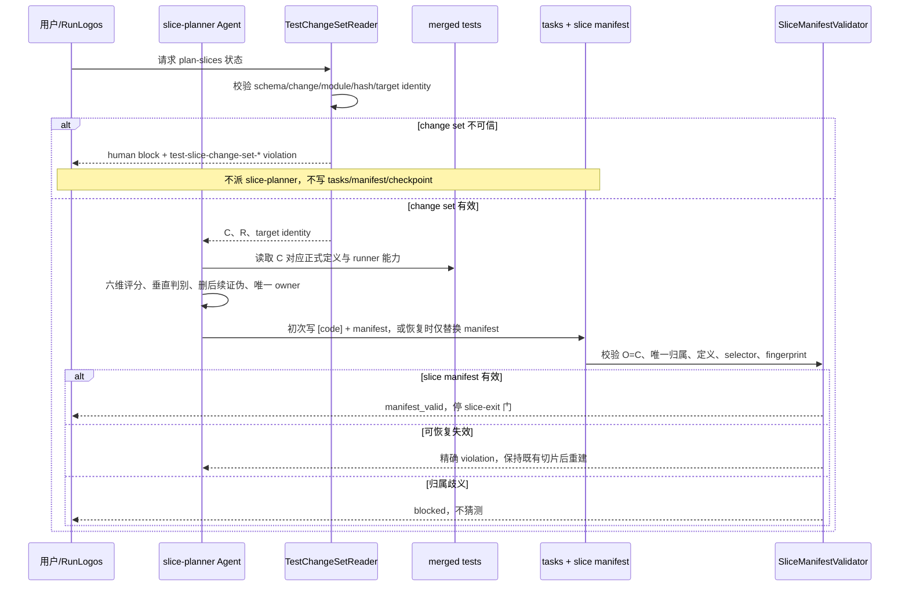

## ADDED — Canonical 测试变更集驱动的切片规划

### 目标

slice-planner 只为 merge 时已固化的真实 changed 测试集合规划唯一 owner；原样携带的 baseline 与已删除测试不得进入切片归属。

### 参与者

- 用户或 RunLogos
- 使用 `slice-planner` Skill 的 Agent
- OpenLogos `TestChangeSetReader`
- OpenLogos slice manifest validator
- `SPEC_MERGED`、`tasks.md`、正式测试规格与 `TEST_SLICE_MANIFEST.json`

### 前置条件

- `SPEC_MERGED` 存在并通过 spec-complete 身份检查。
- `[code]` 为初次规划空承载区，或处于仅重建 manifest 的恢复模式。
- 正式测试规格与 change set 的 `targets[].after_sha256` 一致。

### 步骤

1. OpenLogos 先读取并严格校验 `SPEC_MERGED.test_change_set`；不得从 Delta 或 Git 回退推导。
2. Agent 只把 `changed_test_ids` 分配给切片；`removed_test_ids` 仅供诊断，baseline 不进入 owned。
3. 初次规划按已合并规格与真实 ID 形成 `[code]` 切片，再生成稳定 `slice_id`、owner、selector 与 fingerprint。
4. validator 强制 `O=C`、切片间无交集、owned ID 在唯一 spec target 中存在且 selector 可执行。
5. change set 有效但 manifest 非法时，恢复模式保留 task 文本、顺序、checkbox、slice identity 与有效 checkpoint，只原子替换 manifest。
6. 合法 manifest 后停在 `slice-exit` 人类门，不因恢复自动越门进入实现。

### 事故样本

对完整 `MODIFIED` 测试章节，C 只能包含 `UT-S10-129`、`UT-S10-137`～`UT-S10-140`、`ST-S10-44`。`UT-S10-121`～`UT-S10-128`、`ST-S10-36`～`ST-S10-39` 留在 baseline；若 manifest owned 任一原样 ID，报 unknown；漏掉 `UT-S10-129`，报 missing。

### 异常与边界

- change set missing/unsupported/hash/target 漂移：`human_action_required=true`，不得派 `plan-slices`。
- changed ID 多片归属：ambiguous fail-closed，不自动选择。
- removed ID 被 owned：unknown；不得因它已从正式规格消失而放宽定义门。
- no-delta marker 且确无 mergeable delta：可信空 C/R；不得把任意既有测试猜成 changed。
- final `VERIFY_PASS` 已存在的 legacy 提案不回退。

### 追溯

- 需求：S32/S39 测试变更 ID 语义差异与持久化要求。
- 功能规格：§2.37。
- 方法论：`spec/test-slice-manifest.md`、`spec/baseline-closure.md`。
- 测试：UT-S32-43～UT-S32-49、ST-S32-14～ST-S32-16。
