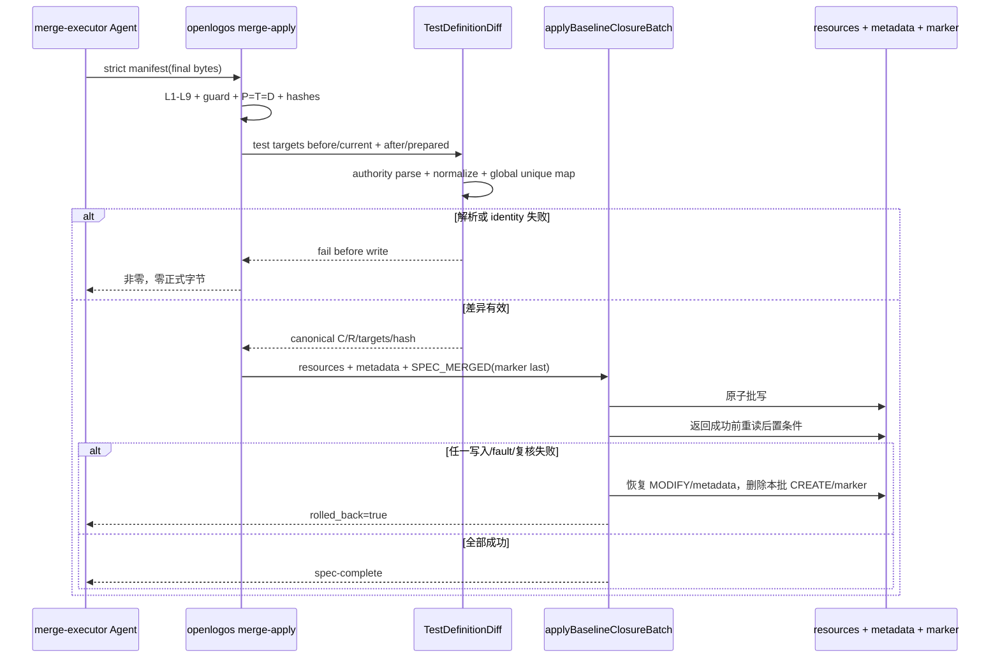

## ADDED — 测试变更集原子 Apply 扩展

### 场景目标

当 baseline closure 批次触及正式测试规格时，`merge-apply` 在自身掌握 before/final 字节的唯一安全时点计算语义 changed/removed ID，并与 resources、metadata、`SPEC_MERGED` 全有或全无提交。

### 参与者

- 用户授权的 merge-executor Agent
- `openlogos merge-apply`
- BaselineClosurePlan / strict apply manifest
- TestDefinitionDiff / TestChangeSetReader
- `applyBaselineClosureBatch()`
- 正式测试 resources、metadata 与提案 marker

### 前置条件

- plan/spec L1～L9 全过，P=T=D。
- `MERGE_APPLY_MANIFEST.json` 严格符合 `openlogos/baseline-merge-apply@1`，每个 prepared target 的 source/before/final hash 已校验。
- `SPEC_MERGED` 不存在，guard 与 slug/module 匹配。

### 成功后置条件

- 所有正式目标和 metadata 等于 prepared final bytes。
- `SPEC_MERGED.test_change_set` 符合 `openlogos/test-change-set@1`，C/R 与 before/final 结构化差异一致。
- marker 中 `manifest_sha256` 继续绑定严格 apply manifest；change-set target identity 与 category=test 的 canonical targets 一致。
- 重启后无需 Git 即可读得相同 C/R。

### 步骤说明

1. 根据 BaselineClosurePlan 确定 category=`test` 的 canonical targets；严格 manifest 本身不增加字段。
2. MODIFY 从当前正式目标读取 before；CREATE 使用空前态；after 使用已校验 `content_base64` 最终字节。
3. 在所有 targets 的 before/after 上建立全局唯一测试记录映射，计算新增、修改、未变与删除。
4. 生成严格字段、ASCII 排序、无时间戳、带 canonical payload hash 的 change set。
5. 构造包含 change set 的完整 `SPEC_MERGED` 字节，并作为批事务最后一个 prepared input。
6. 写入后重读 test targets 与 marker，复核 after hashes、payload hash、change/module、target identity 和 apply-manifest 绑定。
7. 只有后置条件全部成立才报告成功；否则使用事务备份回滚。

### 异常与边界

- 前/后任一侧重复 ID：首写前失败，不采用“最后一行获胜”。
- 非法 UTF-8、表格结构歧义、escaped pipe 解析失败：首写前失败。
- before_sha256 在 Agent 准备 manifest 后漂移：拒绝，不用新磁盘内容静默重算。
- 只触及非 test targets：仍写合法空 C/R 与空 targets，使“无测试变化”和“事实缺失”可区分。
- no-delta merge 不走本批 apply；reader 仅在 marker 类型正确且磁盘确无 mergeable delta 时可信派生空 C/R。
- 事后人为修改正式测试 target 导致 after hash 漂移：后续 reader fail-closed，不从 Delta 重建。
- 不依赖 Git repository、commit、parent、branch、squash 或 rebase 状态。

### 追溯

- 需求：S32/S39 测试变更 ID 语义差异与持久化要求。
- 功能规格：§2.37.1～§2.37.3。
- 架构：§27.3～§27.6。
- 规范：`spec/baseline-closure.md` §18、`spec/test-slice-manifest.md`。
- 测试：UT-S39-33～UT-S39-38、ST-S39-17～ST-S39-19。
