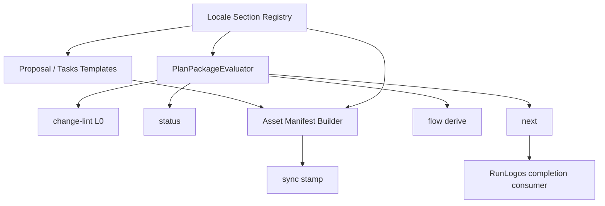

## ADDED — 三十三、Plan Package 完成合同收敛架构

### 33.1 架构边界



OpenLogos 拥有 Markdown 语义、完成判断、issue、CLI JSON 和制品资产合同；宿主只拥有 WorkUnit 生命周期与展示。宿主不得反向实现 proposal/tasks parser。

### 33.2 模块与类型

- `cli/src/lib/plan-package-contract.ts`：schema、locale registry、issue code、严格类型与 canonical 序列化。
- `cli/src/lib/plan-package.ts`：纯读取 evaluator；输入为 proposal/tasks、阶段事实与现有共享 evaluator 结果。
- `cli/src/lib/proposal-lifecycle.ts`：旧导出降为 wrapper，内部委托 PlanPackageEvaluator。
- `cli/src/lib/change-lint.ts`：L0 调用 evaluator，将 issues 投影为 violations，保持 exit 0/2/1 分层。
- status/next/flow：消费同一 evaluation，不解析章节或模板字符串。
- asset manifest builder：对权威 Skill、模板和生成插件做 canonical SHA-256。

### 33.3 核心数据合同

```ts
interface CompletionIssue {
  code: string;
  path: string;
  section_id?: string;
  line?: number;
  actual?: string;
  expected?: string;
  message: string;
  fix_hint: string;
}

interface PlanPackageEvaluation {
  schema: 'openlogos/plan-package-evaluation@1';
  contract_version: string;
  ready: boolean;
  proposal: { filled: boolean; issues: CompletionIssue[] };
  tasks: {
    plan_filled: boolean;
    code_required: boolean;
    code_slices_filled: boolean;
    issues: CompletionIssue[];
  };
  issues: CompletionIssue[];
}
```

issue 集合先按 contract-defined severity/check order，再按 path、line、section_id、code 排序；同一输入必须逐字节稳定。

### 33.4 控制流与只读性

1. 命令层解析项目根、guard、slug 与阶段事实。
2. evaluator 读取 proposal/tasks 并调用既有 clarification、deployment、baseline closure、UI 声明 evaluator。
3. locale registry 完成 authority scan，识别 missing/duplicate/empty/placeholder/invalid。
4. tasks parser 分别计算 plan/code-required/code-slices 三态。
5. 聚合 issues 后计算 ready；消费者只能投影，不能覆盖。
6. change-lint/status/next/flow 运行前后不得写内容、marker、cache 或审批。

### 33.5 Plan 前沿等价与历史旁路

等价只在“尚无 Delta、无 `PLAN_APPROVED`、无更高优先级 marker/error”的 plan 前沿成立。存在 `PLAN_APPROVED|SPEC_MERGED|MERGED|VERIFY_PASS` 时先按历史阶段继续，模板新规则最多生成非阻塞 warning，不改变前沿。

### 33.6 Asset manifest 与 sync

`openlogos/asset-manifest@1` 顶层包含 `version`、`planContractVersion`、`skills`、`templates` 与 canonical payload hash。构建从根权威生成插件副本后校验无 diff；缓存键至少含 semver + payload hash。同 semver/hash 不匹配必须 fail loud。

项目 sync stamp 增加合同版本与 `managedAssetsHash`。CLI 期望 hash 与 stamp 不同时，status/next 输出过期诊断；只读仍可执行，但 producer dispatch 不得静默声称可用旧 Skill。

### 33.7 失败模型

| 失败 | 处理 | 副作用 |
|---|---|---|
| proposal 章节缺失/重复/空 | 精确 issue，ready=false | 无 |
| plan 阶段 code checkbox | `tasks_code_entry_before_spec_complete` | 无 |
| evaluator 内部读取/解析错误 | 操作错误 exit 1，禁止成功 envelope | 无 |
| 四方结论不一致 | 一致性 ST 失败，阻止制品 | 无发布 |
| 生成插件与权威 hash 不同 | 构建失败 | 不产候选包 |
| 项目 Skill 过期 | 提示 sync + 重开 session | 不覆盖用户资产 |

### 33.7.1 TestChangeSet 历史重复收敛

`TestDefinitionDiff` 将 before 表示为 `Map<TestId, TestDefinitionRecord[]>`，after 表示为严格唯一的 `Map<TestId, TestDefinitionRecord>`。before 扫描允许同 ID 多候选，并跳过列数不一致的历史歧义行；after 扫描继续复用严格 duplicate/ambiguous/UTF-8 门。差异规则固定为：after 定义与 before 任一候选 canonical bytes 相等则 unchanged；否则 changed；before ID 在 after 不存在则 removed。

该兼容层只改变内存中的 before 归并，不改变 `openlogos/test-change-set@1` marker shape、target before/after SHA-256、原子事务或后置读取校验。merge-apply 必须先证明 after 唯一，再允许历史 before 重复参与收敛，确保系统只从坏基线走向唯一最终态。

### 33.8 实现映射与不变量

- S05：next、dispatch completion、JSON Schema。
- S08：sync stamp、asset manifest、缓存诊断。
- S09：i18n scaffold、proposal lifecycle wrapper、历史兼容。
- S11：status plan_state/completion issues。
- S35：L0、问题码、四方一致性、只读测试。
- 不变量：单一 evaluator、A 被动派生、只读零写、历史不回退、宿主不复制规则、公开发布零授权。
