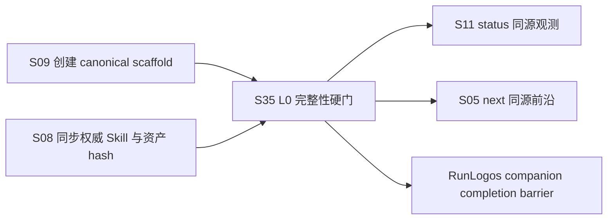

## ADDED — S35 Plan Package L0 场景登记与依赖

### 场景地图增量

| 编号 | 场景名称 | 主要实现 | 测试规格 | 状态 |
|---|---|---|---|---|
| S35 | 提案计划产物左移硬检查（change-lint） | `lib/plan-package.ts` / `lib/change-lint.ts` / `commands/change-lint.ts` | `core-S35-test-cases.md` | 进行中 |

### 依赖关系

- S09 生产 proposal/tasks scaffold，S35 负责独立完成证明。
- S11、S05 与 flow derive 复用 S35 evaluator，不维护第二份判据。
- S08 保证 Agent producer 使用的 Skill/模板与 CLI 合同一致。
- RunLogos companion 只消费 completion 声明，不属于本仓实现范围。

### 场景索引增量

- [S35：提案计划产物左移硬检查](./core-S35-change-lint.md)
