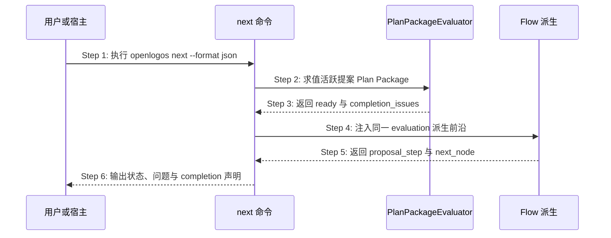

## ADDED — Plan Package completion 驱动的 next 前沿

### 主时序

### 步骤说明

1. **用户或宿主**请求 next 的机器输出。
2. **next**只调用共享 evaluator，不读取 canonical 标题表或模板占位。
3. **evaluator**返回稳定 evaluation；失败问题不被 next 改写。
4. **next**将 evaluation 作为 flow predicate 上下文。
5. **Flow 派生**仅在 ready 时进入 `ready-to-delta`；否则停在 `writing`。
6. **next**输出 completion command、expected JSON Pointer 与 expected proposal step。

### 完成声明

producer dispatch 的 `completion` 至少声明执行 `openlogos change-lint --slug <slug> --format json`，期望 `/data/pass=true`、`/data/plan_package/ready=true` 与 `proposal_step=ready-to-delta`。OpenLogos 不执行宿主重试。

### 异常与边界

#### EX-3.1：Plan Package 未完成
- **触发条件**：evaluation.ready=false。
- **期望响应**：`proposal_step=writing`，原样输出问题，不展示“可写 Delta”。
- **副作用**：无 marker 或内容写入。

#### EX-3.2：旧 CLI 无 completion contract
- **触发条件**：宿主连接的 CLI 未提供声明。
- **期望响应**：宿主保守提示升级/sync；不得自行解析 Markdown。
- **副作用**：无。

### 追溯

- 需求：Plan Package 正常、异常与宿主独立验证验收。
- 测试：UT-S05-30～UT-S05-34、ST-S05-14～ST-S05-15。
