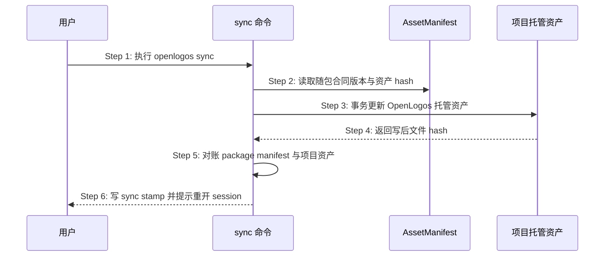

## ADDED — Plan 合同资产 manifest 与 sync 时序

### 主时序

### 步骤说明

1. **用户**显式运行 sync；status/next 不隐式触发。
2. **sync**读取候选包内 `openlogos/asset-manifest@1`。
3. **sync**只更新 OpenLogos owner 的 Skill、模板和插件资产，用户/项目自有资产保持不变。
4. **项目托管资产层**返回真实写后 hash。
5. **sync**验证 Skill、模板、插件副本、合同版本全部一致。
6. **sync**写入 `cliVersion/syncedAt/planContractVersion/managedAssetsHash`，提示重开 Agent session。

### 异常与边界

#### EX-2.1：manifest 缺失或 hash 非法
- **触发条件**：随包 manifest 缺字段、未知 schema 或 hash 不匹配。
- **期望响应**：sync 在提交前失败，输出资产路径与期望/实际 hash。
- **副作用**：项目托管资产与 stamp 保持旧集合。

#### EX-5.1：写后对账失败
- **触发条件**：生成插件、Skill 或模板字节不等于 manifest。
- **期望响应**：事务回滚，不留下部分新资产。
- **副作用**：用户资产始终不变。

### 追溯

- 需求：托管资产可核验与过期诊断。
- 测试：UT-S08-38～UT-S08-42、ST-S08-28～ST-S08-29、SMOKE-core-138～SMOKE-core-139。
