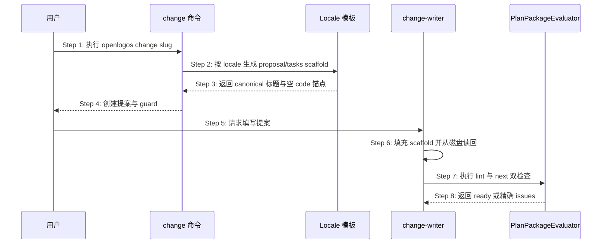

## ADDED — canonical scaffold 与 Plan Package 生命周期时序

### 主时序

### 步骤说明

1. **用户**创建新的 launched change。
2. **change 命令**读取 locale section registry，而非手写另一份标题集合。
3. **Locale 模板**生成完整 proposal scaffold；需要代码的 tasks 只含空 `[code]` 标题。
4. **change 命令**原子创建目录与 guard。
5. **用户**授权 change-writer 填写。
6. **change-writer**保留 scaffold 结构、替换占位并读回实际文件。
7. **change-writer**运行 change-lint 与 next。
8. **evaluator**只有在四方合同可收敛时返回 ready。

### 异常与边界

#### EX-3.1：模板继续生成代码占位 checkbox
- **触发条件**：launched tasks 含精确模板行 `实现代码变更`。
- **期望响应**：模板合同测试失败；L0 同时返回模板残留问题。
- **副作用**：候选制品不得生成。

#### EX-6.1：Agent 改写 canonical summary
- **触发条件**：保留详细设计但删除/改名 canonical summary。
- **期望响应**：返回 `proposal_required_section_missing` 与 locale 期望标题。
- **副作用**：不得进入 plan gate。

### 追溯

- 需求：S09 scaffold 与 plan gate 验收。
- 测试：UT-S09-224～UT-S09-230、ST-S09-88～ST-S09-89。
